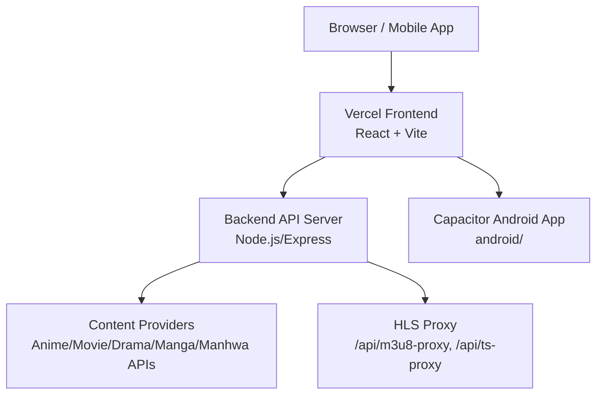
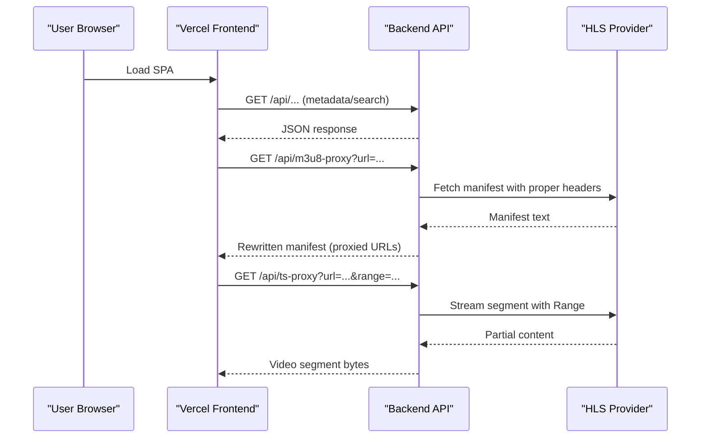

# Getting Started

<cite>
**Referenced Files in This Document**
- [README.md](file://README.md)
- [package.json](file://package.json)
- [server.js](file://server.js)
- [vite.config.js](file://vite.config.js)
- [capacitor.config.json](file://capacitor.config.json)
- [vercel.json](file://vercel.json)
- [.env.example](file://.env.example)
- [.env](file://.env)
- [index.html](file://index.html)
- [src/main.jsx](file://src/main.jsx)
- [src/App.jsx](file://src/App.jsx)
</cite>

## Table of Contents
1. Introduction
2. Project Structure
3. Core Components
4. Architecture Overview
5. Detailed Component Analysis
6. Dependency Analysis
7. Performance Considerations
8. Troubleshooting Guide
9. Conclusion
10. Appendices

## Introduction
Project Anime (also known as AniStream/EetNet) is a full-stack streaming application that aggregates and streams anime, movies, dramas, manga, and manhwa across platforms. The frontend is a React + Vite app deployed on Vercel; the backend is a Node.js/Express server that scrapes content providers and proxies HLS streams to avoid CORS and CDN restrictions. It supports cross-platform deployment including Android via Capacitor.

Key characteristics:
- Multi-format content platform: anime, movies, dramas, manga, manhwa
- Frontend: React + Vite, PWA-ready, deployable on Vercel
- Backend: Node.js/Express with stream proxying for HLS manifests and segments
- Mobile: Capacitor-based Android app using the same built frontend assets
- Environment-driven configuration for API base URLs and provider endpoints

## Project Structure
At a high level:
- Frontend source lives under src/, built by Vite into dist/
- Backend server runs via server.js
- Android project under android/ uses Capacitor to wrap the built web app
- Configuration files include environment variables, Vite config, and Vercal deployment settings

**Diagram sources**
- [package.json:6-12](file://package.json#L6-L12)
- [server.js:1-20](file://server.js#L1-L20)
- [vite.config.js:7-21](file://vite.config.js#L7-L21)
- [capacitor.config.json:1-32](file://capacitor.config.json#L1-L32)

**Section sources**
- [package.json:1-45](file://package.json#L1-L45)
- [README.md:1-160](file://README.md#L1-L160)

## Core Components
- Frontend runtime entry: initializes runtime config then mounts the React app
- Backend API server: Express app with CORS, JSON parsing, route normalization, and multiple proxies
- Stream proxies: rewrite HLS manifests and pipe video segments while preserving Range headers
- Image and subtitle proxies: bypass CORS and hotlink restrictions for images and subtitles
- Mobile wrapper: Capacitor config defines splash screen, status bar, keyboard behavior, and Android-specific options

**Section sources**
- [src/main.jsx:1-15](file://src/main.jsx#L1-L15)
- [server.js:1-20](file://server.js#L1-L20)
- [server.js:235-393](file://server.js#L235-L393)
- [capacitor.config.json:1-32](file://capacitor.config.json#L1-L32)

## Architecture Overview
The system follows a clear separation between client and server:
- The browser or mobile app loads the React SPA from Vercel
- All data and media requests go through the backend API
- The backend normalizes routes, proxies external content, and rewrites HLS playlists so clients only talk to the backend’s public URL
- For local development, Vite proxies /api calls to the local backend

**Diagram sources**
- [vite.config.js:7-21](file://vite.config.js#L7-L21)
- [server.js:23-28](file://server.js#L23-L28)
- [server.js:263-345](file://server.js#L263-L345)
- [server.js:354-393](file://server.js#L354-L393)

## Detailed Component Analysis

### Installation and Setup
- Prerequisites
  - Node.js 18+ for both local development and backend
  - Optional ngrok account for exposing the backend publicly
  - Vercel account for deploying the frontend
- Install dependencies
  - Run the package manager install command to fetch all dependencies listed in the project scripts and dependencies
- Environment setup
  - Create a local .env file based on the provided example
  - Set the frontend API base URL to point at your backend (default is localhost:8080)
  - Configure backend ports and CORS as needed
  - Optionally configure Supabase credentials for cloud features

**Section sources**
- [README.md:17-20](file://README.md#L17-L20)
- [package.json:6-12](file://package.json#L6-L12)
- [.env.example:6-47](file://.env.example#L6-L47)
- [.env:1-13](file://.env#L1-L13)

### Running the Development Server
- Start the backend locally
  - Run the server script to start the Express API on the configured port
- Start the frontend dev server
  - Use the Vite dev script to launch the React app with hot reload
  - Vite automatically proxies /api requests to the local backend so you do not need to set VITE_API_BASE during local development
- Local environment variables
  - If you need to override the backend origin locally, create a .env file and set the appropriate variable

**Section sources**
- [README.md:111-129](file://README.md#L111-L129)
- [package.json:6-12](file://package.json#L6-L12)
- [vite.config.js:7-21](file://vite.config.js#L7-L21)
- [.env.example:6-21](file://.env.example#L6-L21)

### Building Production Versions
- Build the frontend
  - Use the build script to generate optimized assets into the output directory
- Deploy to Vercel
  - Configure environment variables in Vercel settings, particularly the backend API base URL
  - Vercel will pick up the built assets and serve them
- Note on runtime configuration
  - The frontend reads runtime configuration at startup to determine the backend base URL without hardcoding it in the build

**Section sources**
- [README.md:87-108](file://README.md#L87-L108)
- [package.json:6-12](file://package.json#L6-L12)
- [vercel.json:1-22](file://vercel.json#L1-L22)
- [src/main.jsx:1-15](file://src/main.jsx#L1-L15)

### Setting Up the Mobile App with Capacitor
- Build the web app first
  - Generate the production build that Capacitor will bundle
- Configure Capacitor
  - The app ID, app name, and webDir are defined in the Capacitor configuration
  - Splash screen, status bar, and keyboard behaviors are preconfigured
- Add Android platform and run
  - Use the standard Capacitor commands to add Android, sync the built assets, and run on device or emulator
- Important notes
  - Ensure the backend is reachable from the device (use a public tunnel or LAN-accessible server)
  - Mixed content may be allowed per configuration if needed

**Section sources**
- [capacitor.config.json:1-32](file://capacitor.config.json#L1-L32)
- [android/app/build.gradle:1-54](file://android/app/build.gradle#L1-L54)
- [README.md:111-129](file://README.md#L111-L129)

### Basic Usage Examples
- Navigate the application
  - The app manages views and routes internally, updating the browser history for deep links and back navigation
  - Supported sections include anime, movies, dramas, manhwa, manga, new/popular, and my-list
- Search for content
  - Use the search interface to query across categories; results are fetched from the backend and displayed in the UI
- Access different media types
  - Click into details for anime, movies, dramas, manhwa, or manga to view metadata and episodes/chapters
  - Play media via the integrated player; HLS streams are proxied to avoid CORS issues

**Section sources**
- [src/App.jsx:50-445](file://src/App.jsx#L50-L445)
- [server.js:235-393](file://server.js#L235-L393)

## Dependency Analysis
Key runtime dependencies:
- Frontend: React, Vite, HLS.js for playback, Axios for HTTP, Lucide icons, Capacitor plugins for native features
- Backend: Express, CORS, Axios, Cheerio for scraping, Consumet extensions for metadata, optional HTTPS proxy agent

Development dependencies:
- Vite plugin for React, Oxlint for linting, Sharp for image processing

These dependencies enable:
- Fast development with Vite and hot reloading
- Reliable HLS playback with range requests
- Cross-origin image and subtitle access via proxies
- Native mobile capabilities via Capacitor

**Section sources**
- [package.json:14-43](file://package.json#L14-L43)
- [vite.config.js:1-23](file://vite.config.js#L1-L23)
- [capacitor.config.json:1-32](file://capacitor.config.json#L1-L32)

## Performance Considerations
- HLS streaming performance
  - The backend preserves Range headers for segment requests, enabling fast seek and minimal bandwidth usage
  - Manifest rewriting ensures clients only communicate with the backend, avoiding mixed-content and CORS overhead
- Caching strategies
  - Backend caches episode lists and catalog data for reduced latency
  - Image proxy sets cache headers to reduce repeated downloads
- Network resilience
  - Multiple referer fallbacks improve reliability when providers block certain origins
  - Optional relay/proxy can help when providers block datacenter IPs

[No sources needed since this section provides general guidance]

## Troubleshooting Guide
Common setup issues and resolutions:
- Empty drama/manhwa sections
  - Likely the backend is down or the frontend points to a stale backend URL; restart the backend and redeploy the frontend with the correct API base
- Videos load but do not play
  - The video CDN may block the backend IP; route video through the same relay used for metadata if necessary
- Tunnel challenges (403 errors)
  - Some tunnels challenge datacenter IPs; use a tunnel without Cloudflare-edge challenges or a named Cloudflare Tunnel with Bot Fight Mode off
- Port conflicts
  - Do not run the relay proxy and API server on the same port; ensure they use distinct ports
- CORS errors
  - Verify CORS_ORIGIN allows your frontend domain; set it to your Vercel URL in production
- Environment misconfiguration
  - Ensure VITE_API_BASE has no trailing slash and points to the correct backend host
  - Confirm backend PORT matches what your tunnel exposes

**Section sources**
- [README.md:144-160](file://README.md#L144-L160)
- [README.md:76-84](file://README.md#L76-L84)
- [.env.example:6-47](file://.env.example#L6-L47)

## Conclusion
You now have the essentials to install, run, and deploy Project Anime across web and mobile. Start with local development using the provided scripts and environment variables, then move to production by building the frontend and configuring the backend exposure. Use the troubleshooting guide to resolve common issues quickly.

[No sources needed since this section summarizes without analyzing specific files]

## Appendices

### Environment Variables Reference
- Frontend
  - VITE_API_BASE: Backend origin used by the frontend; no trailing slash
- Backend
  - PORT: Listen port for the API server
  - CORS_ORIGIN: Allowed frontend origin
  - KISSKH_BASE: Override for KissKH base URL if using a relay
  - ENCDEC_BASE: Override for encryption service if needed
  - ANIMERULZ_*: Hosts for Hindi/Indian language provider APIs

**Section sources**
- [README.md:132-141](file://README.md#L132-L141)
- [.env.example:13-47](file://.env.example#L13-L47)

### Vercel Deployment Notes
- Rewrites ensure API routes are handled correctly
- Cache-control headers prevent caching of critical pages
- Runtime configuration endpoint allows dynamic backend resolution at startup

**Section sources**
- [vercel.json:1-22](file://vercel.json#L1-L22)
- [src/main.jsx:1-15](file://src/main.jsx#L1-L15)