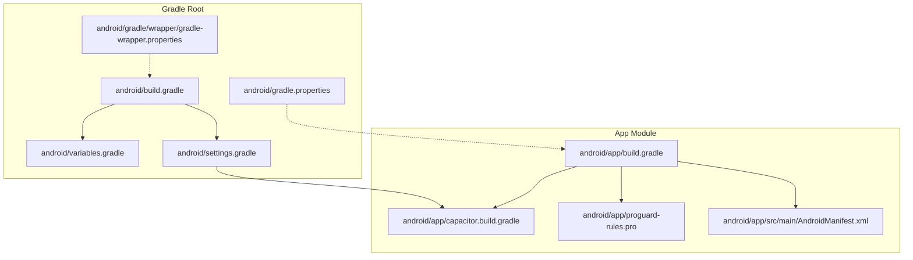
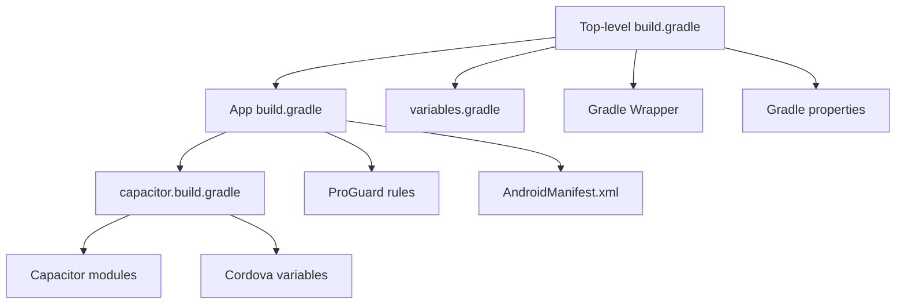
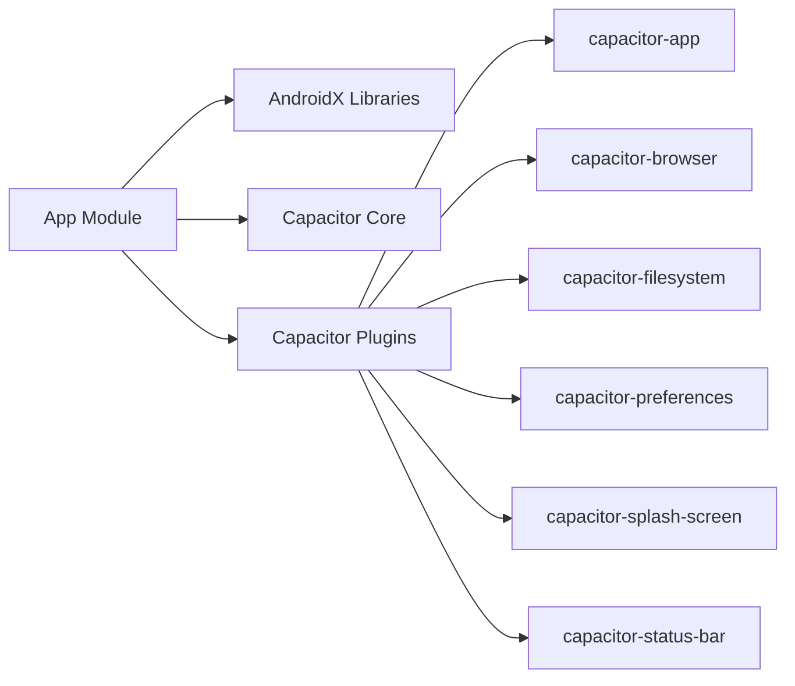
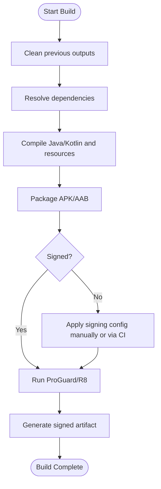

# Build & Deployment

<cite>
**Referenced Files in This Document**
- [android/build.gradle](file://android/build.gradle)
- [android/app/build.gradle](file://android/app/build.gradle)
- [android/variables.gradle](file://android/variables.gradle)
- [android/gradle.properties](file://android/gradle.properties)
- [android/settings.gradle](file://android/settings.gradle)
- [android/gradle/wrapper/gradle-wrapper.properties](file://android/gradle/wrapper/gradle-wrapper.properties)
- [android/app/capacitor.build.gradle](file://android/app/capacitor.build.gradle)
- [android/app/proguard-rules.pro](file://android/app/proguard-rules.pro)
- [android/app/src/main/AndroidManifest.xml](file://android/app/src/main/AndroidManifest.xml)
</cite>

## Table of Contents
1. Introduction
2. Project Structure
3. Core Components
4. Architecture Overview
5. Detailed Component Analysis
6. Dependency Analysis
7. Performance Considerations
8. Troubleshooting Guide
9. Conclusion
10. Appendices

## Introduction
This document explains how to build and deploy the Android application for Project Anime using Gradle and Capacitor. It covers the Gradle configuration, dependency management, signing setup, build variants, end-to-end build process (debug to release), APK/AAB generation, code signing, optimization, Google Play Store submission preparation, CI/CD pipeline setup, and troubleshooting common issues.

## Project Structure
The Android module is a standard Gradle-based project integrated with Capacitor:
- Root-level Gradle files configure repositories, plugins, and shared variables.
- The app module defines compile options, dependencies, build types, and optional Google Services integration.
- Capacitor-specific configuration is applied via an included script that adds required modules and Cordova plugin support.
- ProGuard rules are provided for release builds.
- The Android manifest declares the main activity, permissions, and FileProvider.

**Diagram sources**
- [android/build.gradle:1-30](file://android/build.gradle#L1-L30)
- [android/app/build.gradle:1-55](file://android/app/build.gradle#L1-L55)
- [android/variables.gradle:1-16](file://android/variables.gradle#L1-L16)
- [android/gradle.properties:1-23](file://android/gradle.properties#L1-L23)
- [android/settings.gradle:1-5](file://android/settings.gradle#L1-L5)
- [android/gradle/wrapper/gradle-wrapper.properties:1-8](file://android/gradle/wrapper/gradle-wrapper.properties#L1-L8)
- [android/app/capacitor.build.gradle:1-25](file://android/app/capacitor.build.gradle#L1-L25)
- [android/app/proguard-rules.pro:1-22](file://android/app/proguard-rules.pro#L1-L22)
- [android/app/src/main/AndroidManifest.xml:1-42](file://android/app/src/main/AndroidManifest.xml#L1-L42)

**Section sources**
- [android/build.gradle:1-30](file://android/build.gradle#L1-L30)
- [android/app/build.gradle:1-55](file://android/app/build.gradle#L1-L55)
- [android/variables.gradle:1-16](file://android/variables.gradle#L1-L16)
- [android/gradle.properties:1-23](file://android/gradle.properties#L1-L23)
- [android/settings.gradle:1-5](file://android/settings.gradle#L1-L5)
- [android/gradle/wrapper/gradle-wrapper.properties:1-8](file://android/gradle/wrapper/gradle-wrapper.properties#L1-L8)
- [android/app/capacitor.build.gradle:1-25](file://android/app/capacitor.build.gradle#L1-L25)
- [android/app/proguard-rules.pro:1-22](file://android/app/proguard-rules.pro#L1-L22)
- [android/app/src/main/AndroidManifest.xml:1-42](file://android/app/src/main/AndroidManifest.xml#L1-L42)

## Core Components
- Top-level Gradle configuration:
  - Repositories: Google and Maven Central.
  - Android Gradle Plugin and Google Services classpath.
  - Shared variables imported from variables.gradle.
- App module configuration:
  - Namespace, compile/target SDK versions sourced from variables.gradle.
  - DefaultConfig includes applicationId, versionCode/versionName, instrumentation runner, and AAPT asset ignore pattern.
  - BuildTypes: release with minify enabled flag and ProGuard files referenced.
  - Dependencies include AndroidX libraries, Capacitor core and plugins, and test libraries.
  - Optional Google Services plugin applied if google-services.json exists.
- Capacitor integration:
  - Java 21 compatibility set via capacitor.build.gradle.
  - Capacitor modules added as project dependencies.
  - Cordova variables included for plugin support.
- ProGuard rules:
  - Placeholder rules for WebView JS interfaces and debugging attributes.
- Manifest:
  - Declares MainActivity as launcher, INTERNET permission, and FileProvider for file sharing.

**Section sources**
- [android/build.gradle:1-30](file://android/build.gradle#L1-L30)
- [android/app/build.gradle:1-55](file://android/app/build.gradle#L1-L55)
- [android/variables.gradle:1-16](file://android/variables.gradle#L1-L16)
- [android/app/capacitor.build.gradle:1-25](file://android/app/capacitor.build.gradle#L1-L25)
- [android/app/proguard-rules.pro:1-22](file://android/app/proguard-rules.pro#L1-L22)
- [android/app/src/main/AndroidManifest.xml:1-42](file://android/app/src/main/AndroidManifest.xml#L1-L42)

## Architecture Overview
The build architecture layers Gradle configuration, Capacitor modules, and Android packaging into a cohesive pipeline. The top-level build configures tooling and repositories; the app module wires dependencies and build types; Capacitor contributes runtime modules and Cordova plugin support; ProGuard handles shrinking/obfuscation for release; the manifest defines runtime behavior.

**Diagram sources**
- [android/build.gradle:1-30](file://android/build.gradle#L1-L30)
- [android/app/build.gradle:1-55](file://android/app/build.gradle#L1-L55)
- [android/variables.gradle:1-16](file://android/variables.gradle#L1-L16)
- [android/app/capacitor.build.gradle:1-25](file://android/app/capacitor.build.gradle#L1-L25)
- [android/app/proguard-rules.pro:1-22](file://android/app/proguard-rules.pro#L1-L22)
- [android/app/src/main/AndroidManifest.xml:1-42](file://android/app/src/main/AndroidManifest.xml#L1-L42)
- [android/gradle/wrapper/gradle-wrapper.properties:1-8](file://android/gradle/wrapper/gradle-wrapper.properties#L1-L8)
- [android/gradle.properties:1-23](file://android/gradle.properties#L1-L23)

## Detailed Component Analysis

### Gradle Build System Configuration
- Repositories and Plugins:
  - Google and Maven Central repositories are declared at the root level.
  - Android Gradle Plugin and Google Services plugin are registered in the buildscript classpath.
- Shared Variables:
  - SDK versions and library versions are centralized in variables.gradle and consumed by the app module.
- App Module Defaults:
  - Application ID, SDK targets, and version metadata are defined in defaultConfig.
  - AAPT ignores specific assets patterns suitable for modern web apps.
- Build Types:
  - Release build type references ProGuard files; minification can be toggled.
- Optional Google Services:
  - The Google Services plugin is conditionally applied when google-services.json is present.

**Section sources**
- [android/build.gradle:1-30](file://android/build.gradle#L1-L30)
- [android/app/build.gradle:1-55](file://android/app/build.gradle#L1-L55)
- [android/variables.gradle:1-16](file://android/variables.gradle#L1-L16)

### Dependency Management
- AndroidX Libraries:
  - AppCompat, CoordinatorLayout, Core Splash Screen, and others are pulled via versions defined in variables.gradle.
- Capacitor Modules:
  - Core Capacitor Android module and several plugins are included as project dependencies through capacitor.build.gradle.
- Cordova Integration:
  - Cordova variables are included to support any Cordova-based plugins.
- Test Dependencies:
  - JUnit and AndroidX test libraries are configured for unit and instrumented tests.

**Section sources**
- [android/app/build.gradle:27-55](file://android/app/build.gradle#L27-L55)
- [android/app/capacitor.build.gradle:10-19](file://android/app/capacitor.build.gradle#L10-L19)
- [android/variables.gradle:1-16](file://android/variables.gradle#L1-L16)

### Signing Configurations
- Current State:
  - No explicit signingConfigs block is present in the app module.
  - Release builds will not be signed unless configured locally or via environment variables.
- Recommended Setup:
  - Add a signing configuration referencing a keystore and credentials stored securely (e.g., via environment variables).
  - Apply the signing configuration to the release buildType so generated artifacts are signed automatically.
  - Ensure the keystore is managed outside version control and distributed securely to CI.

[No sources needed since this section provides recommended guidance beyond current configuration]

### Build Variants and Types
- Variants:
  - Debug variant is implicitly available for development and testing.
  - Release variant is explicitly defined with ProGuard rules and optional minification.
- Versioning:
  - versionCode and versionName are set in defaultConfig and should be incremented per release.

**Section sources**
- [android/app/build.gradle:6-24](file://android/app/build.gradle#L6-L24)

### Optimization and Shrinking
- ProGuard Rules:
  - ProGuard files are referenced in the release build type.
  - Placeholder rules exist for WebView JavaScript interfaces and debugging attributes.
- Minification:
  - The release build type has a minifyEnabled flag that can be toggled based on needs.

**Section sources**
- [android/app/build.gradle:19-24](file://android/app/build.gradle#L19-L24)
- [android/app/proguard-rules.pro:1-22](file://android/app/proguard-rules.pro#L1-L22)

### Capacitor Integration
- Java Compatibility:
  - Java 21 source and target compatibility are enforced via capacitor.build.gradle.
- Modules:
  - Capacitor modules (app, browser, filesystem, preferences, splash-screen, status-bar) are included as dependencies.
- Post-build Hook:
  - A postBuildExtras hook is supported for additional customizations.

**Section sources**
- [android/app/capacitor.build.gradle:1-25](file://android/app/capacitor.build.gradle#L1-L25)

### Android Manifest and Runtime Behavior
- Launcher Activity:
  - MainActivity is declared as exported and handles orientation/config changes.
- Permissions:
  - INTERNET permission is declared for network access.
- FileProvider:
  - FileProvider is configured for secure file sharing within the app’s package namespace.

**Section sources**
- [android/app/src/main/AndroidManifest.xml:1-42](file://android/app/src/main/AndroidManifest.xml#L1-L42)

## Dependency Analysis
The app module depends on AndroidX libraries and Capacitor modules. Capacitor modules depend on Android framework APIs and may bring in their own transitive dependencies. The top-level build ensures consistent repository access across modules.

**Diagram sources**
- [android/app/build.gradle:33-43](file://android/app/build.gradle#L33-L43)
- [android/app/capacitor.build.gradle:11-19](file://android/app/capacitor.build.gradle#L11-L19)

**Section sources**
- [android/app/build.gradle:33-43](file://android/app/build.gradle#L33-L43)
- [android/app/capacitor.build.gradle:11-19](file://android/app/capacitor.build.gradle#L11-L19)

## Performance Considerations
- Enable minification and resource shrinking for release builds to reduce APK size and improve startup time.
- Use R8 (default with AGP 8.x) for advanced optimizations; ensure ProGuard rules are minimal and targeted.
- Keep only necessary Capacitor modules to minimize overhead.
- Configure JVM args in gradle.properties for faster builds if needed.
- Avoid large assets in the app bundle; prefer remote loading where appropriate.

[No sources needed since this section provides general guidance]

## Troubleshooting Guide

Common build issues:
- Missing google-services.json:
  - The Google Services plugin is conditionally applied; without it, push notifications will not work.
- Java version mismatch:
  - Java 21 compatibility is enforced; ensure your JDK matches the expected version.
- Repository resolution failures:
  - Verify internet connectivity and that Google/Maven Central repositories are accessible.
- ProGuard errors:
  - If minification fails, review ProGuard rules and add keep rules for classes used via reflection or WebView bridges.

Signing problems:
- Unsigned release builds:
  - Without a signing configuration, release artifacts remain unsigned. Add a signing config and apply it to the release buildType.
- Keystore issues:
  - Ensure keystore paths and passwords are correctly configured and kept secret.

Store rejection scenarios:
- Target SDK requirements:
  - Ensure targetSdkVersion meets Google Play Store minimums.
- Permissions and privacy:
  - Review declared permissions and provide clear privacy disclosures.
- Content policies:
  - Ensure app content complies with store guidelines.

**Section sources**
- [android/app/build.gradle:47-54](file://android/app/build.gradle#L47-L54)
- [android/app/capacitor.build.gradle:3-8](file://android/app/capacitor.build.gradle#L3-L8)
- [android/app/build.gradle:19-24](file://android/app/build.gradle#L19-L24)
- [android/variables.gradle:1-16](file://android/variables.gradle#L1-L16)

## Conclusion
Project Anime’s Android build is a standard Gradle setup enhanced by Capacitor. The configuration centralizes versions, integrates Capacitor modules, and prepares for release builds with ProGuard. To complete production readiness, implement signing configurations, optimize release builds, prepare store assets, and automate builds via CI/CD. Following the guidance here will streamline development, ensure reproducible builds, and facilitate smooth store submissions.

[No sources needed since this section summarizes without analyzing specific files]

## Appendices

### End-to-End Build Process

[No sources needed since this diagram shows conceptual workflow, not actual code structure]

### Google Play Store Submission Checklist
- Update versionCode and versionName for each release.
- Generate a signed release bundle (AAB) or APK as required.
- Prepare store listing: title, description, screenshots, feature graphic, and category.
- Provide privacy policy and data safety forms as required.
- Ensure targetSdkVersion meets current Play Store requirements.
- Test internally via Play Console internal testing track before rollout.

[No sources needed since this section provides general guidance]

### CI/CD Pipeline Setup
- Environment variables:
  - Store keystore, key alias, and passwords securely in CI secrets.
- Steps:
  - Checkout code, cache Gradle dependencies, run assembleRelease, sign artifacts, upload to Play Console.
- Artifacts:
  - Publish signed AAB/APK and generate changelog notes.
- Notifications:
  - Notify team on success/failure and publish to internal tracks automatically.

[No sources needed since this section provides general guidance]