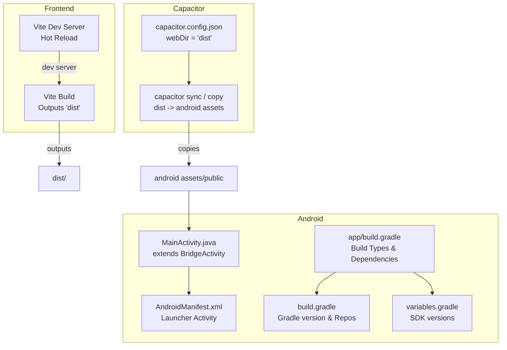
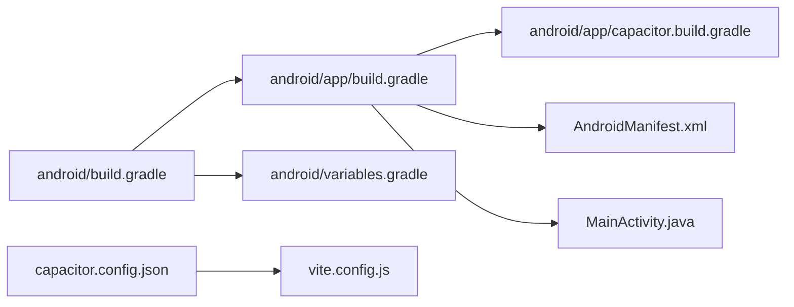

# Development Builds

<cite>
**Referenced Files in This Document**
- [package.json](file://package.json)
- [vite.config.js](file://vite.config.js)
- [capacitor.config.json](file://capacitor.config.json)
- [android/app/build.gradle](file://android/app/build.gradle)
- [android/build.gradle](file://android/build.gradle)
- [android/gradle.properties](file://android/gradle.properties)
- [android/variables.gradle](file://android/variables.gradle)
- [android/app/capacitor.build.gradle](file://android/app/capacitor.build.gradle)
- [android/app/src/main/java/com/eetnet/app/MainActivity.java](file://android/app/src/main/java/com/eetnet/app/MainActivity.java)
- [android/app/src/main/AndroidManifest.xml](file://android/app/src/main/AndroidManifest.xml)
- [README.md](file://README.md)
</cite>

## Table of Contents
1. [Introduction](#introduction)
2. [Project Structure](#project-structure)
3. [Core Components](#core-components)
4. [Architecture Overview](#architecture-overview)
5. [Detailed Component Analysis](#detailed-component-analysis)
6. [Dependency Analysis](#dependency-analysis)
7. [Performance Considerations](#performance-considerations)
8. [Troubleshooting Guide](#troubleshooting-guide)
9. [Conclusion](#conclusion)

## Introduction
This document explains how to build, run, and debug the Android application for Project Anime using Capacitor and Vite. It covers environment setup, running debug builds, syncing web assets with the native app, hot reloading during development, debugging with Android Studio, logging strategies, running on emulators and physical devices, and profiling performance to find memory leaks or bottlenecks.

## Project Structure
The project is a React + Vite frontend packaged into an Android app via Capacitor:
- Frontend build output goes to dist and is copied into the Android assets by Capacitor.
- The Android module uses Gradle to compile and package the app.
- A minimal MainActivity extends Capacitor’s BridgeActivity to host the web content.



**Diagram sources**
- [vite.config.js:1-23](file://vite.config.js#L1-L23)
- [capacitor.config.json:1-32](file://capacitor.config.json#L1-L32)
- [android/app/src/main/AndroidManifest.xml:1-42](file://android/app/src/main/AndroidManifest.xml#L1-L42)
- [android/app/src/main/java/com/eetnet/app/MainActivity.java:1-6](file://android/app/src/main/java/com/eetnet/app/MainActivity.java#L1-L6)
- [android/app/build.gradle:1-55](file://android/app/build.gradle#L1-L55)
- [android/build.gradle:1-30](file://android/build.gradle#L1-L30)
- [android/variables.gradle:1-16](file://android/variables.gradle#L1-L16)

**Section sources**
- [package.json:6-12](file://package.json#L6-L12)
- [capacitor.config.json:1-32](file://capacitor.config.json#L1-L32)
- [android/app/build.gradle:1-55](file://android/app/build.gradle#L1-L55)
- [android/build.gradle:1-30](file://android/build.gradle#L1-L30)
- [android/variables.gradle:1-16](file://android/variables.gradle#L1-L16)
- [android/app/src/main/AndroidManifest.xml:1-42](file://android/app/src/main/AndroidManifest.xml#L1-L42)
- [android/app/src/main/java/com/eetnet/app/MainActivity.java:1-6](file://android/app/src/main/java/com/eetnet/app/MainActivity.java#L1-L6)

## Core Components
- Frontend dev server (Vite): Provides fast hot reload for UI changes.
- Capacitor configuration: Defines the web directory and plugin settings; controls how assets are synced into Android.
- Android Gradle build: Compiles Java/Kotlin code and packages the app; defines SDK versions and build types.
- MainActivity: Minimal entry point that hosts the web content via Capacitor.

Key responsibilities:
- Vite serves and rebuilds the web app quickly during development.
- Capacitor copies built assets into the Android module so the native app can load them.
- Gradle manages dependencies and build variants for debug/release.
- Android manifest declares permissions and the launcher activity.

**Section sources**
- [package.json:6-12](file://package.json#L6-L12)
- [vite.config.js:1-23](file://vite.config.js#L1-L23)
- [capacitor.config.json:1-32](file://capacitor.config.json#L1-L32)
- [android/app/build.gradle:1-55](file://android/app/build.gradle#L1-L55)
- [android/app/src/main/AndroidManifest.xml:1-42](file://android/app/src/main/AndroidManifest.xml#L1-L42)
- [android/app/src/main/java/com/eetnet/app/MainActivity.java:1-6](file://android/app/src/main/java/com/eetnet/app/MainActivity.java#L1-L6)

## Architecture Overview
The development workflow connects Vite’s dev server with Capacitor and the Android runtime. During development, you typically run the Vite dev server locally and use Capacitor to serve or sync assets to the device/emulator. For production-like builds, Vite outputs static files to dist, which Capacitor copies into the Android assets when syncing.

```mermaid
sequenceDiagram
participant Dev as "Developer"
participant Vite as "Vite Dev Server"
participant Cap as "Capacitor CLI"
participant And as "Android App (BridgeActivity)"
participant Web as "WebView"
Dev->>Vite : Start dev server
Dev->>Cap : Run sync / serve
Cap->>And : Copy web assets (dist) to Android assets
And->>Web : Load index.html from assets
Vite-->>Dev : Hot reload updates
Note over Vite,And : In dev, you may also proxy API calls to local backend
```

**Diagram sources**
- [vite.config.js:1-23](file://vite.config.js#L1-L23)
- [capacitor.config.json:1-32](file://capacitor.config.json#L1-L32)
- [android/app/src/main/java/com/eetnet/app/MainActivity.java:1-6](file://android/app/src/main/java/com/eetnet/app/MainActivity.java#L1-L6)

## Detailed Component Analysis

### Environment Setup
- Install Node.js and npm/yarn/pnpm as needed.
- Ensure Android SDK and emulator/device are configured for Android Studio.
- Install Capacitor CLI if not already present globally or via npx.

Notes:
- The project includes scripts for building and previewing the web app.
- The Android module uses Gradle with specific SDK versions defined centrally.

**Section sources**
- [package.json:6-12](file://package.json#L6-L12)
- [android/variables.gradle:1-16](file://android/variables.gradle#L1-L16)
- [android/build.gradle:1-30](file://android/build.gradle#L1-L30)

### Running Debug Builds
To build and run the Android app in debug mode:
- Use the Android Gradle wrapper to assemble a debug APK/AAB and install it on a connected device or emulator.
- Alternatively, open the android folder in Android Studio and run the default debug configuration.

What happens under the hood:
- Gradle compiles the Android code and packages the app.
- If you have previously synced Capacitor assets, they are included in the build.

**Section sources**
- [android/app/build.gradle:19-24](file://android/app/build.gradle#L19-L24)
- [android/build.gradle:1-30](file://android/build.gradle#L1-L30)

### Capacitor Sync Process
Capacitor synchronizes your web build output into the Android assets directory. The configuration specifies where the web directory is located. When you run sync, Capacitor copies the built assets into the Android module so the app can load them at runtime.

Key points:
- The web directory is set in the Capacitor configuration.
- The generated Android assets include the web app’s index.html and related resources.
- After changing web assets, re-run the sync to update the Android bundle.

**Section sources**
- [capacitor.config.json:1-32](file://capacitor.config.json#L1-L32)

### Hot Reloading During Development
For rapid feedback while developing the UI:
- Start the Vite dev server to get instant hot reload of frontend changes.
- You can either:
  - Serve the Capacitor app pointing to the Vite dev server URL, or
  - Rebuild and sync frequently to refresh the bundled assets in the Android app.

Proxying:
- The Vite dev server proxies certain paths to external services and to a local backend, simplifying development without modifying base URLs.

**Section sources**
- [package.json:6-12](file://package.json#L6-L12)
- [vite.config.js:7-21](file://vite.config.js#L7-L21)

### Running on Emulators and Physical Devices
You can run the app using:
- Android Studio: Connect a device or start an emulator, then run the debug configuration.
- Command line: Use the Gradle wrapper to assemble and install the debug build.

Ensure:
- USB debugging is enabled for physical devices.
- The correct device or emulator is selected in Android Studio or via command-line flags.

**Section sources**
- [android/app/src/main/AndroidManifest.xml:12-25](file://android/app/src/main/AndroidManifest.xml#L12-L25)

### Debugging Techniques Using Android Studio
- Open the android folder in Android Studio to access the full Android toolchain.
- Attach the debugger to the running app to step through Java/Kotlin code.
- Inspect WebView logs and network requests using browser developer tools or Android Studio’s network inspector.
- Use Logcat to view runtime logs from both native and web layers.

Tips:
- Verify the app loads the expected assets after sync.
- Check for mixed content or CORS issues when loading remote resources.

**Section sources**
- [android/app/src/main/java/com/eetnet/app/MainActivity.java:1-6](file://android/app/src/main/java/com/eetnet/app/MainActivity.java#L1-L6)
- [android/app/src/main/AndroidManifest.xml:38-41](file://android/app/src/main/AndroidManifest.xml#L38-L41)

### Logging Strategies for Development
- Use standard console logging in your web code; inspect via Chrome DevTools or Android Studio’s log capture.
- Capture native logs with Logcat to diagnose startup or permission issues.
- Validate network requests and responses to ensure the backend endpoints are reachable.

Environment considerations:
- The README documents environment variables for the backend and frontend, including API base URLs used during development.

**Section sources**
- [README.md:111-129](file://README.md#L111-L129)

### Building for Release
When ready to distribute:
- Build the release variant using Gradle.
- Configure signing and minification according to your distribution needs.

Note:
- The current configuration disables minification in release by default but applies ProGuard rules.

**Section sources**
- [android/app/build.gradle:19-24](file://android/app/build.gradle#L19-L24)

## Dependency Analysis
The Android build depends on:
- Gradle and Android SDK versions defined in root-level files.
- Capacitor Android libraries and plugins declared in the app module.
- The web assets produced by Vite and synchronized by Capacitor.



**Diagram sources**
- [android/build.gradle:1-30](file://android/build.gradle#L1-L30)
- [android/app/build.gradle:1-55](file://android/app/build.gradle#L1-L55)
- [android/variables.gradle:1-16](file://android/variables.gradle#L1-L16)
- [android/app/capacitor.build.gradle:1-24](file://android/app/capacitor.build.gradle#L1-L24)
- [android/app/src/main/AndroidManifest.xml:1-42](file://android/app/src/main/AndroidManifest.xml#L1-L42)
- [android/app/src/main/java/com/eetnet/app/MainActivity.java:1-6](file://android/app/src/main/java/com/eetnet/app/MainActivity.java#L1-L6)
- [vite.config.js:1-23](file://vite.config.js#L1-L23)
- [capacitor.config.json:1-32](file://capacitor.config.json#L1-L32)

**Section sources**
- [android/build.gradle:1-30](file://android/build.gradle#L1-L30)
- [android/app/build.gradle:1-55](file://android/app/build.gradle#L1-L55)
- [android/variables.gradle:1-16](file://android/variables.gradle#L1-L16)
- [android/app/capacitor.build.gradle:1-24](file://android/app/capacitor.build.gradle#L1-L24)

## Performance Considerations
- Prefer the Vite dev server for fast iteration on UI changes.
- Keep Capacitor sync steps minimal during development by only rebuilding when necessary.
- Profile the Android app using Android Studio’s Profiler:
  - CPU Profiler to identify heavy computations.
  - Memory Profiler to detect leaks and excessive allocations.
  - Network Profiler to analyze slow or failing requests.
- Use Logcat filters to focus on relevant logs during profiling sessions.

[No sources needed since this section provides general guidance]

## Troubleshooting Guide
Common issues and resolutions:
- Assets not updating: Re-run the Capacitor sync to copy the latest web build into Android assets.
- Mixed content errors: Ensure HTTPS resources are loaded or adjust Capacitor settings to allow mixed content in development.
- Backend connectivity: Confirm the Vite dev server proxies and local backend are running and accessible.
- Build failures: Verify Gradle and Android SDK versions match the project configuration.

References:
- Environment variables and local development instructions are documented in the project README.

**Section sources**
- [capacitor.config.json:26-30](file://capacitor.config.json#L26-L30)
- [vite.config.js:7-21](file://vite.config.js#L7-L21)
- [README.md:111-129](file://README.md#L111-L129)

## Conclusion
Project Anime’s Android development workflow combines Vite’s fast frontend iteration with Capacitor’s seamless asset synchronization into a native Android app. By leveraging Android Studio for debugging and profiling, and following the sync and build steps outlined here, you can efficiently develop, test, and optimize the app across emulators and physical devices.

[No sources needed since this section summarizes without analyzing specific files]