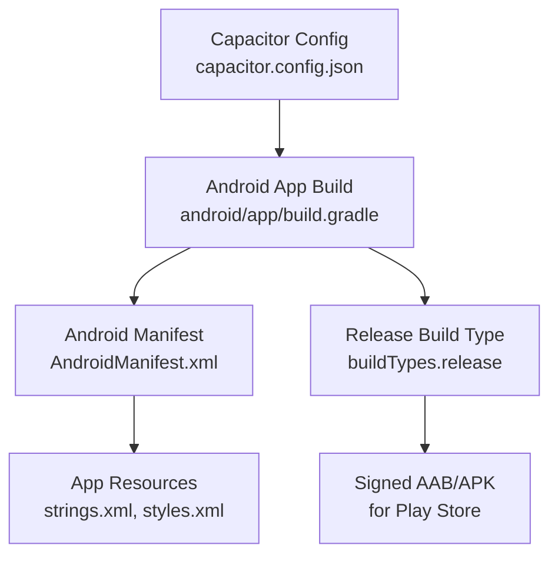
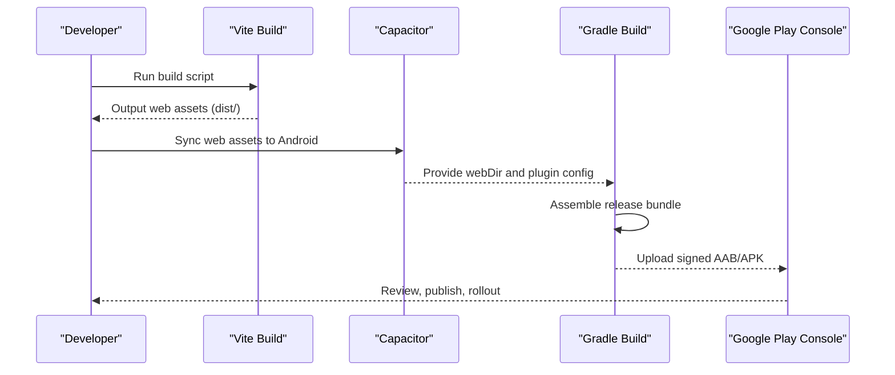
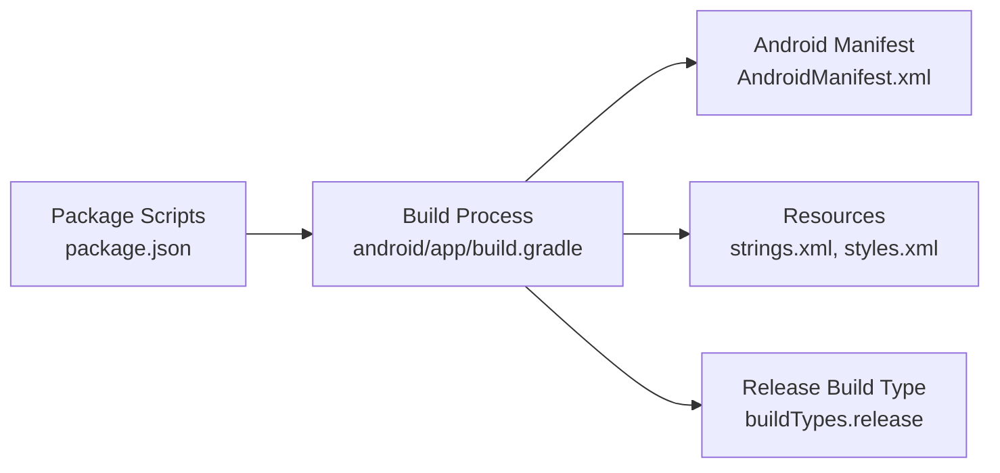

# Google Play Store Deployment

<cite>
**Referenced Files in This Document**
- [android/app/build.gradle](file://android/app/build.gradle)
- [android/app/src/main/AndroidManifest.xml](file://android/app/src/main/AndroidManifest.xml)
- [capacitor.config.json](file://capacitor.config.json)
- [package.json](file://package.json)
- [README.md](file://README.md)
- [android/app/src/main/res/values/strings.xml](file://android/app/src/main/res/values/strings.xml)
- [android/app/src/main/res/values/styles.xml](file://android/app/src/main/res/values/styles.xml)
</cite>

## Table of Contents
1. [Introduction](#introduction)
2. [Project Structure](#project-structure)
3. [Core Components](#core-components)
4. [Architecture Overview](#architecture-overview)
5. [Detailed Component Analysis](#detailed-component-analysis)
6. [Dependency Analysis](#dependency-analysis)
7. [Performance Considerations](#performance-considerations)
8. [Troubleshooting Guide](#troubleshooting-guide)
9. [Conclusion](#conclusion)
10. [Appendices](#appendices)

## Introduction
This document provides a complete, step-by-step guide to publishing Project Anime on the Google Play Store. It covers app store listing creation (title, description, keywords, category), preparing screenshots and promotional materials, privacy policy requirements, content rating, uploading builds, managing versions, staged rollouts, post-launch monitoring, handling reviews, and managing updates through the Play Console. The guidance is tailored to this Capacitor-based Android project and references relevant configuration files within the repository.

## Project Structure
Project Anime is a web application packaged as an Android app using Capacitor. The Android module defines the package identity, versioning, permissions, and launcher activity. The build system compiles the web assets into the Android APK/AAB for distribution.

**Diagram sources**
- [capacitor.config.json:1-32](file://capacitor.config.json#L1-L32)
- [android/app/build.gradle:1-55](file://android/app/build.gradle#L1-L55)
- [android/app/src/main/AndroidManifest.xml:1-42](file://android/app/src/main/AndroidManifest.xml#L1-L42)
- [android/app/src/main/res/values/strings.xml:1-8](file://android/app/src/main/res/values/strings.xml#L1-L8)
- [android/app/src/main/res/values/styles.xml:1-22](file://android/app/src/main/res/values/styles.xml#L1-L22)

**Section sources**
- [capacitor.config.json:1-32](file://capacitor.config.json#L1-L32)
- [android/app/build.gradle:1-55](file://android/app/build.gradle#L1-L55)
- [android/app/src/main/AndroidManifest.xml:1-42](file://android/app/src/main/AndroidManifest.xml#L1-L42)
- [android/app/src/main/res/values/strings.xml:1-8](file://android/app/src/main/res/values/strings.xml#L1-L8)
- [android/app/src/main/res/values/styles.xml:1-22](file://android/app/src/main/res/values/styles.xml#L1-L22)

## Core Components
- Application Identity and Versioning
  - Package name and app identifier are defined in the Android build configuration and manifest.
  - Version code and version name are set in the Android build configuration.
- Permissions and Capabilities
  - Internet access is declared in the manifest for network requests.
- UI and Branding
  - App label and icons are configured via resources and themes.
- Web-to-Native Packaging
  - Capacitor config points to the built web directory and configures splash screen and status bar behavior.

Key implementation references:
- Application ID, versioning, and release build type: [android/app/build.gradle:1-55](file://android/app/build.gradle#L1-L55)
- Launcher activity and internet permission: [android/app/src/main/AndroidManifest.xml:1-42](file://android/app/src/main/AndroidManifest.xml#L1-L42)
- App name and custom URL scheme: [android/app/src/main/res/values/strings.xml:1-8](file://android/app/src/main/res/values/strings.xml#L1-L8)
- Splash and theme setup: [android/app/src/main/res/values/styles.xml:1-22](file://android/app/src/main/res/values/styles.xml#L1-L22)
- Capacitor packaging and runtime options: [capacitor.config.json:1-32](file://capacitor.config.json#L1-L32)

**Section sources**
- [android/app/build.gradle:1-55](file://android/app/build.gradle#L1-L55)
- [android/app/src/main/AndroidManifest.xml:1-42](file://android/app/src/main/AndroidManifest.xml#L1-L42)
- [android/app/src/main/res/values/strings.xml:1-8](file://android/app/src/main/res/values/strings.xml#L1-L8)
- [android/app/src/main/res/values/styles.xml:1-22](file://android/app/src/main/res/values/styles.xml#L1-L22)
- [capacitor.config.json:1-32](file://capacitor.config.json#L1-L32)

## Architecture Overview
The deployment pipeline integrates frontend build outputs with the Android wrapper to produce a distributable artifact for the Play Store.

**Diagram sources**
- [package.json:1-45](file://package.json#L1-L45)
- [capacitor.config.json:1-32](file://capacitor.config.json#L1-L32)
- [android/app/build.gradle:1-55](file://android/app/build.gradle#L1-L55)

## Detailed Component Analysis

### App Store Listing Creation
- Title
  - Use the app’s display name from resources for consistency across platforms.
  - Reference: [android/app/src/main/res/values/strings.xml:1-8](file://android/app/src/main/res/values/strings.xml#L1-L8)
- Description
  - Write a concise, user-focused short description and a detailed long description highlighting features (streaming aggregator for anime, dramas, manhwa).
  - Include platform capabilities and any backend dependencies if relevant to users.
- Keywords
  - Choose search terms that reflect core functionality (e.g., anime streaming, Asian drama, webtoon reader).
- Category Selection
  - Select the most appropriate category based on primary use (e.g., Entertainment or Video Players & Editors).
- Privacy Policy
  - Provide a publicly accessible privacy policy URL in the Play Console. Ensure it covers data collection, third-party services, and user rights.
- Content Rating
  - Complete the content questionnaire in the Play Console to determine the official rating.

No direct file analysis required for this section.

### Screenshot and Promotional Material Preparation
- Screenshots
  - Prepare device-appropriate screenshots for multiple screen sizes and orientations.
  - Ensure they showcase key flows: home feed, detail views, playback, and reading modes.
- Icon and Graphics
  - Use high-resolution app icon assets already present in the Android resources.
  - Reference: [android/app/src/main/res/mipmap-hdpi/ic_launcher.png](file://android/app/src/main/res/mipmap-hdpi/ic_launcher.png)
- Feature Graphic
  - Create a compelling feature graphic sized per Play Store guidelines.

No direct file analysis required for this section.

### Privacy Policy Requirements
- Host a privacy policy page online and link it in the Play Console.
- Cover data usage, analytics, third-party APIs, and user controls.
- Ensure the policy is easily accessible from your website and referenced in the store listing.

No direct file analysis required for this section.

### Content Rating Procedures
- Complete the content rating questionnaire in the Play Console.
- Answer questions about violence, language, sexual content, and other categories accurately.
- Submit for review; the rating will be displayed on your store listing.

No direct file analysis required for this section.

### Uploading Builds and Managing Versions
- Build the Android app bundle (AAB) for release.
- Increment versionCode and update versionName before each upload.
- Sign the bundle with a secure keystore.
- Upload the signed AAB to the Play Console and select the target track (Internal, Closed, Open, Production).

References:
- Versioning and build types: [android/app/build.gradle:1-55](file://android/app/build.gradle#L1-L55)
- Application identity: [android/app/build.gradle:1-55](file://android/app/build.gradle#L1-L55), [android/app/src/main/AndroidManifest.xml:1-42](file://android/app/src/main/AndroidManifest.xml#L1-L42)

**Section sources**
- [android/app/build.gradle:1-55](file://android/app/build.gradle#L1-L55)
- [android/app/src/main/AndroidManifest.xml:1-42](file://android/app/src/main/AndroidManifest.xml#L1-L42)

### Staged Rollouts
- Start with a small percentage of users (e.g., 1–5%) to monitor stability and performance.
- Gradually increase rollout percentages after validating metrics and reviews.
- Use separate tracks for testing (Internal/Closed) and production releases.

No direct file analysis required for this section.

### Monitoring Post-Launch Performance
- Track crash reports, ANRs, and performance metrics in the Play Console.
- Monitor user acquisition, retention, and engagement.
- Set up alerts for critical issues and regressions.

No direct file analysis required for this section.

### Handling User Reviews
- Respond promptly to user feedback and address reported issues.
- Use reviews to prioritize improvements and bug fixes.
- Encourage satisfied users to leave positive reviews.

No direct file analysis required for this section.

### Managing Updates Through the Play Console
- Prepare updated assets and metadata changes alongside new builds.
- Maintain consistent versioning strategy across platforms.
- Communicate notable changes in release notes.

No direct file analysis required for this section.

## Dependency Analysis
The Android build depends on Capacitor and standard Android libraries. The manifest declares necessary permissions and components.

**Diagram sources**
- [package.json:1-45](file://package.json#L1-L45)
- [android/app/build.gradle:1-55](file://android/app/build.gradle#L1-L55)
- [android/app/src/main/AndroidManifest.xml:1-42](file://android/app/src/main/AndroidManifest.xml#L1-L42)
- [android/app/src/main/res/values/strings.xml:1-8](file://android/app/src/main/res/values/strings.xml#L1-L8)
- [android/app/src/main/res/values/styles.xml:1-22](file://android/app/src/main/res/values/styles.xml#L1-L22)

**Section sources**
- [package.json:1-45](file://package.json#L1-L45)
- [android/app/build.gradle:1-55](file://android/app/build.gradle#L1-L55)
- [android/app/src/main/AndroidManifest.xml:1-42](file://android/app/src/main/AndroidManifest.xml#L1-L42)

## Performance Considerations
- Optimize web assets before bundling to reduce APK size and improve load times.
- Enable minification and resource shrinking in release builds when appropriate.
- Monitor network calls and ensure efficient caching strategies in the app.
- Validate performance on low-end devices during staging.

No direct file analysis required for this section.

## Troubleshooting Guide
Common issues and resolutions:
- Missing google-services.json
  - If push notifications are not needed, you can proceed without it; otherwise, add the correct configuration file.
  - Reference: [android/app/build.gradle:47-55](file://android/app/build.gradle#L47-L55)
- Permission errors
  - Ensure INTERNET permission is declared if network access is required.
  - Reference: [android/app/src/main/AndroidManifest.xml:38-42](file://android/app/src/main/AndroidManifest.xml#L38-L42)
- Launch issues
  - Verify the launcher activity is exported and has the correct intent filter.
  - Reference: [android/app/src/main/AndroidManifest.xml:12-25](file://android/app/src/main/AndroidManifest.xml#L12-L25)
- Theme and splash problems
  - Confirm theme settings and splash configuration in resources and Capacitor config.
  - References: [android/app/src/main/res/values/styles.xml:1-22](file://android/app/src/main/res/values/styles.xml#L1-L22), [capacitor.config.json:1-32](file://capacitor.config.json#L1-L32)

**Section sources**
- [android/app/build.gradle:47-55](file://android/app/build.gradle#L47-L55)
- [android/app/src/main/AndroidManifest.xml:12-25](file://android/app/src/main/AndroidManifest.xml#L12-L25)
- [android/app/src/main/AndroidManifest.xml:38-42](file://android/app/src/main/AndroidManifest.xml#L38-L42)
- [android/app/src/main/res/values/styles.xml:1-22](file://android/app/src/main/res/values/styles.xml#L1-L22)
- [capacitor.config.json:1-32](file://capacitor.config.json#L1-L32)

## Conclusion
Project Anime is ready for Play Store distribution with a well-defined Android configuration, clear versioning, and necessary permissions. Follow the steps outlined above to create a compelling store listing, prepare assets, manage versions, and monitor performance post-launch. Use staged rollouts to mitigate risk and iterate quickly based on user feedback and metrics.

## Appendices

### Build and Deploy Checklist
- Update versionCode and versionName in the Android build configuration.
- Ensure app icon and branding assets are up to date.
- Confirm permissions and manifest entries are correct.
- Build and sign the release bundle.
- Upload to Play Console and configure store listing, privacy policy, and content rating.
- Publish to a test track first, then gradually roll out to production.

**Section sources**
- [android/app/build.gradle:1-55](file://android/app/build.gradle#L1-L55)
- [android/app/src/main/AndroidManifest.xml:1-42](file://android/app/src/main/AndroidManifest.xml#L1-L42)
- [capacitor.config.json:1-32](file://capacitor.config.json#L1-L32)

### Backend and Frontend Notes Relevant to Distribution
- The frontend is built with Vite and deployed separately; ensure environment variables point to the correct backend endpoint.
- For mobile distribution, verify that network endpoints are reachable and CORS is properly configured.

**Section sources**
- [README.md:87-108](file://README.md#L87-L108)
- [README.md:132-140](file://README.md#L132-L140)