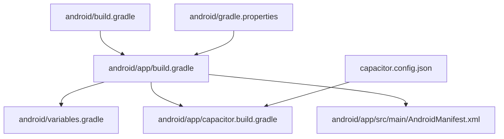
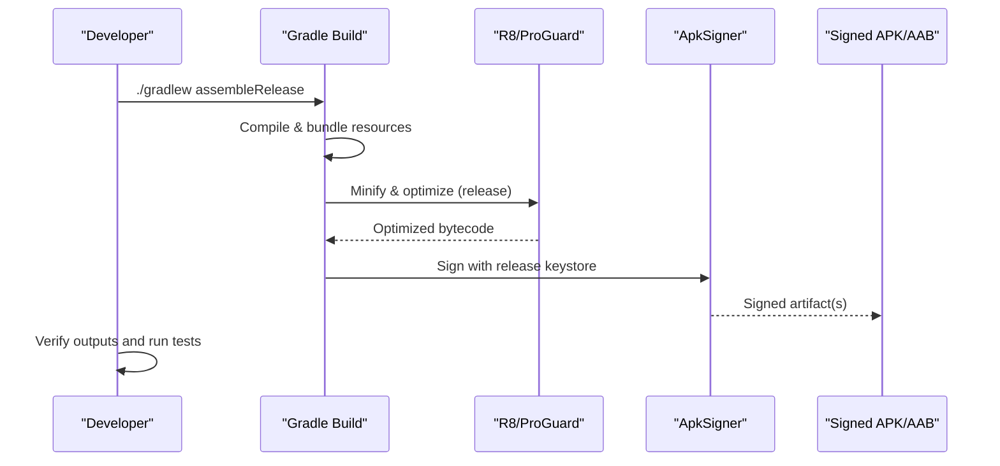
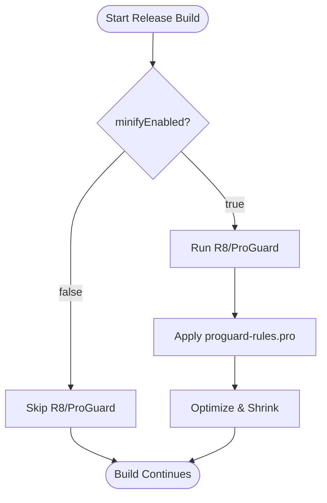
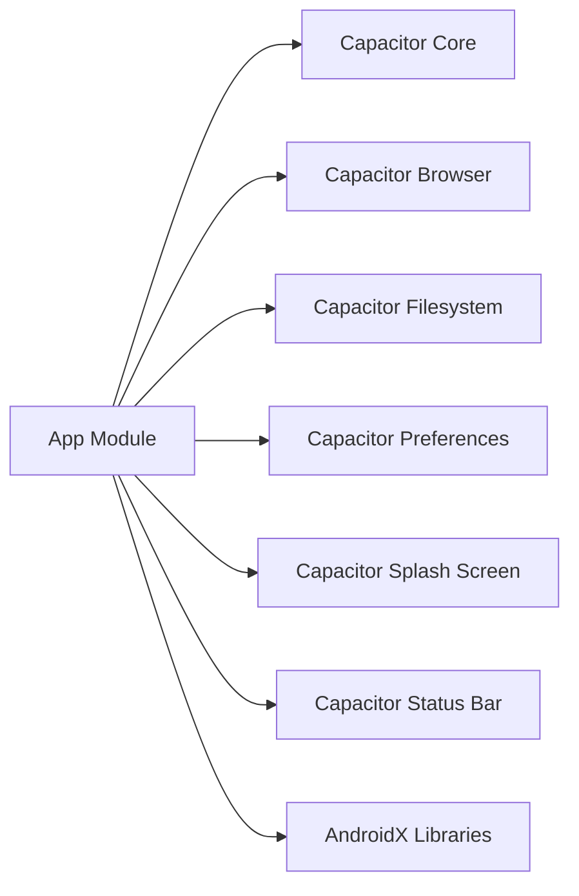

# Release Packaging

<cite>
**Referenced Files in This Document**
- [android/app/build.gradle](file://android/app/build.gradle)
- [android/app/proguard-rules.pro](file://android/app/proguard-rules.pro)
- [android/build.gradle](file://android/build.gradle)
- [android/gradle.properties](file://android/gradle.properties)
- [android/variables.gradle](file://android/variables.gradle)
- [android/app/capacitor.build.gradle](file://android/app/capacitor.build.gradle)
- [android/app/src/main/AndroidManifest.xml](file://android/app/src/main/AndroidManifest.xml)
- [capacitor.config.json](file://capacitor.config.json)
</cite>

## Table of Contents
1. Introduction
2. Project Structure
3. Core Components
4. Architecture Overview
5. Detailed Component Analysis
6. Dependency Analysis
7. Performance Considerations
8. Troubleshooting Guide
9. Conclusion
10. Appendices

## Introduction
This document explains how to package release builds for Project Anime’s Android application. It covers ProGuard/R8 configuration, keystore generation and management, multi-ABI APK generation, signing, build verification, and testing procedures. It also provides guidelines for creating optimized builds, reducing APK size, and ensuring compatibility across Android versions and device configurations.

## Project Structure
The Android module is a Capacitor-based app with Gradle build scripts that define SDK versions, dependencies, and build types. The web assets are bundled into the Android app via Capacitor.

**Diagram sources**
- [android/app/build.gradle:1-25](file://android/app/build.gradle#L1-L25)
- [android/variables.gradle:1-16](file://android/variables.gradle#L1-L16)
- [android/app/capacitor.build.gradle:1-25](file://android/app/capacitor.build.gradle#L1-L25)
- [android/app/src/main/AndroidManifest.xml:1-42](file://android/app/src/main/AndroidManifest.xml#L1-L42)
- [android/build.gradle:1-30](file://android/build.gradle#L1-L30)
- [android/gradle.properties:1-23](file://android/gradle.properties#L1-L23)
- [capacitor.config.json:1-32](file://capacitor.config.json#L1-L32)

**Section sources**
- [android/app/build.gradle:1-25](file://android/app/build.gradle#L1-L25)
- [android/build.gradle:1-30](file://android/build.gradle#L1-L30)
- [android/gradle.properties:1-23](file://android/gradle.properties#L1-L23)
- [android/variables.gradle:1-16](file://android/variables.gradle#L1-L16)
- [android/app/capacitor.build.gradle:1-25](file://android/app/capacitor.build.gradle#L1-L25)
- [android/app/src/main/AndroidManifest.xml:1-42](file://android/app/src/main/AndroidManifest.xml#L1-L42)
- [capacitor.config.json:1-32](file://capacitor.config.json#L1-L32)

## Core Components
- Build type and minification: The release build type references ProGuard rules and can enable code shrinking.
- SDK targets: Centralized in variables.gradle; compileSdk and targetSdk are set to modern levels.
- Java/Kotlin compatibility: Set to Java 21 via capacitor.build.gradle.
- Manifest: Declares the main activity, FileProvider, and internet permission required by the app.
- Capacitor integration: Web assets from dist are packaged; plugin modules are included.

Key implications for release packaging:
- Enable minifyEnabled for release to activate R8/ProGuard optimization and shrinking.
- Keep proguard-rules.pro as the place for project-specific keep rules.
- Ensure Java 21 toolchain compatibility when building release artifacts.

**Section sources**
- [android/app/build.gradle:19-24](file://android/app/build.gradle#L19-L24)
- [android/app/proguard-rules.pro:1-22](file://android/app/proguard-rules.pro#L1-L22)
- [android/variables.gradle:1-16](file://android/variables.gradle#L1-L16)
- [android/app/capacitor.build.gradle:3-8](file://android/app/capacitor.build.gradle#L3-L8)
- [android/app/src/main/AndroidManifest.xml:12-41](file://android/app/src/main/AndroidManifest.xml#L12-L41)

## Architecture Overview
Release packaging flow for this Capacitor-based Android app:

**Diagram sources**
- [android/app/build.gradle:19-24](file://android/app/build.gradle#L19-L24)
- [android/app/proguard-rules.pro:1-22](file://android/app/proguard-rules.pro#L1-L22)

## Detailed Component Analysis

### ProGuard/R8 Configuration
- Current state: Release build type includes proguardFiles but minifyEnabled is disabled by default.
- Action: Enable minifyEnabled true for release to activate R8/ProGuard shrinking and optimization.
- Rules: Add project-specific keep rules in proguard-rules.pro for any JS-to-native bridges or third-party libraries that require reflection or specific classes to be preserved.
- Debugging: Optionally preserve line numbers for stack traces during release debugging if needed.

**Diagram sources**
- [android/app/build.gradle:19-24](file://android/app/build.gradle#L19-L24)
- [android/app/proguard-rules.pro:1-22](file://android/app/proguard-rules.pro#L1-L22)

**Section sources**
- [android/app/build.gradle:19-24](file://android/app/build.gradle#L19-L24)
- [android/app/proguard-rules.pro:1-22](file://android/app/proguard-rules.pro#L1-L22)

### Keystore Generation and Management
- Generate a production-grade keystore using keytool with strong algorithms and long validity.
- Store the keystore securely outside version control; use environment variables or secure secret managers to pass alias and passwords at build time.
- For CI/CD, store secrets in your platform’s secret store and inject them into Gradle properties or command-line arguments.

Recommended steps:
- Create a keystore file with a strong password and alias.
- Configure Gradle signing config to reference the keystore path and credentials via environment variables.
- Restrict access to the keystore and maintain backups.

Note: No explicit signing block exists in the current app-level build script; add a signingConfig for release builds pointing to your secure keystore location.

**Section sources**
- [android/app/build.gradle:19-24](file://android/app/build.gradle#L19-L24)

### Multi-APK Generation for Different Architectures
- The current setup does not declare ABI splits; it will produce a universal APK by default.
- To generate architecture-specific APKs, configure ABI splits in the app module’s build script and ensure each split produces a separate APK.
- Alternatively, consider generating an App Bundle (AAB), which Play Store and modern installers handle efficiently by delivering only necessary ABIs.

Implementation guidance:
- Add ABI split configuration under android { splits { abi { ... } } }.
- Rebuild release to produce per-ABI APKs.
- Validate output sizes and functionality on target devices.

**Section sources**
- [android/app/build.gradle:19-24](file://android/app/build.gradle#L19-L24)

### Signing Process
- Use the generated keystore to sign release artifacts.
- If using Gradle signing, configure signingConfigs and assign to release buildType.
- For manual signing, use the Android signing tool against the unsigned release artifact.

Verification:
- Confirm signature integrity post-signing.
- Install on test devices and verify app launch and core flows.

**Section sources**
- [android/app/build.gradle:19-24](file://android/app/build.gradle#L19-L24)

### Build Verification and Testing Procedures
- Unit and instrumented tests:
  - Ensure existing tests pass before release.
  - Run instrumentation tests on emulators/devices covering minSdk and targetSdk ranges.
- Manual QA:
  - Test WebView interactions, permissions (e.g., Internet), and Capacitor plugins.
  - Validate splash screen and status bar behavior per capacitor.config.json.
- Device matrix:
  - Test on devices spanning different Android versions and screen densities.

**Section sources**
- [android/app/src/main/AndroidManifest.xml:38-41](file://android/app/src/main/AndroidManifest.xml#L38-L41)
- [capacitor.config.json:6-24](file://capacitor.config.json#L6-L24)

### Creating Optimized Builds and Reducing APK Size
- Enable minification and resource shrinking in release to reduce size and improve performance.
- Remove unused resources and libraries; keep only what is required.
- Avoid bundling large native libraries unless necessary; prefer smaller alternatives or dynamic delivery where possible.
- Review Capacitor plugins to include only those used by the app.

**Section sources**
- [android/app/build.gradle:19-24](file://android/app/build.gradle#L19-L24)
- [android/app/capacitor.build.gradle:11-18](file://android/app/capacitor.build.gradle#L11-L18)

### Ensuring Compatibility Across Android Versions and Devices
- SDK targets:
  - compileSdk and targetSdk are set centrally; ensure they remain compatible with your dependencies.
- Minimum SDK:
  - minSdkVersion defines the lowest supported Android version; validate features and APIs accordingly.
- Java compatibility:
  - Java 21 is configured; ensure all dependencies support this toolchain.

**Section sources**
- [android/variables.gradle:1-16](file://android/variables.gradle#L1-L16)
- [android/app/capacitor.build.gradle:3-8](file://android/app/capacitor.build.gradle#L3-L8)

## Dependency Analysis
The app depends on Capacitor modules and AndroidX libraries. Dependencies are declared in the app module and pulled from Maven repositories.

**Diagram sources**
- [android/app/capacitor.build.gradle:11-18](file://android/app/capacitor.build.gradle#L11-L18)
- [android/app/build.gradle:33-43](file://android/app/build.gradle#L33-L43)

**Section sources**
- [android/app/capacitor.build.gradle:11-18](file://android/app/capacitor.build.gradle#L11-L18)
- [android/app/build.gradle:33-43](file://android/app/build.gradle#L33-L43)

## Performance Considerations
- Enable minification and resource shrinking for release to reduce APK size and startup time.
- Limit unnecessary native libraries and heavy assets.
- Use efficient image formats and vector drawables where possible.
- Profile app startup and runtime performance on representative devices.

[No sources needed since this section provides general guidance]

## Troubleshooting Guide
Common issues and resolutions:
- Build fails due to Java version mismatch:
  - Ensure Java 21 compatibility as configured in capacitor.build.gradle.
- Runtime crashes after enabling minification:
  - Add appropriate keep rules in proguard-rules.pro for reflective usage or third-party libraries.
- WebView or plugin issues:
  - Verify Capacitor plugin usage and permissions in AndroidManifest.xml.
- Permission errors:
  - Confirm INTERNET permission is present and network operations work as expected.

**Section sources**
- [android/app/capacitor.build.gradle:3-8](file://android/app/capacitor.build.gradle#L3-L8)
- [android/app/proguard-rules.pro:1-22](file://android/app/proguard-rules.pro#L1-L22)
- [android/app/src/main/AndroidManifest.xml:38-41](file://android/app/src/main/AndroidManifest.xml#L38-L41)

## Conclusion
To package reliable release builds for Project Anime’s Android app:
- Enable minification in the release build type and refine proguard-rules.pro as needed.
- Generate and securely manage a production keystore; configure signing for release.
- Consider ABI splits or App Bundle delivery for optimized distribution.
- Validate builds through automated and manual testing across device configurations.
- Maintain SDK targets and Java compatibility to ensure broad device support.

[No sources needed since this section summarizes without analyzing specific files]

## Appendices

### Appendix A: Build Commands
- Clean and assemble release:
  - ./gradlew clean assembleRelease
- Run tests:
  - ./gradlew test
  - ./gradlew connectedAndroidTest
- Analyze APK size:
  - Use Android Studio’s APK Analyzer or bundletool for AAB analysis.

[No sources needed since this section provides general guidance]

### Appendix B: Configuration Reference
- SDK versions and dependency versions are centralized in variables.gradle.
- Capacitor configuration for Android behavior is defined in capacitor.config.json.
- Manifest declares app entry points, provider, and permissions.

**Section sources**
- [android/variables.gradle:1-16](file://android/variables.gradle#L1-L16)
- [capacitor.config.json:1-32](file://capacitor.config.json#L1-L32)
- [android/app/src/main/AndroidManifest.xml:1-42](file://android/app/src/main/AndroidManifest.xml#L1-L42)