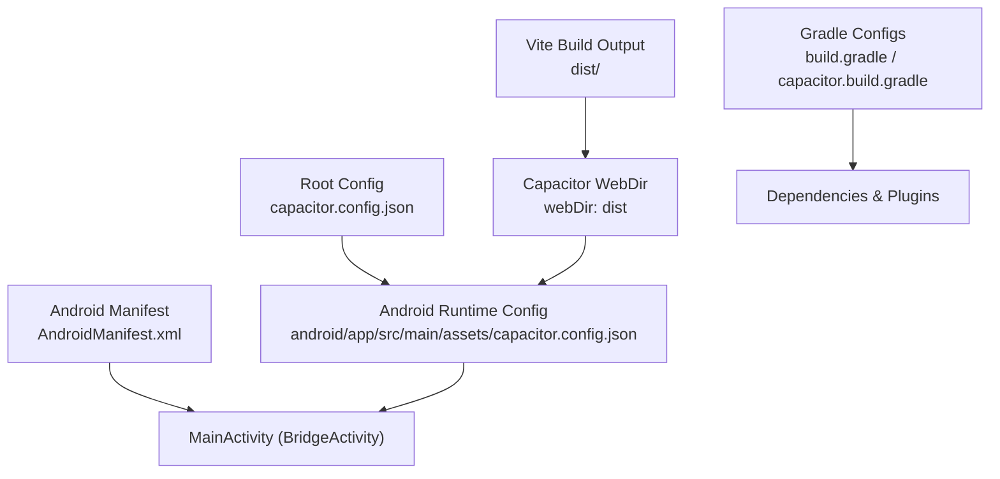
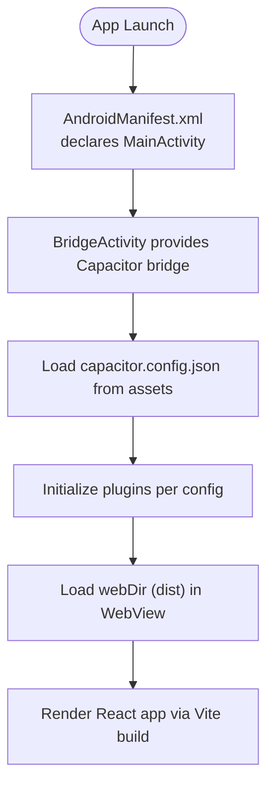
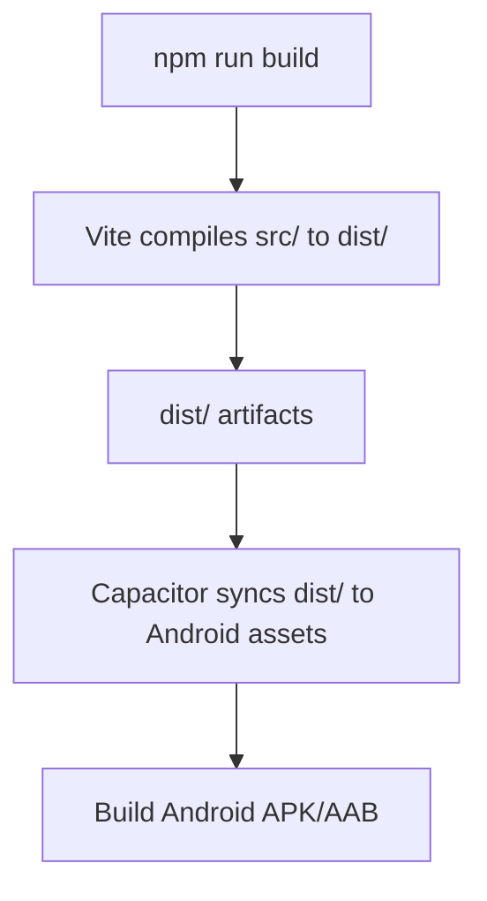
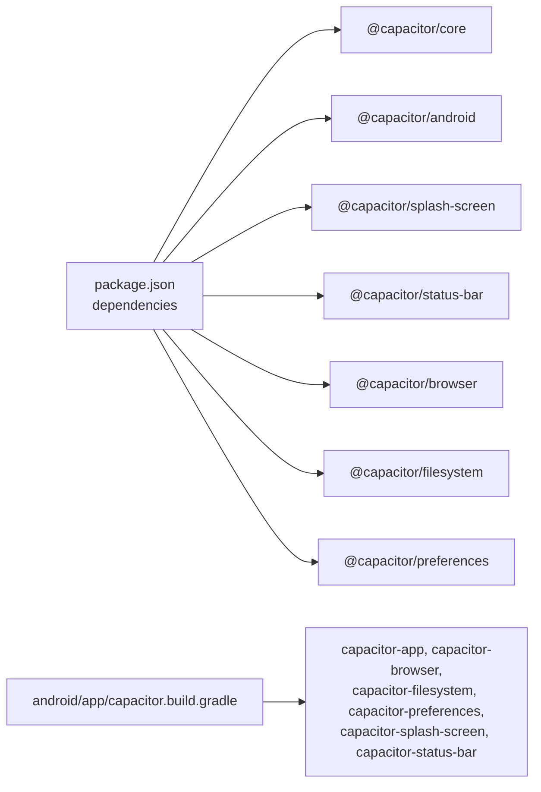

# Capacitor Setup & Configuration

<cite>
**Referenced Files in This Document**
- [capacitor.config.json](file://capacitor.config.json)
- [android/app/src/main/assets/capacitor.config.json](file://android/app/src/main/assets/capacitor.config.json)
- [android/app/src/main/AndroidManifest.xml](file://android/app/src/main/AndroidManifest.xml)
- [android/app/build.gradle](file://android/app/build.gradle)
- [android/app/capacitor.build.gradle](file://android/app/capacitor.build.gradle)
- [android/gradle.properties](file://android/gradle.properties)
- [package.json](file://package.json)
- [src/main.jsx](file://src/main.jsx)
- [vite.config.js](file://vite.config.js)
</cite>

## Table of Contents
1. Introduction
2. Project Structure
3. Core Components
4. Architecture Overview
5. Detailed Component Analysis
6. Dependency Analysis
7. Performance Considerations
8. Troubleshooting Guide
9. Conclusion

## Introduction
This document explains how Capacitor is set up and configured in Project Anime, focusing on the configuration file structure, plugin settings for SplashScreen, StatusBar, and Keyboard, Android-specific options, and step-by-step instructions to initialize Capacitor, add the Android platform, and configure build environments. It also includes troubleshooting guidance for common setup issues and environment-specific configurations.

## Project Structure
Project Anime uses a standard Capacitor layout:
- Root-level capacitor.config.json defines app identification, web directory mapping, and plugin configurations.
- The Android project under android/ contains the generated native shell, including assets with a copy of capacitor.config.json used at runtime by the Android WebView.
- Vite builds the web app into a dist folder, which Capacitor references as the webDir.
- The Android manifest declares the main activity and internet permission required for network access.



**Diagram sources**
- [capacitor.config.json:1-32](file://capacitor.config.json#L1-L32)
- [android/app/src/main/assets/capacitor.config.json:1-32](file://android/app/src/main/assets/capacitor.config.json#L1-L32)
- [android/app/src/main/AndroidManifest.xml:1-42](file://android/app/src/main/AndroidManifest.xml#L1-L42)
- [android/app/build.gradle:1-55](file://android/app/build.gradle#L1-L55)
- [android/app/capacitor.build.gradle:1-25](file://android/app/capacitor.build.gradle#L1-L25)

**Section sources**
- [capacitor.config.json:1-32](file://capacitor.config.json#L1-L32)
- [android/app/src/main/assets/capacitor.config.json:1-32](file://android/app/src/main/assets/capacitor.config.json#L1-L32)
- [android/app/src/main/AndroidManifest.xml:1-42](file://android/app/src/main/AndroidManifest.xml#L1-L42)
- [android/app/build.gradle:1-55](file://android/app/build.gradle#L1-L55)
- [android/app/capacitor.build.gradle:1-25](file://android/app/capacitor.build.gradle#L1-L25)

## Core Components
- App identification and web directory:
  - appId identifies the app bundle ID.
  - appName sets the display name.
  - webDir points to the built web assets folder (dist).
- Plugin configurations:
  - SplashScreen controls launch splash behavior and appearance.
  - StatusBar configures status bar style and background.
  - Keyboard manages keyboard resize behavior and styling.
- Android-specific options:
  - allowMixedContent enables loading HTTP resources when the app uses HTTPS.
  - captureInput toggles input capture behavior.
  - useLegacyBridge selects the bridge mode for JS-to-native communication.

These settings are defined in the root capacitor.config.json and mirrored in the Android assets copy used at runtime.

**Section sources**
- [capacitor.config.json:1-32](file://capacitor.config.json#L1-L32)
- [android/app/src/main/assets/capacitor.config.json:1-32](file://android/app/src/main/assets/capacitor.config.json#L1-L32)

## Architecture Overview
The runtime flow integrates Vite’s build output with Capacitor’s Android shell:

```mermaid
sequenceDiagram
participant Dev as "Developer"
participant Vite as "Vite Build"
participant Cap as "Capacitor CLI"
participant And as "Android Shell"
participant WebView as "WebView"
participant Plugins as "Plugins (Splash/Status/Keyboard)"
Dev->>Vite : Run build script
Vite-->>Dev : Produce dist/
Dev->>Cap : Add Android platform / update
Cap->>And : Generate/update Android project
Dev->>Cap : Sync web assets
Cap->>WebView : Load webDir (dist)
WebView->>Plugins : Apply SplashScreen/StatusBar/Keyboard settings
Note over WebView,Plugins : UI and system integration based on capacitor.config.json
```

**Diagram sources**
- [vite.config.js:1-23](file://vite.config.js#L1-L23)
- [capacitor.config.json:1-32](file://capacitor.config.json#L1-L32)
- [android/app/src/main/assets/capacitor.config.json:1-32](file://android/app/src/main/assets/capacitor.config.json#L1-L32)
- [android/app/build.gradle:1-55](file://android/app/build.gradle#L1-L55)
- [android/app/capacitor.build.gradle:1-25](file://android/app/capacitor.build.gradle#L1-L25)

## Detailed Component Analysis

### Capacitor Configuration File Structure
- App identification:
  - appId: Unique bundle identifier for the app.
  - appName: Human-readable app name shown in the launcher and status areas.
- Web directory mapping:
  - webDir: Points to the Vite build output folder (dist), which Capacitor serves from the Android WebView.
- Plugin configurations:
  - SplashScreen: Controls duration, auto-hide, background color, resource name, spinner visibility, full-screen and immersive modes.
  - StatusBar: Sets style, background color, and overlay behavior relative to the WebView.
  - Keyboard: Defines resize strategy, style, and whether resizing applies in full-screen contexts.
- Android-specific options:
  - allowMixedContent: Allows mixed content (HTTP resources on HTTPS pages).
  - captureInput: Toggles input capture behavior for the WebView.
  - useLegacyBridge: Chooses legacy bridge mode for JS-to-native calls.

Impact on user experience:
- SplashScreen ensures a branded first impression and smooth transition to the app UI.
- StatusBar styling aligns with the app’s dark theme and prevents visual clashes.
- Keyboard resize behavior maintains usable layouts when text inputs appear.

**Section sources**
- [capacitor.config.json:1-32](file://capacitor.config.json#L1-L32)
- [android/app/src/main/assets/capacitor.config.json:1-32](file://android/app/src/main/assets/capacitor.config.json#L1-L32)

### Android Platform Integration
- Main Activity:
  - The Android app extends BridgeActivity, enabling Capacitor’s bridge between JavaScript and native features.
- Manifest:
  - Declares the main activity and internet permission required for network requests.
- Gradle dependencies:
  - Includes Capacitor core and plugin modules for app, browser, filesystem, preferences, splash screen, and status bar.



**Diagram sources**
- [android/app/src/main/AndroidManifest.xml:1-42](file://android/app/src/main/AndroidManifest.xml#L1-L42)
- [android/app/capacitor.build.gradle:1-25](file://android/app/capacitor.build.gradle#L1-L25)
- [android/app/src/main/assets/capacitor.config.json:1-32](file://android/app/src/main/assets/capacitor.config.json#L1-L32)

**Section sources**
- [android/app/src/main/AndroidManifest.xml:1-42](file://android/app/src/main/AndroidManifest.xml#L1-L42)
- [android/app/capacitor.build.gradle:1-25](file://android/app/capacitor.build.gradle#L1-L25)

### Build Environment and Scripts
- Vite:
  - Build script produces the dist folder referenced by webDir.
  - Development server proxies API routes for local development.
- Gradle:
  - Android SDK versions and Java compatibility are managed in Gradle files.
  - Capacitor plugin modules are added via capacitor.build.gradle.
- Package scripts:
  - npm scripts provide dev, build, preview, and server commands.



**Diagram sources**
- [vite.config.js:1-23](file://vite.config.js#L1-L23)
- [package.json:1-45](file://package.json#L1-L45)
- [android/app/build.gradle:1-55](file://android/app/build.gradle#L1-L55)
- [android/app/capacitor.build.gradle:1-25](file://android/app/capacitor.build.gradle#L1-L25)

**Section sources**
- [vite.config.js:1-23](file://vite.config.js#L1-L23)
- [package.json:1-45](file://package.json#L1-L45)
- [android/app/build.gradle:1-55](file://android/app/build.gradle#L1-L55)
- [android/app/capacitor.build.gradle:1-25](file://android/app/capacitor.build.gradle#L1-L25)

## Dependency Analysis
Capacitor and related plugins are declared in package.json. The Android project pulls in corresponding modules through Gradle.



**Diagram sources**
- [package.json:1-45](file://package.json#L1-L45)
- [android/app/capacitor.build.gradle:1-25](file://android/app/capacitor.build.gradle#L1-L25)

**Section sources**
- [package.json:1-45](file://package.json#L1-L45)
- [android/app/capacitor.build.gradle:1-25](file://android/app/capacitor.build.gradle#L1-L25)

## Performance Considerations
- Keep webDir aligned with Vite’s output to avoid unnecessary rebuilds.
- Use appropriate SplashScreen duration to balance perceived performance and UX.
- Disable spinner if not needed to reduce overhead during splash.
- Ensure StatusBar overlaysWebView is set correctly to prevent layout shifts.
- For mixed content scenarios, enable allowMixedContent only when necessary due to security implications.

[No sources needed since this section provides general guidance]

## Troubleshooting Guide
Common setup issues and resolutions:
- Missing or mismatched webDir:
  - Ensure webDir points to the correct Vite build output folder (dist). If the folder is missing, run the build before syncing with Capacitor.
- Android permissions:
  - Confirm INTERNET permission is present in AndroidManifest.xml for network access.
- Mixed content errors:
  - If loading HTTP resources from HTTPS, enable allowMixedContent in the Android section of capacitor.config.json.
- Input handling anomalies:
  - Adjust captureInput and Keyboard.resize settings to match your UI behavior.
- Bridge mode issues:
  - If encountering JS-to-native communication problems, toggle useLegacyBridge to switch bridge modes.
- Build environment:
  - Verify Gradle properties and Java compatibility in Gradle files. Ensure Android SDK versions are consistent across build files.

**Section sources**
- [android/app/src/main/AndroidManifest.xml:1-42](file://android/app/src/main/AndroidManifest.xml#L1-L42)
- [capacitor.config.json:1-32](file://capacitor.config.json#L1-L32)
- [android/app/src/main/assets/capacitor.config.json:1-32](file://android/app/src/main/assets/capacitor.config.json#L1-L32)
- [android/app/build.gradle:1-55](file://android/app/build.gradle#L1-L55)
- [android/gradle.properties:1-23](file://android/gradle.properties#L1-L23)

## Conclusion
Project Anime’s Capacitor setup centers on a clear configuration file that defines app identity, web directory mapping, and plugin behaviors tailored for a dark-themed mobile experience. The Android integration leverages Capacitor’s bridge and plugin modules to deliver a seamless native wrapper around the Vite-built web app. By following the provided steps and troubleshooting tips, you can reliably initialize Capacitor, add the Android platform, and configure the build environment for consistent results across development and production.

[No sources needed since this section summarizes without analyzing specific files]