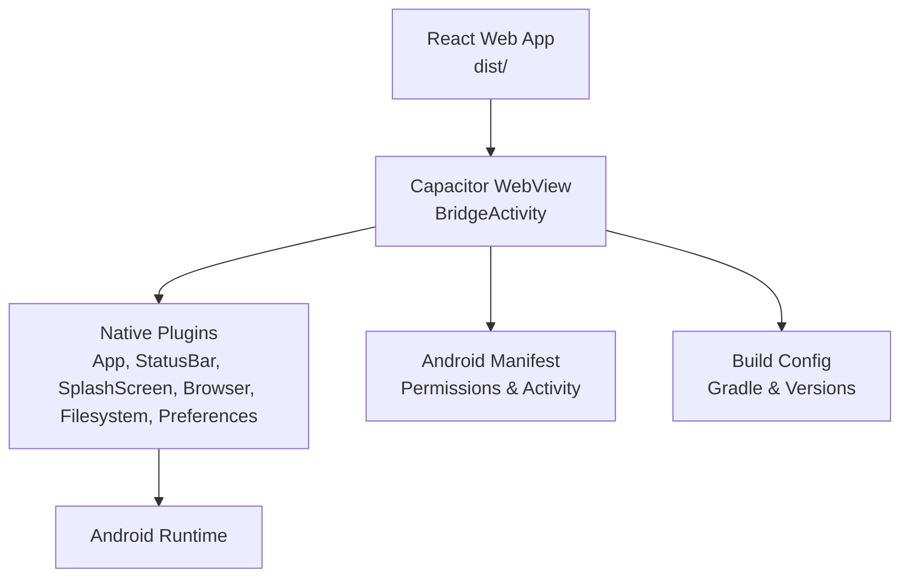
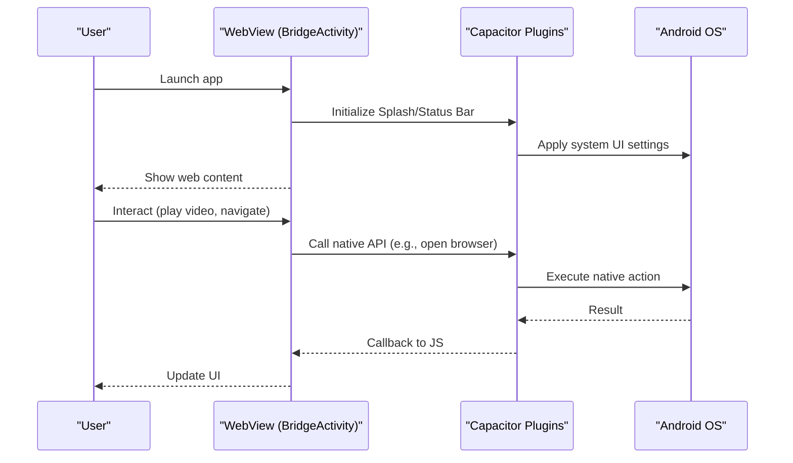
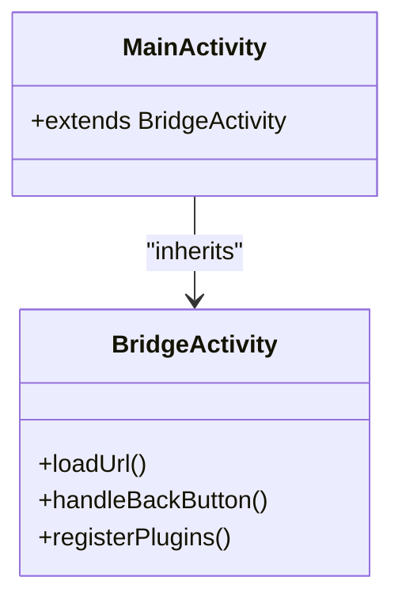
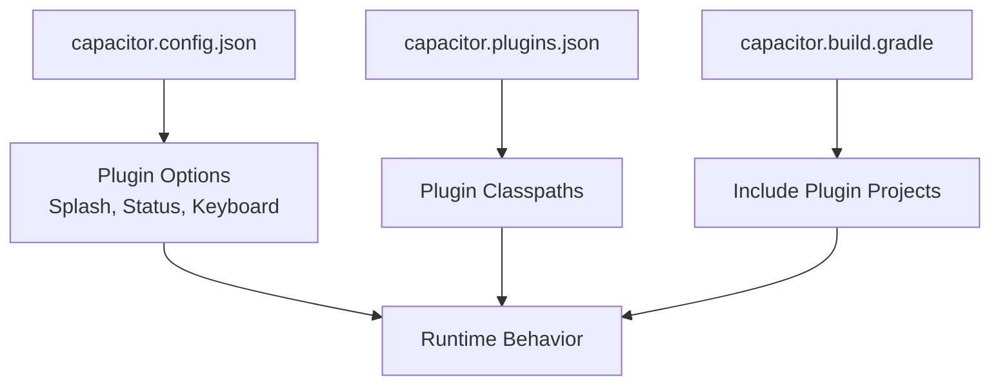
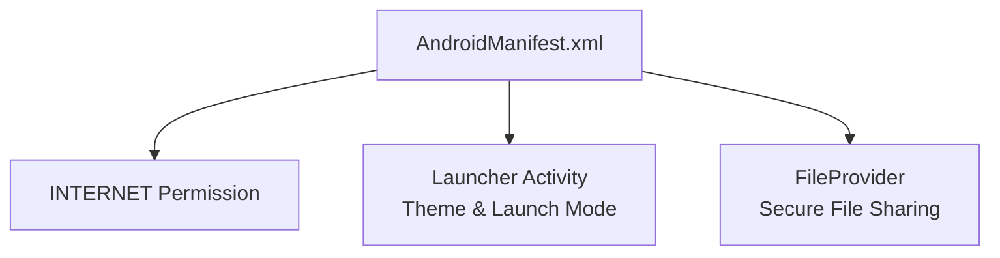
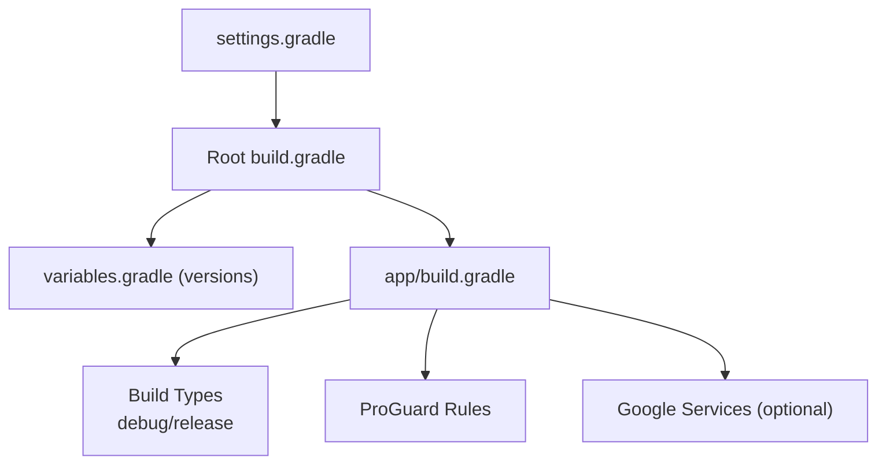
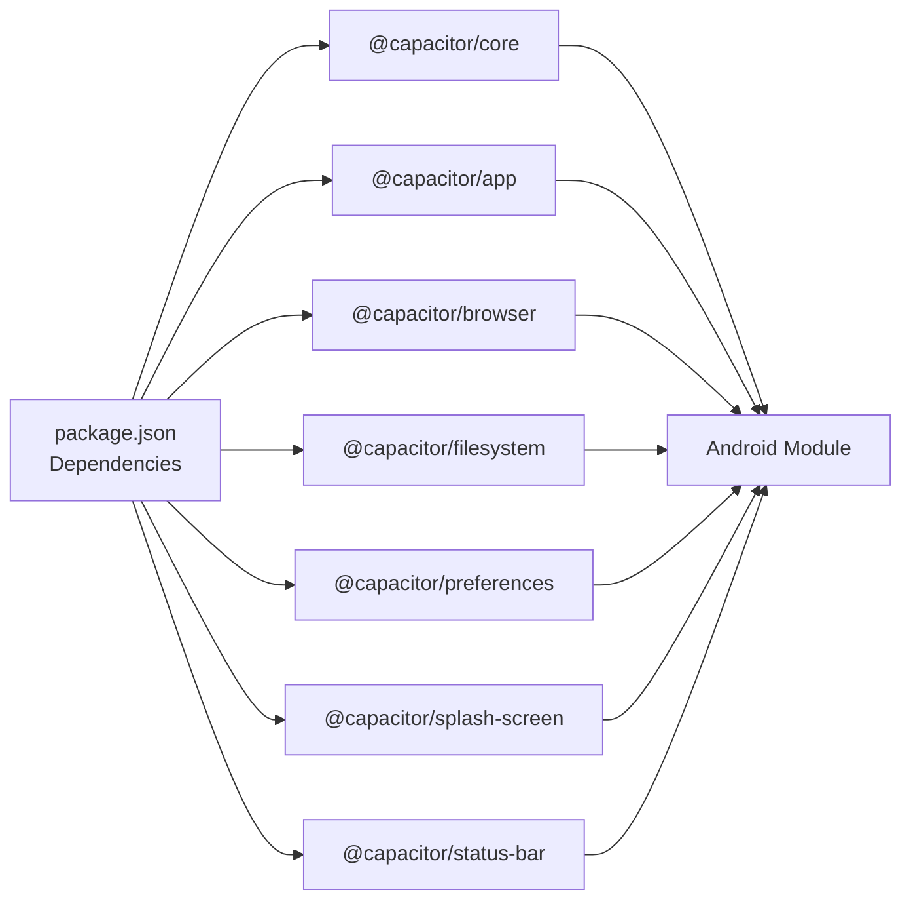

# Mobile Application

<cite>
**Referenced Files in This Document**
- [MainActivity.java](file://android/app/src/main/java/com/eetnet/app/MainActivity.java)
- [AndroidManifest.xml](file://android/app/src/main/AndroidManifest.xml)
- [build.gradle (app)](file://android/app/build.gradle)
- [capacitor.build.gradle](file://android/app/capacitor.build.gradle)
- [capacitor.config.json (root)](file://capacitor.config.json)
- [capacitor.config.json (assets)](file://android/app/src/main/assets/capacitor.config.json)
- [capacitor.plugins.json](file://android/app/src/main/assets/capacitor.plugins.json)
- [styles.xml](file://android/app/src/main/res/values/styles.xml)
- [strings.xml](file://android/app/src/main/res/values/strings.xml)
- [proguard-rules.pro](file://android/app/proguard-rules.pro)
- [gradle.properties](file://android/gradle.properties)
- [settings.gradle](file://android/settings.gradle)
- [build.gradle (root)](file://android/build.gradle)
- [nativeApp.js](file://src/utils/nativeApp.js)
- [useDeviceType.js](file://src/utils/useDeviceType.js)
- [package.json](file://package.json)
</cite>

## Table of Contents
1. Introduction
2. Project Structure
3. Core Components
4. Architecture Overview
5. Detailed Component Analysis
6. Dependency Analysis
7. Performance Considerations
8. Troubleshooting Guide
9. Conclusion
10. Appendices

## Introduction
This document explains the mobile application for Project Anime built with Capacitor, which wraps a React web app into a native Android application. It covers how Capacitor bridges the web layer to native Android capabilities, the native project structure and configuration, build and signing procedures, mobile-specific features such as touch interactions and device capability detection, testing and debugging guidance, and performance considerations for streaming media on Android.

## Project Structure
The Android module is generated by Capacitor and configured to host the built web assets from the dist directory. The root Capacitor configuration defines plugin behavior and Android-specific options. The Android manifest declares the main activity and permissions. Build scripts configure compilation targets, dependencies, and optional Google Services integration.



**Diagram sources**
- [MainActivity.java:1-6](file://android/app/src/main/java/com/eetnet/app/MainActivity.java#L1-L6)
- [AndroidManifest.xml:1-42](file://android/app/src/main/AndroidManifest.xml#L1-L42)
- [capacitor.config.json:1-32](file://capacitor.config.json#L1-L32)
- [capacitor.plugins.json:1-26](file://android/app/src/main/assets/capacitor.plugins.json#L1-L26)
- [build.gradle (app):1-55](file://android/app/build.gradle#L1-L55)

**Section sources**
- [MainActivity.java:1-6](file://android/app/src/main/java/com/eetnet/app/MainActivity.java#L1-L6)
- [AndroidManifest.xml:1-42](file://android/app/src/main/AndroidManifest.xml#L1-L42)
- [capacitor.config.json:1-32](file://capacitor.config.json#L1-L32)
- [capacitor.config.json (assets):1-32](file://android/app/src/main/assets/capacitor.config.json#L1-L32)
- [capacitor.plugins.json:1-26](file://android/app/src/main/assets/capacitor.plugins.json#L1-L26)
- [build.gradle (app):1-55](file://android/app/build.gradle#L1-L55)

## Core Components
- MainActivity: A minimal entry point that extends Capacitor’s BridgeActivity to host the web content and bridge JS to native APIs.
- AndroidManifest: Declares the launcher activity, theme, and INTERNET permission required for streaming.
- Capacitor Configuration: Defines app identity, splash screen, status bar, keyboard behavior, and Android-specific WebView settings.
- Plugin Registration: Lists enabled plugins and their classpaths for runtime discovery.
- Build Scripts: Configure compile/target SDKs, dependencies, and optional Google Services.

Key responsibilities:
- Host the built web app inside a WebView via BridgeActivity.
- Provide lifecycle hooks and UI polish through plugins (splash, status bar).
- Expose native capabilities (browser, filesystem, preferences) to the web layer.
- Ensure network access and proper launch behavior for streaming.

**Section sources**
- [MainActivity.java:1-6](file://android/app/src/main/java/com/eetnet/app/MainActivity.java#L1-L6)
- [AndroidManifest.xml:1-42](file://android/app/src/main/AndroidManifest.xml#L1-L42)
- [capacitor.config.json:1-32](file://capacitor.config.json#L1-L32)
- [capacitor.plugins.json:1-26](file://android/app/src/main/assets/capacitor.plugins.json#L1-L26)
- [build.gradle (app):1-55](file://android/app/build.gradle#L1-L55)

## Architecture Overview
Capacitor acts as a bridge between the React web app and native Android. The web app runs in a WebView managed by BridgeActivity. Plugins are registered and invoked from JavaScript to access native features like status bar control, splash screen management, deep links, and file storage.



**Diagram sources**
- [MainActivity.java:1-6](file://android/app/src/main/java/com/eetnet/app/MainActivity.java#L1-L6)
- [capacitor.plugins.json:1-26](file://android/app/src/main/assets/capacitor.plugins.json#L1-L26)
- [capacitor.config.json:1-32](file://capacitor.config.json#L1-L32)

## Detailed Component Analysis

### MainActivity and WebView Hosting
- Extends BridgeActivity to integrate with Capacitor’s bridge.
- No custom logic; all behavior is delegated to Capacitor core and plugins.
- Ensures single task launch mode and proper intent handling for streaming and deep links.



**Diagram sources**
- [MainActivity.java:1-6](file://android/app/src/main/java/com/eetnet/app/MainActivity.java#L1-L6)

**Section sources**
- [MainActivity.java:1-6](file://android/app/src/main/java/com/eetnet/app/MainActivity.java#L1-L6)
- [AndroidManifest.xml:12-25](file://android/app/src/main/AndroidManifest.xml#L12-L25)

### Capacitor Configuration and Plugins
- Root and asset-level capacitor.config.json define app metadata, plugin options, and Android WebView behavior (mixed content allowed, input capture, legacy bridge disabled).
- capacitor.plugins.json registers App, Browser, Filesystem, Preferences, SplashScreen, and StatusBar plugins with their classpaths.
- capacitor.build.gradle includes these plugins as Gradle projects for compilation and packaging.



**Diagram sources**
- [capacitor.config.json:1-32](file://capacitor.config.json#L1-L32)
- [capacitor.config.json (assets):1-32](file://android/app/src/main/assets/capacitor.config.json#L1-L32)
- [capacitor.plugins.json:1-26](file://android/app/src/main/assets/capacitor.plugins.json#L1-L26)
- [capacitor.build.gradle:1-24](file://android/app/capacitor.build.gradle#L1-L24)

**Section sources**
- [capacitor.config.json:1-32](file://capacitor.config.json#L1-L32)
- [capacitor.config.json (assets):1-32](file://android/app/src/main/assets/capacitor.config.json#L1-L32)
- [capacitor.plugins.json:1-26](file://android/app/src/main/assets/capacitor.plugins.json#L1-L26)
- [capacitor.build.gradle:1-24](file://android/app/capacitor.build.gradle#L1-L24)

### Android Manifest and Permissions
- Declares the main launcher activity with appropriate theme and config changes.
- Adds INTERNET permission required for streaming media.
- Includes a FileProvider for secure file sharing used by some plugins or features.



**Diagram sources**
- [AndroidManifest.xml:1-42](file://android/app/src/main/AndroidManifest.xml#L1-L42)

**Section sources**
- [AndroidManifest.xml:1-42](file://android/app/src/main/AndroidManifest.xml#L1-L42)

### Build System and Signing
- Top-level build.gradle sets repositories and Gradle plugin versions.
- App build.gradle defines applicationId, SDK versions, versioning, and release build type with ProGuard rules.
- gradle.properties configures JVM memory and AndroidX usage.
- settings.gradle includes modules and applies Capacitor settings.
- Optional Google Services plugin is applied if google-services.json exists.



**Diagram sources**
- [settings.gradle:1-5](file://android/settings.gradle#L1-L5)
- [build.gradle (root):1-30](file://android/build.gradle#L1-L30)
- [build.gradle (app):1-55](file://android/app/build.gradle#L1-L55)
- [gradle.properties:1-23](file://android/gradle.properties#L1-L23)

**Section sources**
- [build.gradle (root):1-30](file://android/build.gradle#L1-L30)
- [build.gradle (app):1-55](file://android/app/build.gradle#L1-L55)
- [gradle.properties:1-23](file://android/gradle.properties#L1-L23)
- [settings.gradle:1-5](file://android/settings.gradle#L1-L5)

### Native Lifecycle and Deep Links in the Web Layer
- nativeApp.js detects native platform, hides splash screen, sets dark status bar, and registers listeners for back button, app state changes, and deep link callbacks.
- useDeviceType.js provides responsive detection for mobile/tablet breakpoints and adds CSS classes for styling.

```mermaid
sequenceDiagram
participant JS as "Web App JS"
participant NA as "nativeApp.js"
participant CAP as "Capacitor App Plugin"
participant AND as "Android OS"
JS->>NA : initNativeApp()
NA->>CAP : Import App/Splash/StatusBar
NA->>AND : Set status bar style/color
NA->>AND : Hide splash screen
CAP-->>NA : backButton / appStateChange / appUrlOpen
NA->>JS : Invoke callbacks (pause/resume/deep link)
```

**Diagram sources**
- [nativeApp.js:1-69](file://src/utils/nativeApp.js#L1-L69)

**Section sources**
- [nativeApp.js:1-69](file://src/utils/nativeApp.js#L1-L69)
- [useDeviceType.js:1-49](file://src/utils/useDeviceType.js#L1-L49)

## Dependency Analysis
Capacitor plugins are declared in package.json and included in the Android build via capacitor.build.gradle. The app depends on Capacitor core and specific plugins for app lifecycle, browser, filesystem, preferences, splash screen, and status bar.



**Diagram sources**
- [package.json:14-35](file://package.json#L14-L35)
- [capacitor.build.gradle:11-18](file://android/app/capacitor.build.gradle#L11-L18)

**Section sources**
- [package.json:14-35](file://package.json#L14-L35)
- [capacitor.build.gradle:11-18](file://android/app/capacitor.build.gradle#L11-L18)

## Performance Considerations
- Streaming Media:
  - Use hardware-accelerated playback where possible and ensure HLS support via hls.js in the web layer.
  - Keep WebView cache size reasonable; avoid excessive DOM nodes during playback.
- Memory Management:
  - Minimize long-lived references in JS; release event listeners when navigating away.
  - Avoid heavy image processing on the UI thread; prefer background tasks or native libraries when necessary.
- Network and I/O:
  - Enable HTTP caching at the server level; leverage CDN for static assets.
  - Use compression (gzip/brotli) for responses.
- UI Responsiveness:
  - Offload heavy computations to Web Workers.
  - Debounce resize/orientation handlers; use the provided useDeviceType hook to update UI efficiently.
- Battery Optimization:
  - Pause media when app moves to background using the appStateChange listener.
  - Reduce polling frequency while in background.

[No sources needed since this section provides general guidance]

## Troubleshooting Guide
- Build Issues:
  - Verify SDK path in local.properties and that AndroidX is enabled in gradle.properties.
  - Clean and rebuild if dependency resolution fails.
- Runtime Errors:
  - Check logs via adb logcat for exceptions thrown by plugins or WebView.
  - Ensure INTERNET permission is present in the manifest for streaming.
- Splash/Status Bar:
  - If splash does not hide, verify initialization order in nativeApp.js and that the correct resource name is set in capacitor.config.json.
- Deep Links:
  - Confirm the custom URL scheme matches strings.xml and that the appUrlOpen listener is registered.
- ProGuard:
  - If crashes occur after enabling minification, add keep rules for any custom JS interfaces or third-party libraries.

**Section sources**
- [local.properties:1-8](file://android/local.properties#L1-L8)
- [gradle.properties:1-23](file://android/gradle.properties#L1-L23)
- [AndroidManifest.xml:38-41](file://android/app/src/main/AndroidManifest.xml#L38-L41)
- [capacitor.config.json:6-24](file://capacitor.config.json#L6-L24)
- [strings.xml:1-8](file://android/app/src/main/res/values/strings.xml#L1-L8)
- [proguard-rules.pro:1-22](file://android/app/proguard-rules.pro#L1-L22)

## Conclusion
Project Anime’s mobile app leverages Capacitor to deliver a high-quality Android experience by hosting a React web app within a native shell. The setup uses standard Capacitor plugins for lifecycle, UI polish, and device capabilities, with a straightforward build and signing process. For streaming-focused apps, prioritize efficient media playback, memory management, and background handling to ensure smooth performance on Android devices.

[No sources needed since this section summarizes without analyzing specific files]

## Appendices

### Build and Release Procedures
- Development Build:
  - Build web assets and sync to Android, then assemble debug APK using Gradle.
- Release Build:
  - Create a signed release APK/AAB using Gradle with your keystore and alias.
  - Configure signing in Gradle properties or Android Studio signing configurations.
- Optional Google Services:
  - Place google-services.json in the app module to enable Firebase-related features.

**Section sources**
- [build.gradle (app):19-24](file://android/app/build.gradle#L19-L24)
- [build.gradle (app):47-54](file://android/app/build.gradle#L47-L54)

### Testing and Debugging
- Unit and Instrumented Tests:
  - Existing example tests demonstrate basic instrumentation setup.
- Device Testing:
  - Test on multiple Android versions and screen sizes to validate responsive behavior and streaming performance.
- Logging:
  - Use console logs in JS and logcat on Android to trace issues.

**Section sources**
- [ExampleInstrumentedTest.java:1-26](file://android/app/src/androidTest/java/com/getcapacitor/myapp/ExampleInstrumentedTest.java#L1-L26)

### Platform-Specific Notes for Streaming
- Mixed Content:
  - allowMixedContent is enabled to support HTTP streams when needed.
- Input Capture:
  - captureInput is disabled to prevent conflicts with media controls.
- Legacy Bridge:
  - useLegacyBridge is disabled to use the modern bridge for better performance.

**Section sources**
- [capacitor.config.json:26-30](file://capacitor.config.json#L26-L30)