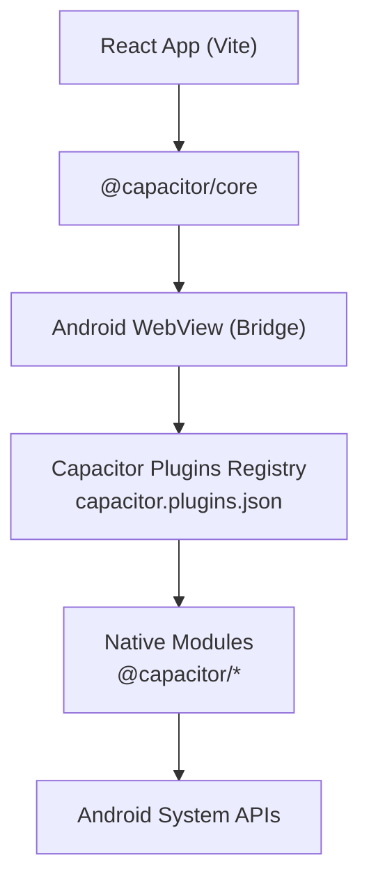
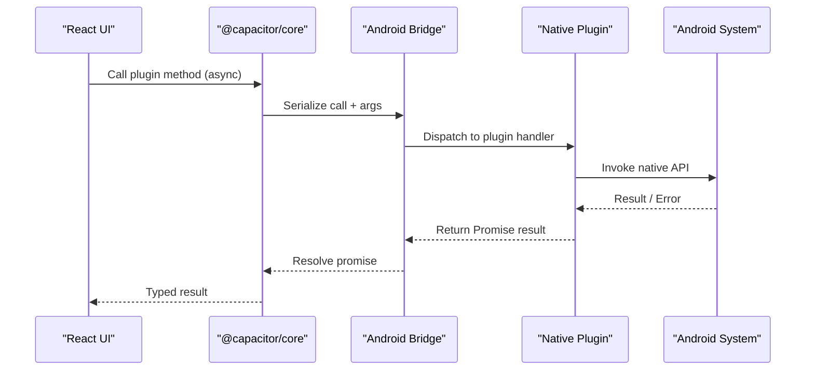
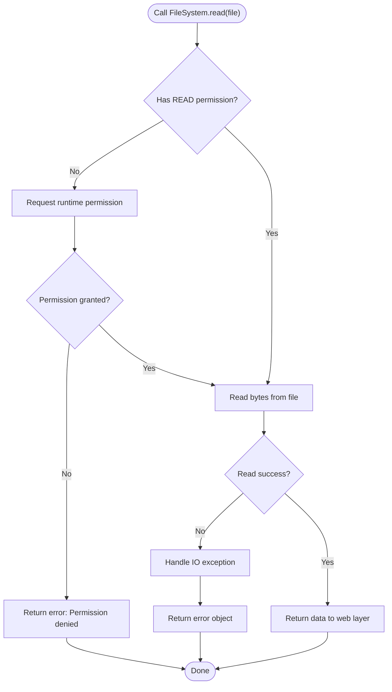
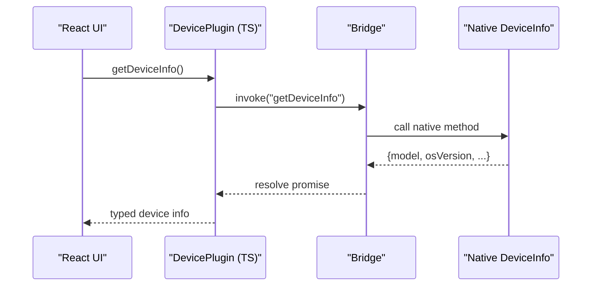
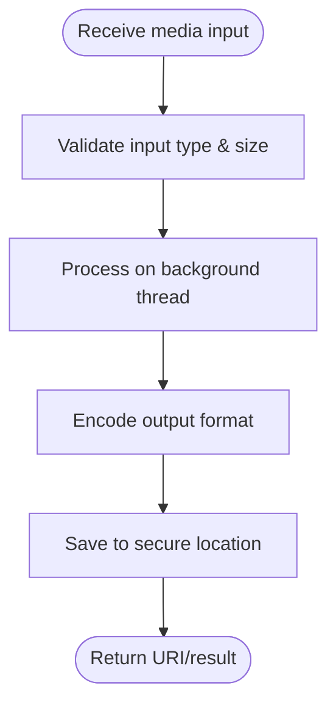
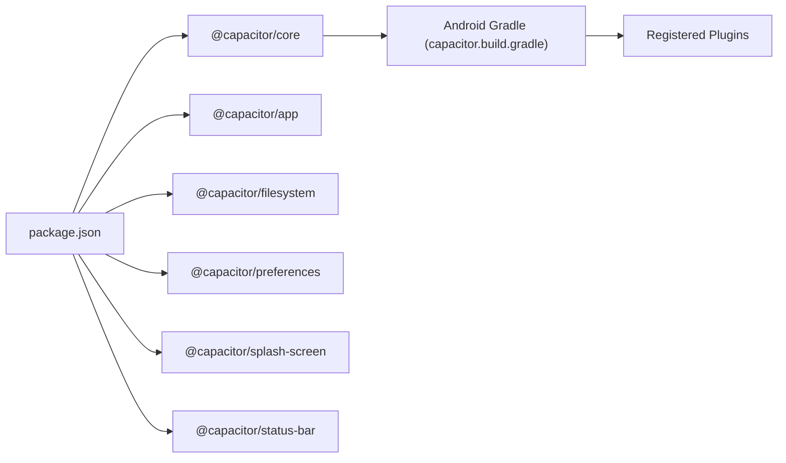

# Custom Plugin Development

<cite>
**Referenced Files in This Document**
- [capacitor.config.json](file://capacitor.config.json)
- [android/app/src/main/assets/capacitor.config.json](file://android/app/src/main/assets/capacitor.config.json)
- [android/app/src/main/assets/capacitor.plugins.json](file://android/app/src/main/assets/capacitor.plugins.json)
- [android/app/src/main/java/com/eetnet/app/MainActivity.java](file://android/app/src/main/java/com/eetnet/app/MainActivity.java)
- [android/app/build.gradle](file://android/app/build.gradle)
- [android/app/capacitor.build.gradle](file://android/app/capacitor.build.gradle)
- [android/build.gradle](file://android/build.gradle)
- [android/variables.gradle](file://android/variables.gradle)
- [src/utils/nativeApp.js](file://src/utils/nativeApp.js)
- [src/utils/storage.js](file://src/utils/storage.js)
- [package.json](file://package.json)
</cite>

## Table of Contents
1. [Introduction](#introduction)
2. [Project Structure](#project-structure)
3. [Core Components](#core-components)
4. [Architecture Overview](#architecture-overview)
5. [Detailed Component Analysis](#detailed-component-analysis)
6. [Dependency Analysis](#dependency-analysis)
7. [Performance Considerations](#performance-considerations)
8. [Troubleshooting Guide](#troubleshooting-guide)
9. [Conclusion](#conclusion)
10. [Appendices](#appendices)

## Introduction
This document explains how to develop custom Capacitor plugins for Project Anime, focusing on the plugin architecture, TypeScript interfaces, and native Android implementation patterns. It also covers exposing native functionality to the React frontend, handling asynchronous operations, managing plugin lifecycle, and provides examples for common plugin types such as file system access, device information, and media processing. Finally, it includes testing strategies and debugging techniques for native code issues.

## Project Structure
Project Anime uses Capacitor to bridge a React frontend with native Android capabilities. The key configuration and integration points are:
- Root and Android-specific Capacitor configurations define app metadata, plugin settings, and platform options.
- The Android app module registers built-in plugins and extends the default BridgeActivity.
- The React layer dynamically imports Capacitor plugins at runtime to interact with native features.

**Diagram sources**
- [android/app/src/main/assets/capacitor.plugins.json:1-26](file://android/app/src/main/assets/capacitor.plugins.json#L1-L26)
- [android/app/build.gradle:33-43](file://android/app/build.gradle#L33-L43)
- [android/app/capacitor.build.gradle:11-18](file://android/app/capacitor.build.gradle#L11-L18)

**Section sources**
- [capacitor.config.json:1-32](file://capacitor.config.json#L1-L32)
- [android/app/src/main/assets/capacitor.config.json:1-32](file://android/app/src/main/assets/capacitor.config.json#L1-L32)
- [android/app/src/main/assets/capacitor.plugins.json:1-26](file://android/app/src/main/assets/capacitor.plugins.json#L1-L26)
- [android/app/src/main/java/com/eetnet/app/MainActivity.java:1-6](file://android/app/src/main/java/com/eetnet/app/MainActivity.java#L1-L6)
- [android/app/build.gradle:1-54](file://android/app/build.gradle#L1-L54)
- [android/app/capacitor.build.gradle:1-24](file://android/app/capacitor.build.gradle#L1-L24)
- [android/build.gradle:1-30](file://android/build.gradle#L1-L30)
- [android/variables.gradle:1-16](file://android/variables.gradle#L1-L16)

## Core Components
- Capacitor configuration files define app identity, web directory, and plugin settings for both root and Android assets.
- The Android app module integrates Capacitor core and included plugins via Gradle.
- The React utilities demonstrate dynamic imports of Capacitor plugins for storage and app lifecycle.

Key observations:
- The Android app extends BridgeActivity, enabling Capacitor’s bridge between web and native.
- Plugins are registered in capacitor.plugins.json and wired into the build via capacitor.build.gradle.
- The React side uses environment detection and dynamic imports to load Capacitor modules only when running on native platforms.

**Section sources**
- [android/app/src/main/java/com/eetnet/app/MainActivity.java:1-6](file://android/app/src/main/java/com/eetnet/app/MainActivity.java#L1-L6)
- [android/app/src/main/assets/capacitor.plugins.json:1-26](file://android/app/src/main/assets/capacitor.plugins.json#L1-L26)
- [android/app/capacitor.build.gradle:11-18](file://android/app/capacitor.build.gradle#L11-L18)
- [src/utils/nativeApp.js:11-68](file://src/utils/nativeApp.js#L11-L68)
- [src/utils/storage.js:8-37](file://src/utils/storage.js#L8-L37)

## Architecture Overview
The plugin architecture follows Capacitor’s standard model:
- Web layer calls typed JavaScript methods from Capacitor plugins.
- Capacitor core serializes calls and routes them through the Android WebView bridge.
- Native Android plugins implement handlers that execute system APIs and return results asynchronously.

[No sources needed since this diagram shows conceptual workflow, not actual code structure]

## Detailed Component Analysis

### Capacitor Configuration and Plugin Registration
- Root and Android asset configurations specify app ID, name, web directory, and plugin options (SplashScreen, StatusBar, Keyboard).
- The Android assets include a plugin registry mapping package names to classpaths, which tells Capacitor which native classes to instantiate.

Practical implications:
- Ensure your custom plugin is added to the registry so the Android runtime can locate it.
- Keep plugin options consistent across root and Android configs to avoid runtime mismatches.

**Section sources**
- [capacitor.config.json:1-32](file://capacitor.config.json#L1-L32)
- [android/app/src/main/assets/capacitor.config.json:1-32](file://android/app/src/main/assets/capacitor.config.json#L1-L32)
- [android/app/src/main/assets/capacitor.plugins.json:1-26](file://android/app/src/main/assets/capacitor.plugins.json#L1-L26)

### Android App Integration
- MainActivity extends BridgeActivity, enabling Capacitor’s bridge without additional setup.
- Gradle dependencies include Capacitor core and each plugin project referenced by capacitor.plugins.json.
- Build variables centralize SDK versions and dependency versions for consistency.

Best practices:
- Extend BridgeActivity if you need custom initialization before the web view loads.
- Add new plugin projects to capacitor.build.gradle after registering them in the plugin registry.

**Section sources**
- [android/app/src/main/java/com/eetnet/app/MainActivity.java:1-6](file://android/app/src/main/java/com/eetnet/app/MainActivity.java#L1-L6)
- [android/app/build.gradle:33-43](file://android/app/build.gradle#L33-L43)
- [android/app/capacitor.build.gradle:11-18](file://android/app/capacitor.build.gradle#L11-L18)
- [android/variables.gradle:1-16](file://android/variables.gradle#L1-L16)

### React Integration Patterns
- Environment detection ensures Capacitor plugins are only used on native platforms.
- Dynamic imports reduce bundle size and avoid loading native-only modules in the browser.
- Storage utility demonstrates graceful fallback to localStorage when Capacitor preferences are unavailable.

Patterns to follow:
- Always guard Capacitor usage with isNative checks.
- Use dynamic imports for optional or heavy plugins.
- Provide robust fallbacks for non-native environments.

**Section sources**
- [src/utils/nativeApp.js:11-68](file://src/utils/nativeApp.js#L11-L68)
- [src/utils/storage.js:8-37](file://src/utils/storage.js#L8-L37)

### Example: File System Access Plugin
Conceptual flow for a custom file system plugin:
- Define TypeScript interfaces for read/write operations and path resolution.
- Implement an Android plugin class extending Capacitor’s base plugin.
- Map web calls to native file I/O using safe paths and permissions.
- Return structured results and handle errors consistently.

[No sources needed since this diagram shows conceptual workflow, not actual code structure]

### Example: Device Information Plugin
- Expose device properties like model, OS version, and screen metrics.
- On Android, query system services and map values to a typed interface.
- Cache results where appropriate to avoid repeated queries.

[No sources needed since this diagram shows conceptual workflow, not actual code structure]

### Example: Media Processing Plugin
- Accept media inputs (images/video) and perform transformations (resize, compress, format conversion).
- Use Android media libraries safely on background threads.
- Stream large outputs to avoid memory pressure; return URIs or byte arrays as needed.

[No sources needed since this diagram shows conceptual workflow, not actual code structure]

## Dependency Analysis
Project Anime depends on several Capacitor packages for core functionality and platform integrations. These are declared in the Node package manifest and reflected in the Android build configuration.

**Diagram sources**
- [package.json:14-23](file://package.json#L14-L23)
- [android/app/capacitor.build.gradle:11-18](file://android/app/capacitor.build.gradle#L11-L18)

**Section sources**
- [package.json:14-23](file://package.json#L14-L23)
- [android/app/capacitor.build.gradle:11-18](file://android/app/capacitor.build.gradle#L11-L18)

## Performance Considerations
- Prefer lazy/dynamic imports for plugins to reduce initial bundle size and startup time.
- Avoid blocking the main thread in native plugins; offload heavy work to background threads.
- Cache frequently accessed device or configuration data to minimize repeated native calls.
- Use streaming for large media operations to prevent out-of-memory errors.
- Minimize synchronous bridges; favor async patterns and batched operations where possible.

[No sources needed since this section provides general guidance]

## Troubleshooting Guide
Common issues and remedies:
- Plugin not found on Android:
  - Ensure the plugin is listed in capacitor.plugins.json with correct package and classpath.
  - Verify the plugin project is included in capacitor.build.gradle.
- Runtime errors when calling plugins in the browser:
  - Guard calls with isNative checks and provide fallbacks.
- Lifecycle events not firing:
  - Confirm listeners are registered after Capacitor initializes and only on native platforms.
- Build failures due to SDK/version mismatches:
  - Align compileSdk/targetSdk/minSdk across variables.gradle and plugin requirements.

Debugging tips:
- Use Android Studio Logcat to inspect native logs from your plugin.
- Wrap plugin calls in try/catch and log detailed error messages.
- Test on real devices for hardware-dependent features (camera, sensors).
- Validate permissions are requested and granted before accessing sensitive resources.

**Section sources**
- [android/app/src/main/assets/capacitor.plugins.json:1-26](file://android/app/src/main/assets/capacitor.plugins.json#L1-L26)
- [android/app/capacitor.build.gradle:11-18](file://android/app/capacitor.build.gradle#L11-L18)
- [src/utils/nativeApp.js:11-68](file://src/utils/nativeApp.js#L11-L68)
- [android/variables.gradle:1-16](file://android/variables.gradle#L1-L16)

## Conclusion
Project Anime leverages Capacitor to integrate React with native Android capabilities through a well-defined plugin architecture. By following established patterns—registering plugins, extending BridgeActivity, using dynamic imports, and implementing robust native handlers—you can create reliable, high-performance plugins for file system access, device information, and media processing. Adhering to the guidelines in this document will streamline development, improve maintainability, and simplify testing and debugging.

[No sources needed since this section summarizes without analyzing specific files]

## Appendices

### Appendix A: Creating a Custom Plugin (Step-by-Step)
- Define TypeScript interfaces for your plugin’s API.
- Implement the Android plugin class extending Capacitor’s base plugin and register handlers.
- Add your plugin to capacitor.plugins.json with the correct package and classpath.
- Include the plugin project in capacitor.build.gradle.
- Import and use the plugin in React with environment checks and dynamic imports.

**Section sources**
- [android/app/src/main/assets/capacitor.plugins.json:1-26](file://android/app/src/main/assets/capacitor.plugins.json#L1-L26)
- [android/app/capacitor.build.gradle:11-18](file://android/app/capacitor.build.gradle#L11-L18)
- [src/utils/nativeApp.js:11-68](file://src/utils/nativeApp.js#L11-L68)

### Appendix B: Testing Strategies
- Unit tests for TypeScript interfaces and helpers in the React layer.
- Instrumented tests on Android for native plugin behavior and edge cases.
- Mock Capacitor in web tests to validate logic without native dependencies.
- Use feature flags to toggle plugin usage during tests.

[No sources needed since this section provides general guidance]

### Appendix C: Debugging Techniques
- Enable verbose logging in native plugins and filter by tag in Logcat.
- Reproduce issues on physical devices for accurate behavior.
- Validate permissions and runtime states before invoking sensitive APIs.
- Use Android Studio Profiler to identify performance bottlenecks in native code.

[No sources needed since this section provides general guidance]