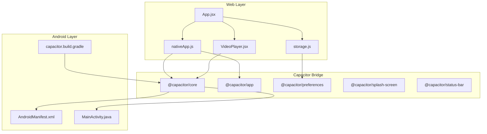
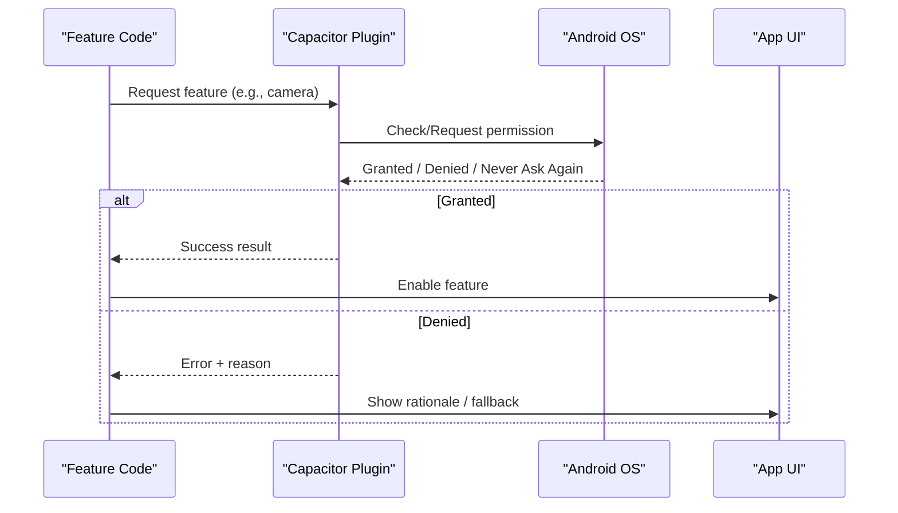
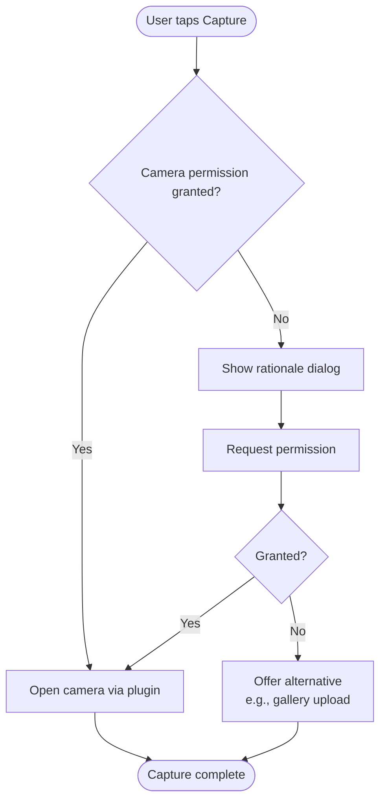
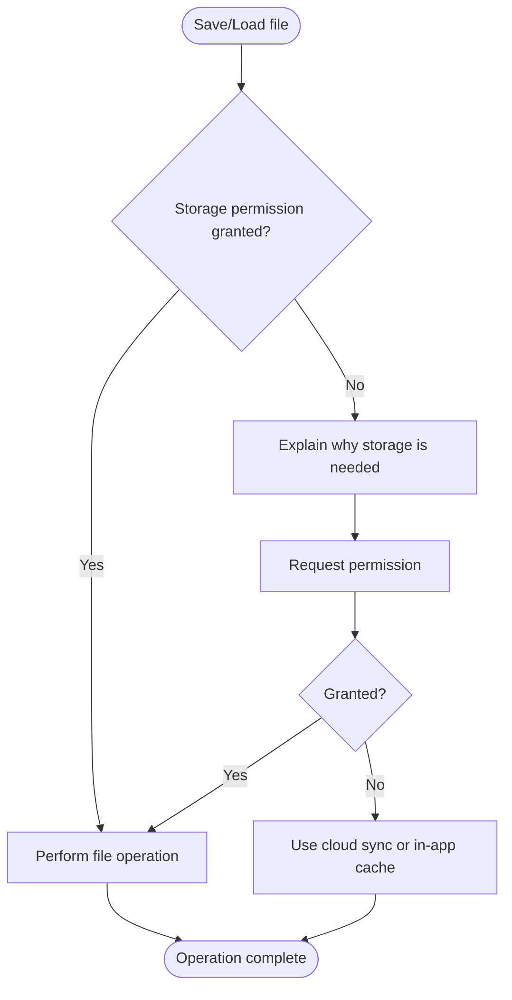
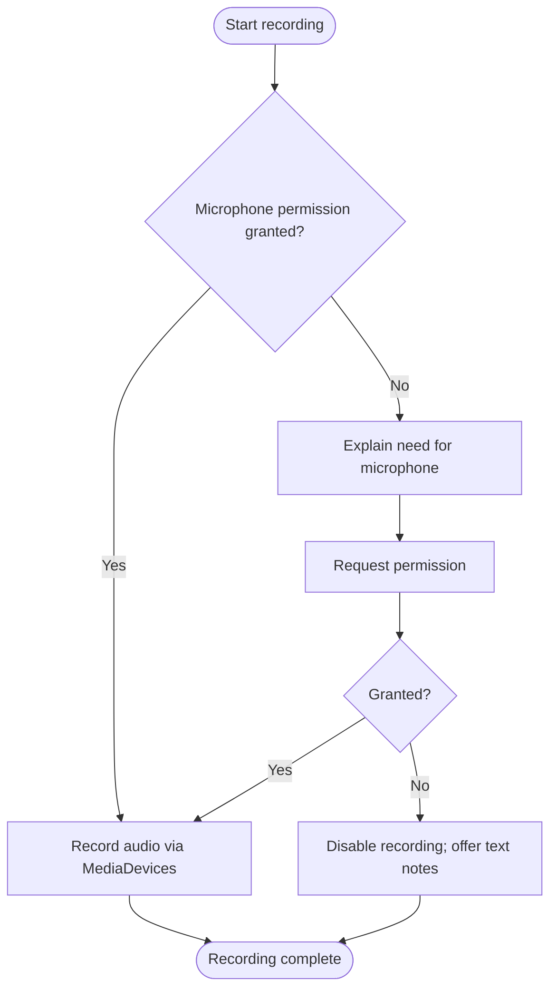
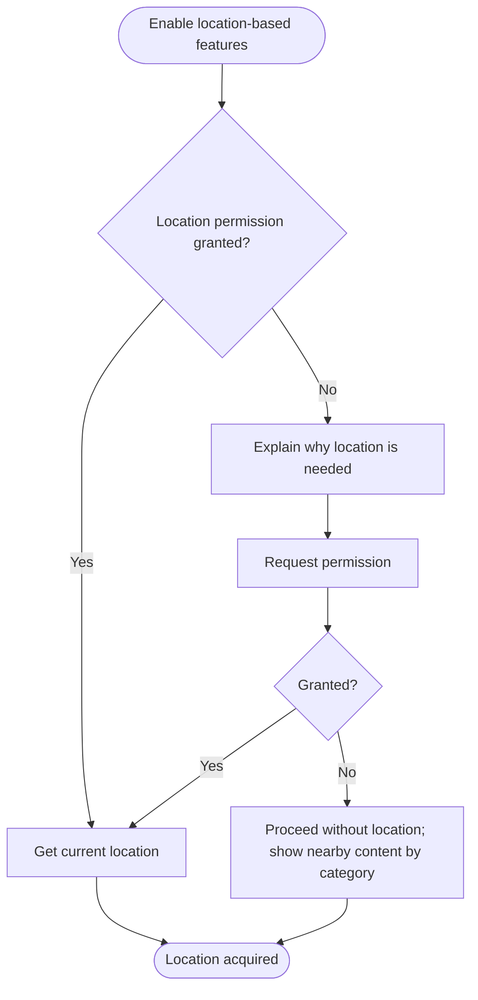
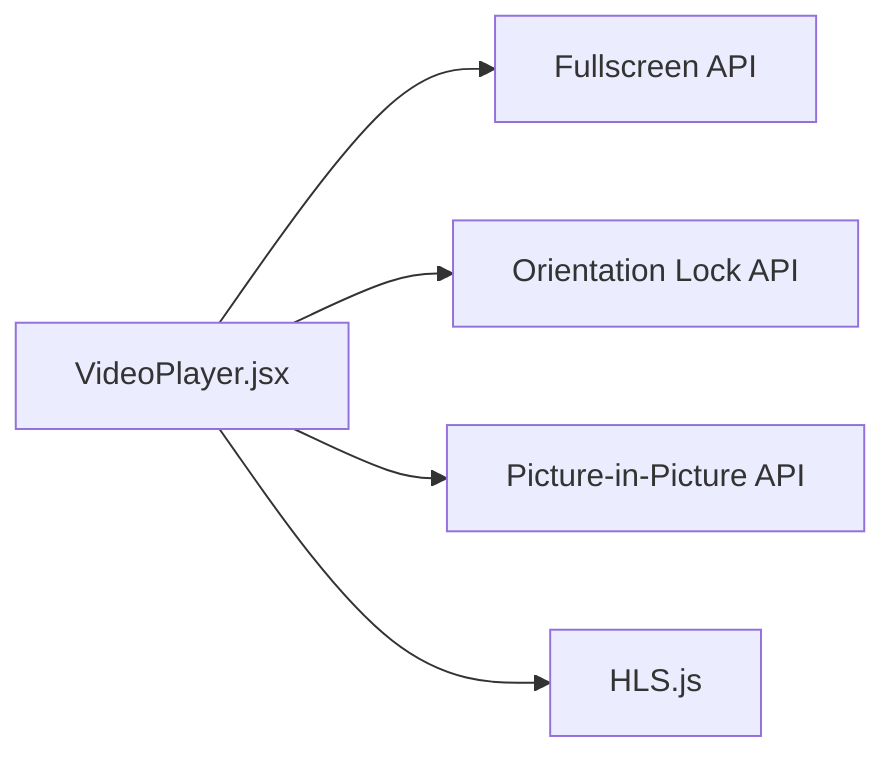
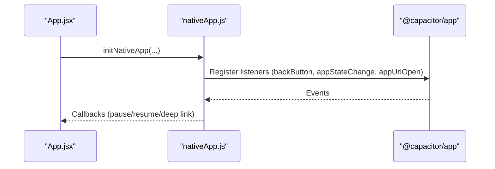
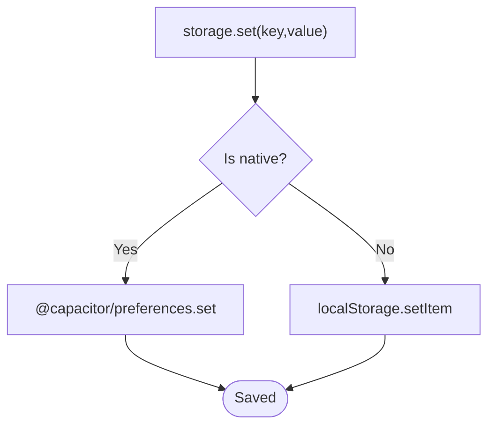
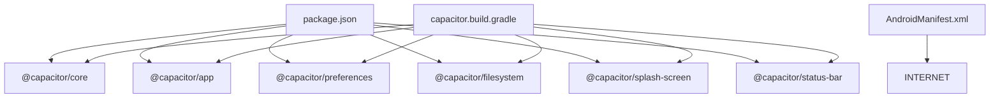

# Device Features & Permissions

<cite>
**Referenced Files in This Document**
- [AndroidManifest.xml](file://android/app/src/main/AndroidManifest.xml)
- [MainActivity.java](file://android/app/src/main/java/com/eetnet/app/MainActivity.java)
- [capacitor.config.json](file://capacitor.config.json)
- [package.json](file://package.json)
- [nativeApp.js](file://src/utils/nativeApp.js)
- [storage.js](file://src/utils/storage.js)
- [VideoPlayer.jsx](file://src/components/VideoPlayer.jsx)
- [app build.gradle](file://android/app/build.gradle)
- [capacitor.build.gradle](file://android/app/capacitor.build.gradle)
</cite>

## Table of Contents
1. [Introduction](#introduction)
2. [Project Structure](#project-structure)
3. [Core Components](#core-components)
4. [Architecture Overview](#architecture-overview)
5. [Detailed Component Analysis](#detailed-component-analysis)
6. [Dependency Analysis](#dependency-analysis)
7. [Performance Considerations](#performance-considerations)
8. [Troubleshooting Guide](#troubleshooting-guide)
9. [Conclusion](#conclusion)

## Introduction
This document explains how Project Anime accesses device features and manages permissions on Android via Capacitor. It covers the current state of the codebase, where to add runtime permission requests for camera, storage, microphone, and location, and how to handle user consent gracefully with fallback behaviors. It also provides guidance for accessing sensors, GPS, and hardware acceleration through Capacitor plugins and browser APIs already used by the app.

## Project Structure
The project is a React web application wrapped as an Android app using Capacitor. The Android layer declares the main activity and minimal manifest entries. Capacitor plugins are registered and configured at both the JavaScript and Android Gradle levels.

**Diagram sources**
- [AndroidManifest.xml:1-42](file://android/app/src/main/AndroidManifest.xml#L1-L42)
- [MainActivity.java:1-6](file://android/app/src/main/java/com/eetnet/app/MainActivity.java#L1-L6)
- [capacitor.config.json:1-32](file://capacitor.config.json#L1-L32)
- [package.json:14-23](file://package.json#L14-L23)
- [nativeApp.js:17-68](file://src/utils/nativeApp.js#L17-L68)
- [storage.js:1-37](file://src/utils/storage.js#L1-L37)
- [VideoPlayer.jsx:416-440](file://src/components/VideoPlayer.jsx#L416-L440)
- [capacitor.build.gradle:11-17](file://android/app/capacitor.build.gradle#L11-L17)

**Section sources**
- [AndroidManifest.xml:1-42](file://android/app/src/main/AndroidManifest.xml#L1-L42)
- [MainActivity.java:1-6](file://android/app/src/main/java/com/eetnet/app/MainActivity.java#L1-L6)
- [capacitor.config.json:1-32](file://capacitor.config.json#L1-L32)
- [package.json:14-23](file://package.json#L14-L23)
- [capacitor.build.gradle:11-17](file://android/app/capacitor.build.gradle#L11-L17)

## Core Components
- Native lifecycle and UI polish: nativeApp.js initializes splash screen, status bar, back button handling, pause/resume, and deep links via @capacitor/app and related plugins.
- Persistent storage: storage.js uses @capacitor/preferences on Android and falls back to localStorage on web.
- Video playback: VideoPlayer.jsx uses HLS.js, fullscreen, picture-in-picture, and orientation lock via browser APIs.
- Android entry point: MainActivity.java extends Capacitor’s BridgeActivity; AndroidManifest.xml currently declares only INTERNET permission and a FileProvider.

These components form the foundation for adding feature-specific permissions (camera, storage, microphone, location) through Capacitor plugins and declaring required Android permissions in the manifest.

**Section sources**
- [nativeApp.js:17-68](file://src/utils/nativeApp.js#L17-L68)
- [storage.js:1-37](file://src/utils/storage.js#L1-L37)
- [VideoPlayer.jsx:416-440](file://src/components/VideoPlayer.jsx#L416-L440)
- [AndroidManifest.xml:27-41](file://android/app/src/main/AndroidManifest.xml#L27-L41)

## Architecture Overview
Permission and device access flow in this project follows a layered approach:
- Feature code calls Capacitor plugins (e.g., Camera, Geolocation, Filesystem).
- Plugins request OS-level permissions when needed and return results to JS.
- JS handles success/failure and updates UI or applies fallbacks.
- AndroidManifest.xml must declare any required permissions that the plugin needs at install time.

[No sources needed since this diagram shows conceptual workflow, not actual code structure]

## Detailed Component Analysis

### Android Permission Model and Current State
- The app currently declares only INTERNET permission in the manifest.
- The main activity extends Capacitor’s BridgeActivity, enabling standard Capacitor plugin behavior.
- Capacitor plugins are included via Gradle and package dependencies.

To support camera, storage, microphone, and location:
- Add corresponding <uses-permission> entries in AndroidManifest.xml for each sensitive feature.
- Use Capacitor plugins that encapsulate permission flows:
  - Camera: @capacitor/camera
  - Storage/Filesystem: @capacitor/filesystem (for scoped storage operations)
  - Microphone: typically handled via MediaDevices.getUserMedia in the browser layer or a media capture plugin
  - Location: @capacitor/geolocation

Best practices:
- Request permissions immediately before use, not at app start.
- Provide clear user-facing rationales before prompting.
- Handle “Never ask again” by directing users to system settings.
- Implement graceful fallbacks when permissions are denied.

**Section sources**
- [AndroidManifest.xml:38-41](file://android/app/src/main/AndroidManifest.xml#L38-L41)
- [MainActivity.java:1-6](file://android/app/src/main/java/com/eetnet/app/MainActivity.java#L1-L6)
- [package.json:14-23](file://package.json#L14-L23)
- [capacitor.build.gradle:11-17](file://android/app/capacitor.build.gradle#L11-L17)

### Runtime Permission Flow for Camera

[No sources needed since this diagram shows conceptual workflow, not actual code structure]

### Runtime Permission Flow for Storage/Filesystem

[No sources needed since this diagram shows conceptual workflow, not actual code structure]

### Runtime Permission Flow for Microphone

[No sources needed since this diagram shows conceptual workflow, not actual code structure]

### Runtime Permission Flow for Location

[No sources needed since this diagram shows conceptual workflow, not actual code structure]

### Accessing Sensors, GPS, and Hardware Acceleration
- Sensors and GPS: Use @capacitor/geolocation for GPS. For other sensors (accelerometer, gyroscope), use dedicated Capacitor plugins if available or Web APIs where supported.
- Hardware acceleration: Ensure WebView rendering benefits from GPU acceleration by keeping default Capacitor settings and avoiding heavy CPU-bound tasks in the main thread.
- Orientation and fullscreen: VideoPlayer.jsx demonstrates using browser APIs for fullscreen and orientation lock, which work well on Android Chrome.

**Diagram sources**
- [VideoPlayer.jsx:416-440](file://src/components/VideoPlayer.jsx#L416-L440)

**Section sources**
- [VideoPlayer.jsx:416-440](file://src/components/VideoPlayer.jsx#L416-L440)

### Lifecycle and Native Integration
- nativeApp.js sets up splash screen, status bar, back button, app state changes, and deep link handling via Capacitor plugins.
- This pattern can be extended to wrap permission prompts within lifecycle events (e.g., prompt on resume if needed).

**Diagram sources**
- [nativeApp.js:17-68](file://src/utils/nativeApp.js#L17-L68)

**Section sources**
- [nativeApp.js:17-68](file://src/utils/nativeApp.js#L17-L68)

### Persistent Storage and Preferences
- storage.js abstracts persistence across platforms using @capacitor/preferences on Android and localStorage on web.
- This ensures data survives app restarts and OS memory pressure on Android.

**Diagram sources**
- [storage.js:1-37](file://src/utils/storage.js#L1-L37)

**Section sources**
- [storage.js:1-37](file://src/utils/storage.js#L1-L37)

## Dependency Analysis
- Android layer depends on Capacitor core and selected plugins declared in Gradle and package.json.
- Manifest currently includes only INTERNET; additional permissions must be added for sensitive features.
- The app integrates video playback via HLS.js and browser APIs, while native lifecycle is managed through Capacitor.

**Diagram sources**
- [package.json:14-23](file://package.json#L14-L23)
- [capacitor.build.gradle:11-17](file://android/app/capacitor.build.gradle#L11-L17)
- [AndroidManifest.xml:38-41](file://android/app/src/main/AndroidManifest.xml#L38-L41)

**Section sources**
- [package.json:14-23](file://package.json#L14-L23)
- [capacitor.build.gradle:11-17](file://android/app/capacitor.build.gradle#L11-L17)
- [AndroidManifest.xml:38-41](file://android/app/src/main/AndroidManifest.xml#L38-L41)

## Performance Considerations
- Defer permission prompts until just-in-time to reduce friction.
- Avoid blocking the UI thread during permission checks; use async flows.
- Prefer streaming video via HLS.js with adaptive bitrate to conserve bandwidth and battery.
- Use Picture-in-Picture and orientation lock judiciously to maintain smooth playback.
- Persist preferences efficiently using Capacitor preferences on Android to avoid frequent disk writes.

[No sources needed since this section provides general guidance]

## Troubleshooting Guide
Common issues and resolutions:
- Missing permissions in manifest: If a plugin requires a permission (e.g., CAMERA, RECORD_AUDIO, ACCESS_FINE_LOCATION), add it to AndroidManifest.xml. Without it, the OS will deny access even if requested at runtime.
- Permission denied permanently: Detect “Never ask again” and guide users to open app settings to grant the permission.
- Storage failures: On modern Android versions, prefer scoped storage APIs via Capacitor Filesystem rather than broad storage permissions when possible.
- Video playback errors: Validate stream URLs, ensure HLS support, and handle network errors gracefully.

**Section sources**
- [AndroidManifest.xml:38-41](file://android/app/src/main/AndroidManifest.xml#L38-L41)
- [VideoPlayer.jsx:416-440](file://src/components/VideoPlayer.jsx#L416-L440)

## Conclusion
Project Anime uses Capacitor to bridge web code with Android capabilities. Currently, only internet access is declared in the manifest. To fully support camera, storage, microphone, and location, add the appropriate Capacitor plugins, declare required permissions in AndroidManifest.xml, implement just-in-time permission prompts with clear rationales, and provide robust fallbacks when permissions are denied. Leverage existing patterns in nativeApp.js and storage.js for consistent native integration and persistence.