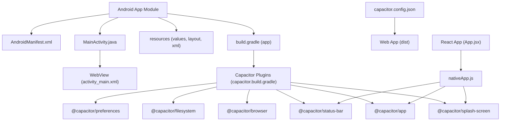
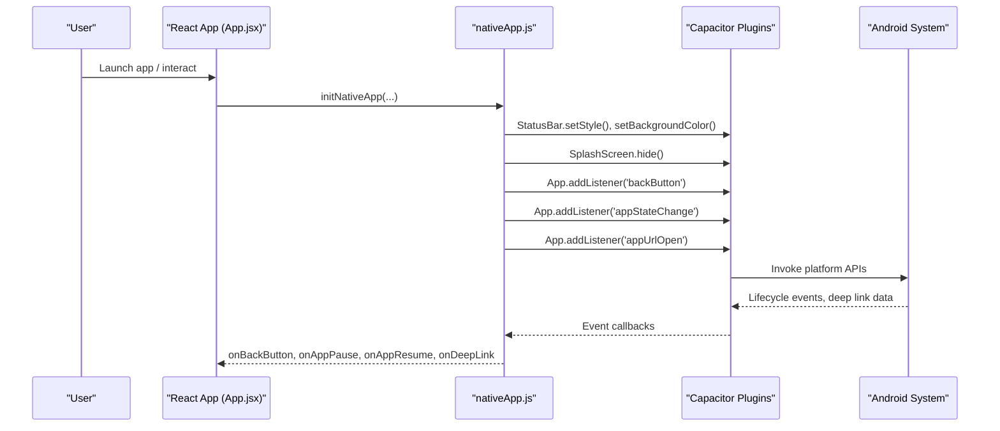
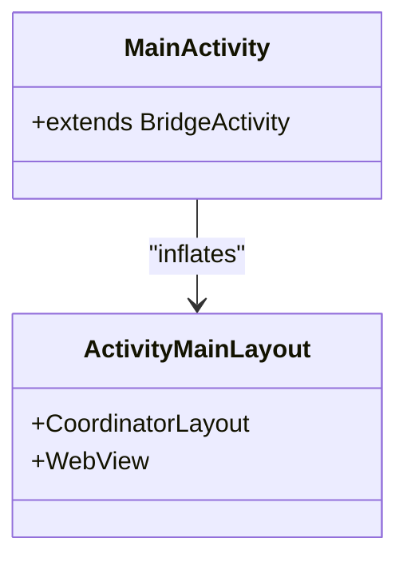
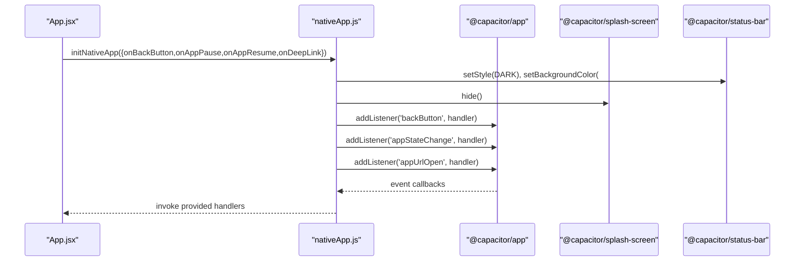
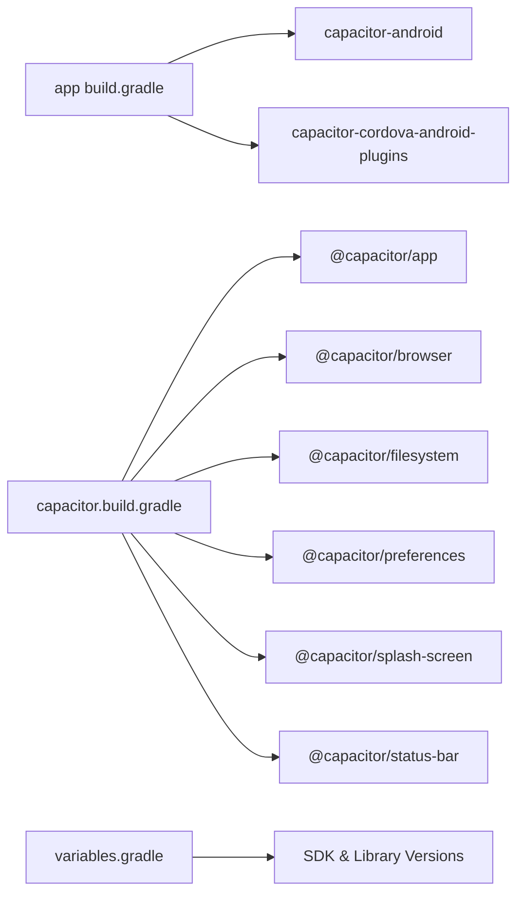

# Native Android Development

<cite>
**Referenced Files in This Document**
- [MainActivity.java](file://android/app/src/main/java/com/eetnet/app/MainActivity.java)
- [AndroidManifest.xml](file://android/app/src/main/AndroidManifest.xml)
- [build.gradle (app)](file://android/app/build.gradle)
- [variables.gradle](file://android/variables.gradle)
- [capacitor.build.gradle](file://android/app/capacitor.build.gradle)
- [activity_main.xml](file://android/app/src/main/res/layout/activity_main.xml)
- [styles.xml](file://android/app/src/main/res/values/styles.xml)
- [strings.xml](file://android/app/src/main/res/values/strings.xml)
- [file_paths.xml](file://android/app/src/main/res/xml/file_paths.xml)
- [capacitor.config.json](file://capacitor.config.json)
- [nativeApp.js](file://src/utils/nativeApp.js)
- [App.jsx](file://src/App.jsx)
</cite>

## Table of Contents
1. Introduction
2. Project Structure
3. Core Components
4. Architecture Overview
5. Detailed Component Analysis
6. Dependency Analysis
7. Performance Considerations
8. Troubleshooting Guide
9. Conclusion

## Introduction
This document explains native Android development for the Project Anime mobile application built with Capacitor. It focuses on how the Android host app integrates with React components, how to configure resources and permissions, and how to implement custom native plugins and device features. It also provides guidance for accessing camera, storage, network capabilities, integrating third-party libraries, handling lifecycle events, and optimizing performance for streaming scenarios.

## Project Structure
The Android project is a standard Capacitor-based Android module that hosts a WebView containing the web build. Key areas:
- App entry point and WebView container
- Manifest configuration for permissions and providers
- Resource management for themes, strings, and file sharing
- Build configuration for SDK versions, dependencies, and Capacitor plugins
- Bridge between React and native via Capacitor plugins

**Diagram sources**
- [MainActivity.java:1-6](file://android/app/src/main/java/com/eetnet/app/MainActivity.java#L1-L6)
- [AndroidManifest.xml:1-42](file://android/app/src/main/AndroidManifest.xml#L1-L42)
- [build.gradle (app):1-55](file://android/app/build.gradle#L1-L55)
- [capacitor.build.gradle:1-25](file://android/app/capacitor.build.gradle#L1-L25)
- [activity_main.xml:1-13](file://android/app/src/main/res/layout/activity_main.xml#L1-L13)
- [capacitor.config.json:1-32](file://capacitor.config.json#L1-L32)
- [nativeApp.js:1-69](file://src/utils/nativeApp.js#L1-L69)
- [App.jsx:240-278](file://src/App.jsx#L240-L278)

**Section sources**
- [MainActivity.java:1-6](file://android/app/src/main/java/com/eetnet/app/MainActivity.java#L1-L6)
- [AndroidManifest.xml:1-42](file://android/app/src/main/AndroidManifest.xml#L1-L42)
- [build.gradle (app):1-55](file://android/app/build.gradle#L1-L55)
- [variables.gradle:1-16](file://android/variables.gradle#L1-L16)
- [capacitor.build.gradle:1-25](file://android/app/capacitor.build.gradle#L1-L25)
- [activity_main.xml:1-13](file://android/app/src/main/res/layout/activity_main.xml#L1-L13)
- [styles.xml:1-22](file://android/app/src/main/res/values/styles.xml#L1-L22)
- [strings.xml:1-8](file://android/app/src/main/res/values/strings.xml#L1-L8)
- [file_paths.xml:1-5](file://android/app/src/main/res/xml/file_paths.xml#L1-L5)
- [capacitor.config.json:1-32](file://capacitor.config.json#L1-L32)
- [nativeApp.js:1-69](file://src/utils/nativeApp.js#L1-L69)
- [App.jsx:240-278](file://src/App.jsx#L240-L278)

## Core Components
- MainActivity: Minimal bridge class extending Capacitor’s BridgeActivity to host the WebView and manage the app lifecycle.
- AndroidManifest: Declares the main activity, theme, FileProvider for secure file sharing, and Internet permission.
- Resources:
  - styles.xml defines app theme and launch splash theme.
  - strings.xml defines app name and URL scheme.
  - activity_main.xml contains the WebView container.
  - file_paths.xml configures FileProvider paths for external/cache directories.
- Build Configuration:
  - variables.gradle centralizes SDK versions and dependency versions.
  - capacitor.build.gradle adds Capacitor plugin modules (App, Splash Screen, Status Bar, Browser, Filesystem, Preferences).
  - app build.gradle sets compile/target SDKs, packaging options, and applies Capacitor Gradle scripts.
- Capacitor Config:
  - capacitor.config.json configures splash screen, status bar, keyboard behavior, and WebView settings like mixed content.
- React Integration:
  - App.jsx initializes native handlers (back button, pause/resume, deep links) and restores sessions.
  - nativeApp.js bridges to Capacitor plugins for UI polish and lifecycle events.

**Section sources**
- [MainActivity.java:1-6](file://android/app/src/main/java/com/eetnet/app/MainActivity.java#L1-L6)
- [AndroidManifest.xml:1-42](file://android/app/src/main/AndroidManifest.xml#L1-L42)
- [activity_main.xml:1-13](file://android/app/src/main/res/layout/activity_main.xml#L1-L13)
- [styles.xml:1-22](file://android/app/src/main/res/values/styles.xml#L1-L22)
- [strings.xml:1-8](file://android/app/src/main/res/values/strings.xml#L1-L8)
- [file_paths.xml:1-5](file://android/app/src/main/res/xml/file_paths.xml#L1-L5)
- [variables.gradle:1-16](file://android/variables.gradle#L1-L16)
- [capacitor.build.gradle:1-25](file://android/app/capacitor.build.gradle#L1-L25)
- [build.gradle (app):1-55](file://android/app/build.gradle#L1-L55)
- [capacitor.config.json:1-32](file://capacitor.config.json#L1-L32)
- [nativeApp.js:1-69](file://src/utils/nativeApp.js#L1-L69)
- [App.jsx:240-278](file://src/App.jsx#L240-L278)

## Architecture Overview
The app uses Capacitor to bridge React code with native Android. The Android host app runs a WebView that loads the web build. React calls Capacitor plugins to access native features (splash screen, status bar, app lifecycle, deep links). The manifest declares necessary permissions and providers. Build files coordinate SDK versions and plugin dependencies.

**Diagram sources**
- [App.jsx:240-278](file://src/App.jsx#L240-L278)
- [nativeApp.js:17-68](file://src/utils/nativeApp.js#L17-L68)
- [capacitor.config.json:1-32](file://capacitor.config.json#L1-L32)
- [AndroidManifest.xml:12-35](file://android/app/src/main/AndroidManifest.xml#L12-L35)

## Detailed Component Analysis

### MainActivity and WebView Container
- MainActivity extends BridgeActivity to integrate with Capacitor. It requires no additional code unless you need custom initialization or overrides.
- The layout activity_main.xml hosts a full-screen WebView within a CoordinatorLayout.
- The manifest registers MainActivity as the launcher activity and applies the NoActionBarLaunch theme for splash integration.

**Diagram sources**
- [MainActivity.java:1-6](file://android/app/src/main/java/com/eetnet/app/MainActivity.java#L1-L6)
- [activity_main.xml:1-13](file://android/app/src/main/res/layout/activity_main.xml#L1-L13)
- [AndroidManifest.xml:12-25](file://android/app/src/main/AndroidManifest.xml#L12-L25)

**Section sources**
- [MainActivity.java:1-6](file://android/app/src/main/java/com/eetnet/app/MainActivity.java#L1-L6)
- [activity_main.xml:1-13](file://android/app/src/main/res/layout/activity_main.xml#L1-L13)
- [AndroidManifest.xml:12-25](file://android/app/src/main/AndroidManifest.xml#L12-L25)

### Android Manifest and Permissions
- Declares the main activity with appropriate configChanges and launch mode.
- Adds a FileProvider for secure file sharing using file_paths.xml.
- Grants INTERNET permission required for network requests from the WebView.

Guidelines for adding more permissions:
- Camera: Add CAMERA permission and request at runtime when needed.
- Storage: For scoped storage, use MediaStore and FileProvider; avoid legacy storage permissions where possible.
- Location, Microphone, Bluetooth, etc.: Add corresponding <uses-permission> entries and handle runtime requests in React via Capacitor plugins.

**Section sources**
- [AndroidManifest.xml:1-42](file://android/app/src/main/AndroidManifest.xml#L1-L42)
- [file_paths.xml:1-5](file://android/app/src/main/res/xml/file_paths.xml#L1-L5)

### Resources and Theming
- styles.xml defines base theme and launch theme for splash screen integration.
- strings.xml defines app name and URL scheme used by deep linking.
- Ensure splash images are provided under drawable resources referenced by the splash configuration.

**Section sources**
- [styles.xml:1-22](file://android/app/src/main/res/values/styles.xml#L1-L22)
- [strings.xml:1-8](file://android/app/src/main/res/values/strings.xml#L1-L8)

### Build Configuration and Dependencies
- variables.gradle centralizes compileSdk, targetSdk, minSdk, and library versions.
- capacitor.build.gradle includes Capacitor plugin modules for App, Splash Screen, Status Bar, Browser, Filesystem, and Preferences.
- app build.gradle sets applicationId, versioning, packaging options, and applies Capacitor Gradle scripts. It also conditionally applies Google Services if google-services.json exists.

Adding third-party Android libraries:
- Use Gradle implementation dependencies in app build.gradle.
- Ensure compatibility with compileSdk and Java/Kotlin versions.
- If using ProGuard/R8, add rules in proguard-rules.pro.

**Section sources**
- [variables.gradle:1-16](file://android/variables.gradle#L1-L16)
- [capacitor.build.gradle:1-25](file://android/app/capacitor.build.gradle#L1-L25)
- [build.gradle (app):1-55](file://android/app/build.gradle#L1-L55)

### Capacitor Configuration and WebView Settings
- capacitor.config.json configures:
  - Splash screen behavior (duration, auto-hide, immersive, background color).
  - Status bar style and overlay behavior.
  - Keyboard resize behavior.
  - WebView options such as allowMixedContent.

These settings affect how the app presents itself and interacts with the WebView during runtime.

**Section sources**
- [capacitor.config.json:1-32](file://capacitor.config.json#L1-L32)

### React-to-Native Bridge (Lifecycle, Back Button, Deep Links)
- App.jsx initializes native handlers:
  - Back button navigation using history API.
  - Pause/Resume to save session state.
  - Deep link callback to handle OAuth redirects.
- nativeApp.js:
  - Detects native platform via Capacitor.
  - Applies dark status bar and hides splash screen.
  - Registers listeners for back button, app state changes, and deep links.

**Diagram sources**
- [App.jsx:240-278](file://src/App.jsx#L240-L278)
- [nativeApp.js:17-68](file://src/utils/nativeApp.js#L17-L68)

**Section sources**
- [App.jsx:240-278](file://src/App.jsx#L240-L278)
- [nativeApp.js:1-69](file://src/utils/nativeApp.js#L1-L69)

### Implementing Custom Native Plugins
To extend native functionality beyond Capacitor plugins:
- Create a new Android module or add classes under your package.
- Expose methods via a Capacitor plugin interface so they can be called from JavaScript.
- Register the plugin in your app’s Gradle configuration and ensure it is included in the build.
- In React, call the plugin through the Capacitor JS bridge.

Best practices:
- Keep plugin APIs minimal and well-documented.
- Handle errors gracefully and return consistent result objects.
- Test on multiple Android versions due to permission and API differences.

[No sources needed since this section provides general guidance]

### Handling Device-Specific Features and Permissions
- Network: INTERNET permission is already declared. For HTTPS-only policies, ensure server certificates are valid and consider allowing specific domains if needed.
- Camera: Add CAMERA permission and request at runtime before invoking camera APIs via Capacitor or custom plugin.
- Storage: Use MediaStore and FileProvider for reading/writing media files. Avoid legacy storage permissions on newer Android versions.
- Location/Microphone/Bluetooth: Add required permissions and request at runtime. Use Capacitor plugins where available.

**Section sources**
- [AndroidManifest.xml:38-41](file://android/app/src/main/AndroidManifest.xml#L38-L41)
- [file_paths.xml:1-5](file://android/app/src/main/res/xml/file_paths.xml#L1-L5)

### Integrating Third-Party Android Libraries
Steps:
- Add implementation dependencies in app build.gradle.
- Sync Gradle and resolve any conflicts with existing versions.
- If the library requires permissions or manifest entries, add them accordingly.
- Configure ProGuard rules if needed.

Example considerations:
- Ensure library supports the compileSdk and Java versions defined in variables.gradle.
- Prefer libraries with active maintenance and clear documentation.

**Section sources**
- [build.gradle (app):33-43](file://android/app/build.gradle#L33-L43)
- [variables.gradle:1-16](file://android/variables.gradle#L1-L16)

### Managing Lifecycle Events
- onPause/onResume: Save app state and release heavy resources in pause; restore in resume.
- Deep links: Handle incoming URLs for authentication flows or navigation.
- Back button: Provide intuitive navigation behavior consistent with user expectations.

Current implementation:
- App.jsx saves session on pause and handles deep links for OAuth callbacks.
- nativeApp.js wires up Capacitor listeners for these events.

**Section sources**
- [App.jsx:240-278](file://src/App.jsx#L240-L278)
- [nativeApp.js:37-68](file://src/utils/nativeApp.js#L37-L68)

## Dependency Analysis
The Android module depends on Capacitor core and several plugin modules. Build configuration centralizes versions to reduce drift.

**Diagram sources**
- [build.gradle (app):33-43](file://android/app/build.gradle#L33-L43)
- [capacitor.build.gradle:11-19](file://android/app/capacitor.build.gradle#L11-L19)
- [variables.gradle:1-16](file://android/variables.gradle#L1-L16)

**Section sources**
- [build.gradle (app):33-43](file://android/app/build.gradle#L33-L43)
- [capacitor.build.gradle:11-19](file://android/app/capacitor.build.gradle#L11-L19)
- [variables.gradle:1-16](file://android/variables.gradle#L1-L16)

## Performance Considerations
For streaming-focused apps on Android:
- Minimize main thread work: Offload heavy tasks to background threads.
- Optimize WebView settings:
  - Enable hardware acceleration.
  - Tune cache sizes and disable unnecessary features.
  - Use allowMixedContent judiciously based on security needs.
- Manage memory:
  - Release resources on pause; reinitialize on resume.
  - Avoid holding large objects in memory across lifecycle changes.
- Network efficiency:
  - Use efficient codecs and adaptive bitrate streaming where possible.
  - Cache responses and assets appropriately.
- UI responsiveness:
  - Defer non-critical UI updates until after initial render.
  - Use lazy loading for lists and media.

[No sources needed since this section provides general guidance]

## Troubleshooting Guide
Common issues and resolutions:
- Splash screen not hiding:
  - Ensure Capacitor splash screen plugin is configured and hide is called after app initialization.
- Status bar styling not applied:
  - Verify Capacitor status bar plugin is included and style is set correctly.
- Deep links not triggering:
  - Confirm URL scheme in strings.xml matches the app’s intent filters and Capacitor configuration.
- Permission denied:
  - Add required permissions to manifest and request at runtime before use.
- FileProvider errors:
  - Ensure file_paths.xml is correctly configured and authorities match the manifest provider declaration.

**Section sources**
- [capacitor.config.json:6-24](file://capacitor.config.json#L6-L24)
- [AndroidManifest.xml:27-35](file://android/app/src/main/AndroidManifest.xml#L27-L35)
- [strings.xml:3-7](file://android/app/src/main/res/values/strings.xml#L3-L7)
- [nativeApp.js:25-35](file://src/utils/nativeApp.js#L25-L35)

## Conclusion
Project Anime leverages Capacitor to seamlessly bridge React components with native Android capabilities. The minimal MainActivity, carefully configured manifest, and resource setup provide a solid foundation. React-side initialization handles lifecycle events, deep links, and UI polish via Capacitor plugins. By following the guidelines for permissions, third-party integrations, and performance optimization, you can extend the app with robust native features tailored for streaming experiences.