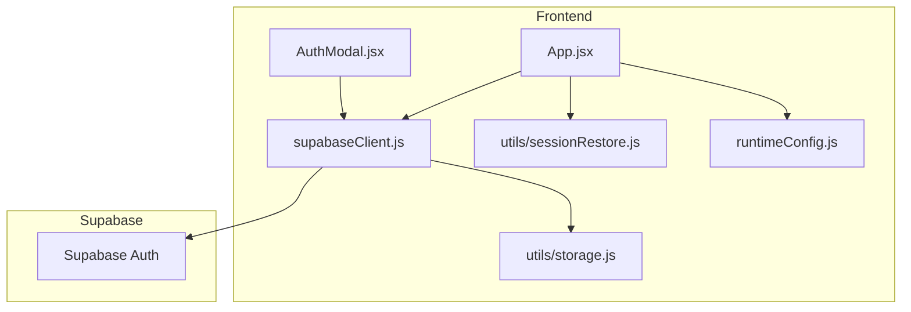
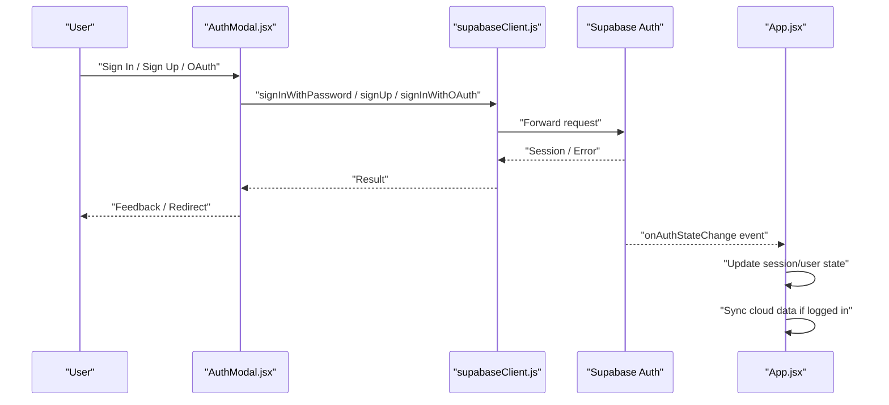
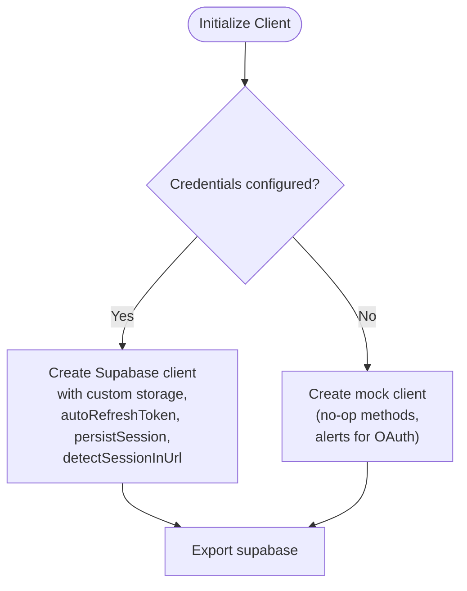
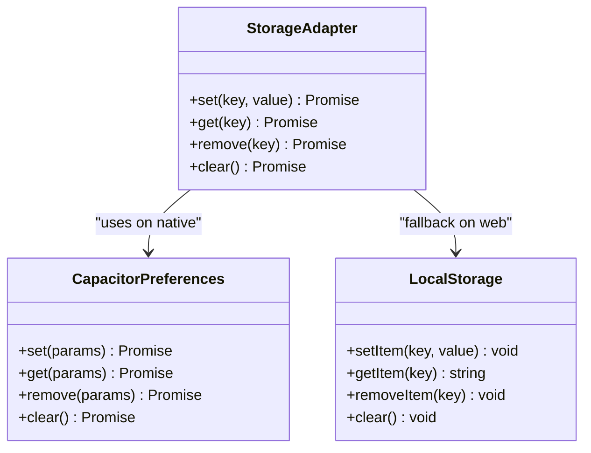
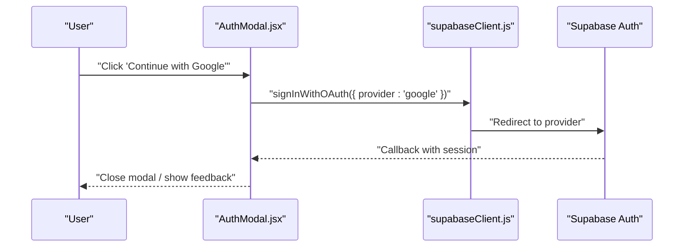
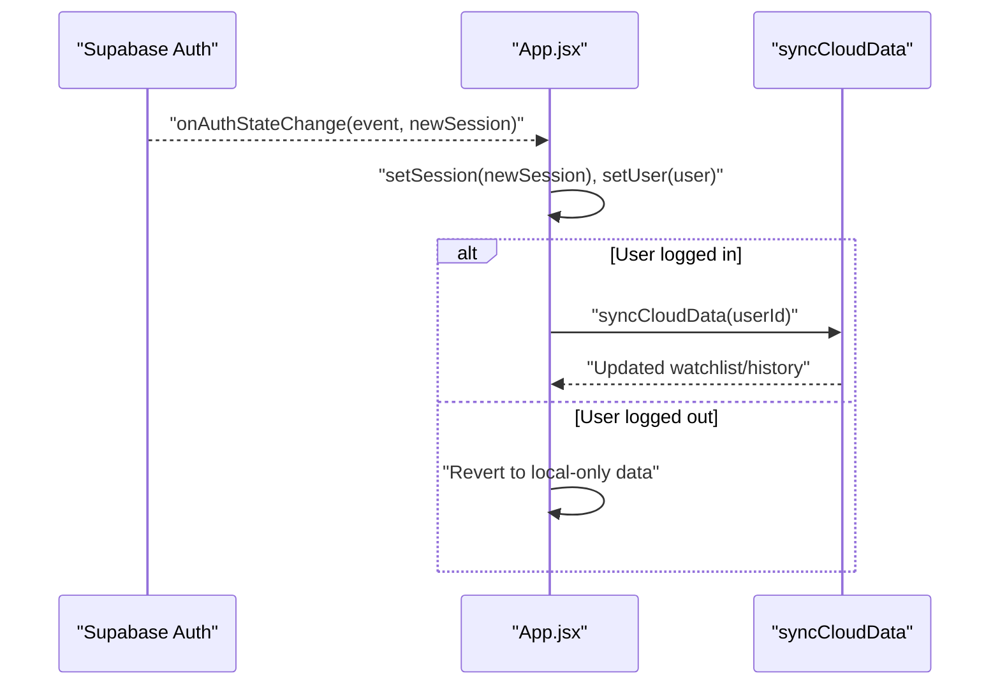
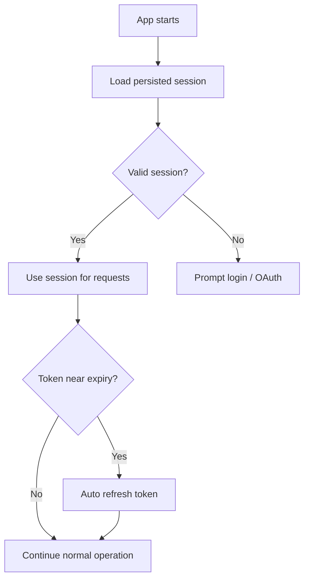
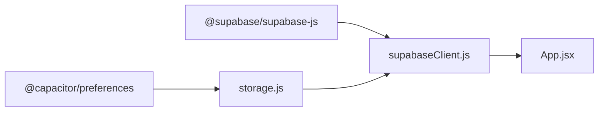

# Authentication System

<cite>
**Referenced Files in This Document**
- [supabaseClient.js](file://src/supabaseClient.js)
- [AuthModal.jsx](file://src/components/AuthModal.jsx)
- [storage.js](file://src/utils/storage.js)
- [sessionRestore.js](file://src/utils/sessionRestore.js)
- [runtimeConfig.js](file://src/runtimeConfig.js)
- [main.jsx](file://src/main.jsx)
- [App.jsx](file://src/App.jsx)
- [vite.config.js](file://vite.config.js)
- [vercel.json](file://vercel.json)
- [package.json](file://package.json)
</cite>

## Table of Contents
1. [Introduction](#introduction)
2. [Project Structure](#project-structure)
3. [Core Components](#core-components)
4. [Architecture Overview](#architecture-overview)
5. [Detailed Component Analysis](#detailed-component-analysis)
6. [Dependency Analysis](#dependency-analysis)
7. [Performance Considerations](#performance-considerations)
8. [Troubleshooting Guide](#troubleshooting-guide)
9. [Conclusion](#conclusion)
10. [Appendices](#appendices)

## Introduction
This document explains Project Anime’s authentication system with a focus on Supabase integration, session management, and the fallback behavior when credentials are not configured. It covers client initialization, custom storage adapter, environment configuration, login flow to protected routes, token management, automatic refresh, OAuth providers (Google, Discord), error handling, cross-tab session synchronization, security considerations, CORS configuration, and debugging steps.

## Project Structure
The authentication system is centered around:
- A Supabase client that initializes either a real client or a mock client depending on environment variables.
- A custom storage adapter that persists sessions using Capacitor Preferences on native platforms and localStorage on web.
- An Auth modal component for sign-in, sign-up, and OAuth flows.
- App-level session listeners that update UI state and sync data across tabs and devices.
- Runtime configuration utilities that manage API endpoints and environment overrides.

**Diagram sources**
- [App.jsx:593-621](file://src/App.jsx#L593-L621)
- [AuthModal.jsx:122-187](file://src/components/AuthModal.jsx#L122-L187)
- [supabaseClient.js:1-98](file://src/supabaseClient.js#L1-L98)
- [storage.js:29-70](file://src/utils/storage.js#L29-L70)
- [sessionRestore.js:17-48](file://src/utils/sessionRestore.js#L17-L48)
- [runtimeConfig.js:82-129](file://src/runtimeConfig.js#L82-L129)

**Section sources**
- [supabaseClient.js:1-98](file://src/supabaseClient.js#L1-L98)
- [AuthModal.jsx:1-419](file://src/components/AuthModal.jsx#L1-L419)
- [storage.js:1-71](file://src/utils/storage.js#L1-L71)
- [sessionRestore.js:1-158](file://src/utils/sessionRestore.js#L1-L158)
- [runtimeConfig.js:1-163](file://src/runtimeConfig.js#L1-L163)
- [main.jsx:1-15](file://src/main.jsx#L1-L15)
- [App.jsx:593-621](file://src/App.jsx#L593-L621)

## Core Components
- Supabase client initialization and fallback
  - Reads environment variables for URL and anon key.
  - Creates a real client with custom storage, auto-refresh tokens, persistence, and URL detection when configured.
  - Falls back to a mock client that simulates auth methods and returns no-op results when credentials are missing.
- Custom storage adapter
  - Persists auth tokens via Capacitor Preferences on native platforms; falls back to localStorage on web.
  - Provides getItem/setItem/removeItem interfaces compatible with Supabase’s expected storage contract.
- Auth modal
  - Handles email/password sign-in/sign-up and OAuth redirects for Google and Discord.
  - Displays user-friendly error messages and loading states.
- App-level session listener
  - Subscribes to auth state changes to keep UI in sync and trigger cloud sync when logged in.
  - Restores deep links/callbacks from native apps by refreshing session.

**Section sources**
- [supabaseClient.js:4-98](file://src/supabaseClient.js#L4-L98)
- [storage.js:29-70](file://src/utils/storage.js#L29-L70)
- [AuthModal.jsx:122-187](file://src/components/AuthModal.jsx#L122-L187)
- [App.jsx:593-621](file://src/App.jsx#L593-L621)

## Architecture Overview
The authentication architecture follows a clear separation of concerns:
- Environment-driven client selection ensures graceful degradation without breaking the app when credentials are absent.
- A unified storage abstraction supports both native and web environments.
- The UI layer reacts to auth events and orchestrates data synchronization.

**Diagram sources**
- [AuthModal.jsx:122-187](file://src/components/AuthModal.jsx#L122-L187)
- [supabaseClient.js:26-39](file://src/supabaseClient.js#L26-L39)
- [App.jsx:593-621](file://src/App.jsx#L593-L621)

## Detailed Component Analysis

### Supabase Client Initialization and Fallback
- When VITE_SUPABASE_URL and VITE_SUPABASE_ANON_KEY are present, a real Supabase client is created with:
  - Custom storage adapter for persistent sessions.
  - Auto token refresh enabled.
  - Session persistence enabled.
  - URL-based session detection enabled for OAuth callbacks.
- If credentials are missing, a mock client is provided:
  - Methods like getSession/getUser return empty/null values.
  - signInWithPassword and signUp simulate success with a mock user.
  - signInWithOAuth shows an alert instructing users to configure credentials.
  - Database queries return no-op builders to prevent runtime errors.

**Diagram sources**
- [supabaseClient.js:4-98](file://src/supabaseClient.js#L4-L98)

**Section sources**
- [supabaseClient.js:4-98](file://src/supabaseClient.js#L4-L98)

### Custom Storage Adapter
- Detects native platform via Capacitor and uses @capacitor/preferences for persistent storage.
- On web, falls back to localStorage.
- Serializes values to JSON for consistent storage format.
- Provides robust get/set/remove/clear operations with error handling.

**Diagram sources**
- [storage.js:8-27](file://src/utils/storage.js#L8-L27)
- [storage.js:29-70](file://src/utils/storage.js#L29-L70)

**Section sources**
- [storage.js:1-71](file://src/utils/storage.js#L1-L71)

### Auth Modal and Flows
- Email/password sign-in:
  - Validates inputs, calls signInWithPassword, handles errors with friendly messages, and closes modal on success.
- Registration:
  - Validates fields including password strength hints, calls signUp with username metadata, and navigates to sign-in after confirmation message.
- OAuth providers:
  - Google and Discord buttons call signInWithOAuth with redirect URL set to current origin.
  - Errors are handled and displayed to the user.

**Diagram sources**
- [AuthModal.jsx:171-187](file://src/components/AuthModal.jsx#L171-L187)
- [supabaseClient.js:87-90](file://src/supabaseClient.js#L87-L90)

**Section sources**
- [AuthModal.jsx:122-187](file://src/components/AuthModal.jsx#L122-L187)

### App-Level Session Management and Protected Routes
- Global auth state subscription:
  - Listens to onAuthStateChange to update session and user state.
  - Triggers cloud sync when a user logs in and reverts to local-only data when logged out.
- Deep link callback handling:
  - On native app resume with a callback URL, refreshes session via getSession.
- Protected route access:
  - While there is no explicit route guard middleware, features can check user presence before rendering sensitive content or syncing data.

**Diagram sources**
- [App.jsx:593-621](file://src/App.jsx#L593-L621)
- [App.jsx:256-260](file://src/App.jsx#L256-L260)

**Section sources**
- [App.jsx:593-621](file://src/App.jsx#L593-L621)
- [App.jsx:256-260](file://src/App.jsx#L256-L260)

### Token Management and Automatic Refresh
- The real Supabase client is configured with autoRefreshToken and persistSession, ensuring:
  - Tokens are automatically refreshed before expiration.
  - Sessions survive page reloads and app restarts.
- Custom storage adapter ensures tokens are stored persistently across sessions.

**Diagram sources**
- [supabaseClient.js:26-39](file://src/supabaseClient.js#L26-L39)
- [storage.js:29-70](file://src/utils/storage.js#L29-L70)

**Section sources**
- [supabaseClient.js:26-39](file://src/supabaseClient.js#L26-L39)
- [storage.js:29-70](file://src/utils/storage.js#L29-L70)

### Fallback Mechanism Without Credentials
- When credentials are not configured:
  - A mock client is exported to prevent runtime errors.
  - Auth methods simulate success or provide alerts guiding setup.
  - Database queries return no-op builders.
- This allows development and testing without a live Supabase project.

**Section sources**
- [supabaseClient.js:41-95](file://src/supabaseClient.js#L41-L95)

### Cross-Tab Session Synchronization
- Supabase’s onAuthStateChange emits events across tabs when sessions change due to shared storage.
- The app updates its UI state accordingly, ensuring consistency across open tabs.

**Section sources**
- [App.jsx:593-621](file://src/App.jsx#L593-L621)

### Environment Configuration and Runtime Config
- Supabase credentials are read from environment variables at build time.
- Runtime config utility manages API base URLs with multiple fallbacks and query overrides, useful for dev/prod scenarios.
- Vite proxy forwards /api requests to a local backend during development.

**Section sources**
- [supabaseClient.js:4-5](file://src/supabaseClient.js#L4-L5)
- [runtimeConfig.js:82-129](file://src/runtimeConfig.js#L82-L129)
- [vite.config.js:7-21](file://vite.config.js#L7-L21)

## Dependency Analysis
Key dependencies involved in authentication:
- @supabase/supabase-js provides the client and auth APIs.
- @capacitor/preferences enables persistent storage on Android.
- Express and cors are available for server-side needs but not directly used by frontend auth.

**Diagram sources**
- [package.json:14-35](file://package.json#L14-L35)
- [supabaseClient.js:1-3](file://src/supabaseClient.js#L1-L3)
- [storage.js:18-27](file://src/utils/storage.js#L18-L27)

**Section sources**
- [package.json:14-35](file://package.json#L14-L35)

## Performance Considerations
- Avoid unnecessary network calls by relying on persisted sessions and auto token refresh.
- Debounce heavy operations like syncing large datasets upon login.
- Prefer minimal state snapshots for session restoration to reduce storage overhead.

[No sources needed since this section provides general guidance]

## Troubleshooting Guide
Common issues and resolutions:
- Missing credentials:
  - Ensure VITE_SUPABASE_URL and VITE_SUPABASE_ANON_KEY are set in your environment.
  - If not configured, the app runs in mock mode; expect alerts for OAuth and simulated logins.
- OAuth redirect failures:
  - Verify redirect URL matches your site origin and is allowed in Supabase provider settings.
  - Check browser console for errors and ensure detectSessionInUrl is enabled.
- Rate limiting:
  - Friendly error messages indicate rate limits; wait and retry.
- Cross-origin issues:
  - For local development, use Vite proxy to forward /api requests.
  - Configure Supabase CORS to allow your domain.
- Debugging:
  - Open browser DevTools Console to see warnings about missing credentials and config resolution.
  - Inspect storage (localStorage or Capacitor Preferences) to verify token persistence.

**Section sources**
- [supabaseClient.js:41-46](file://src/supabaseClient.js#L41-L46)
- [AuthModal.jsx:6-37](file://src/components/AuthModal.jsx#L6-L37)
- [runtimeConfig.js:82-129](file://src/runtimeConfig.js#L82-L129)
- [vite.config.js:7-21](file://vite.config.js#L7-L21)

## Conclusion
Project Anime implements a robust, resilient authentication system that integrates seamlessly with Supabase while providing a smooth developer experience through a comprehensive fallback mechanism. The custom storage adapter ensures persistence across platforms, and the app-level session listener keeps UI and data synchronized. With clear error handling, OAuth support, and environment-aware configuration, the system scales from local development to production deployments.

[No sources needed since this section summarizes without analyzing specific files]

## Appendices

### Security Considerations
- Keep Supabase anon keys safe; they are intended for client-side use but should be scoped appropriately in Supabase policies.
- Validate all user inputs on the client and enforce server-side checks where applicable.
- Use HTTPS in production to protect tokens and sessions.
- Configure Supabase CORS to restrict origins to your domains.

[No sources needed since this section provides general guidance]

### CORS Configuration
- Frontend dev server proxies /api to localhost:8080 to avoid CORS issues during development.
- In production, ensure Supabase and any backend services allow your deployed domain.

**Section sources**
- [vite.config.js:7-21](file://vite.config.js#L7-L21)

### Example Implementations Reference
- OAuth providers:
  - Google: See the handler that initiates OAuth with provider 'google'.
  - Discord: See the handler that initiates OAuth with provider 'discord'.
- Error handling:
  - Centralized error message formatter maps Supabase errors to user-friendly strings.

**Section sources**
- [AuthModal.jsx:171-187](file://src/components/AuthModal.jsx#L171-L187)
- [AuthModal.jsx:6-37](file://src/components/AuthModal.jsx#L6-L37)