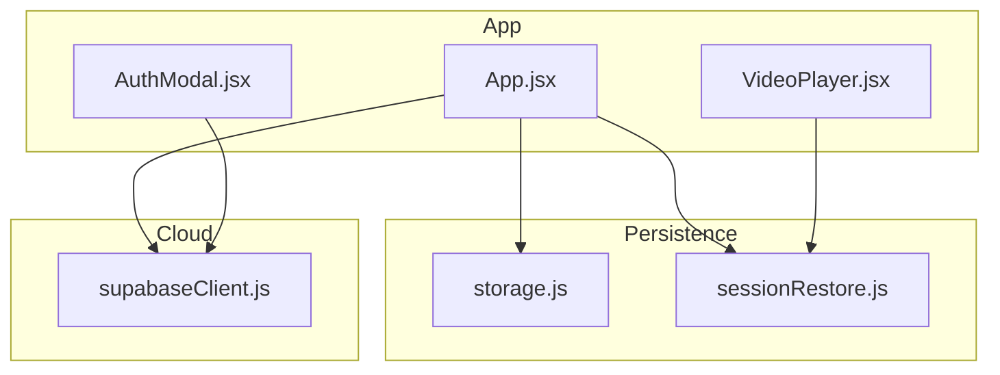
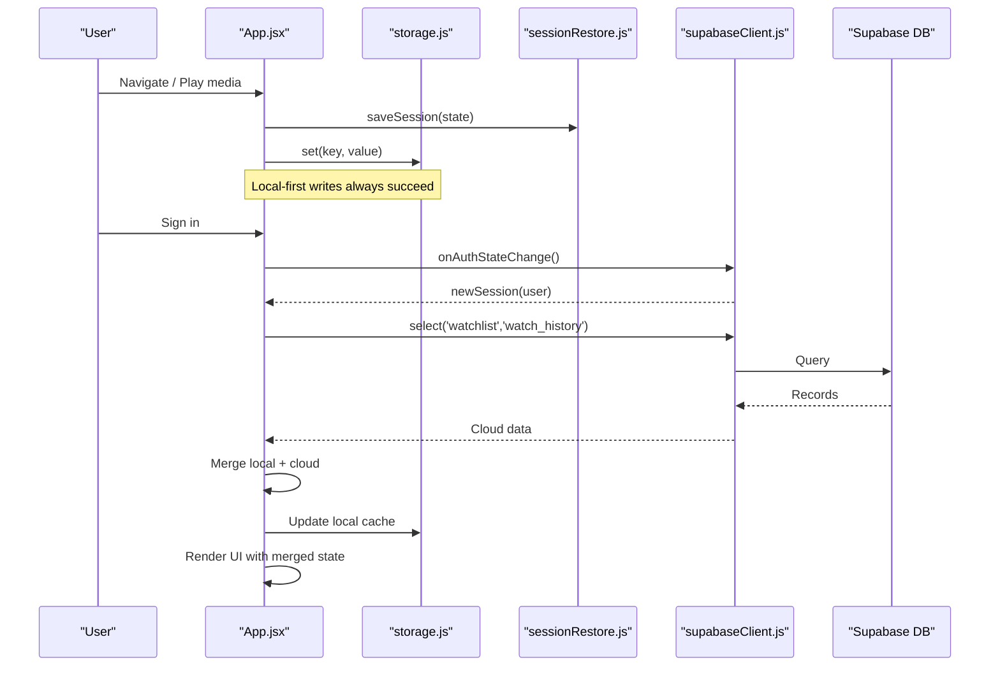
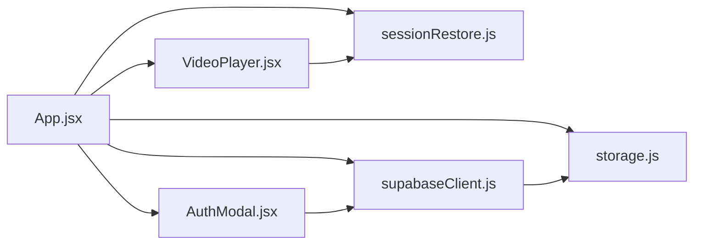

# Data Synchronization

<cite>
**Referenced Files in This Document**
- [storage.js](file://src/utils/storage.js)
- [sessionRestore.js](file://src/utils/sessionRestore.js)
- [supabaseClient.js](file://src/supabaseClient.js)
- [App.jsx](file://src/App.jsx)
- [AuthModal.jsx](file://src/components/AuthModal.jsx)
- [VideoPlayer.jsx](file://src/components/VideoPlayer.jsx)
- [main.jsx](file://src/main.jsx)
- [package.json](file://package.json)
</cite>

## Table of Contents
1. Introduction
2. Project Structure
3. Core Components
4. Architecture Overview
5. Detailed Component Analysis
6. Dependency Analysis
7. Performance Considerations
8. Troubleshooting Guide
9. Conclusion

## Introduction
This document explains the cross-device data consistency system for Project Anime. It covers the dual-storage approach using local storage and Supabase cloud database, the sync strategy (conflict resolution, merging, offline handling), session restoration across page reloads and device switches, real-time update patterns, graceful network failure handling, performance optimizations, and the data models used for watch history, watchlist, and user preferences.

## Project Structure
The synchronization system spans a small set of focused modules:
- Persistent storage abstraction that works on both web and native platforms
- Session save/load utilities to restore app state after reloads or device switches
- Supabase client with custom auth storage and mock fallback when credentials are missing
- App-level orchestration that listens to auth changes, merges local and cloud data, and persists UI state
- Video player integration for progress persistence
- Auth modal for sign-in/sign-up and OAuth flows

**Diagram sources**
- [App.jsx:224-725](file://src/App.jsx#L224-L725)
- [AuthModal.jsx:121-187](file://src/components/AuthModal.jsx#L121-L187)
- [VideoPlayer.jsx:1-200](file://src/components/VideoPlayer.jsx#L1-L200)
- [storage.js:29-70](file://src/utils/storage.js#L29-L70)
- [sessionRestore.js:17-95](file://src/utils/sessionRestore.js#L17-L95)
- [supabaseClient.js:1-98](file://src/supabaseClient.js#L1-L98)

**Section sources**
- [main.jsx:6-14](file://src/main.jsx#L6-L14)
- [package.json:14-35](file://package.json#L14-L35)

## Core Components
- Dual storage layer:
  - Local-first persistent storage via a unified API that uses Capacitor Preferences on Android and falls back to localStorage on web.
  - Session utilities that persist navigation state and video playback positions with expiration policies.
- Cloud integration:
  - Supabase client configured with custom storage adapter to persist auth sessions locally.
  - Mock client fallback when environment variables are not configured, ensuring the app remains functional offline.
- Sync engine:
  - On authentication, fetches cloud watchlist and watch history, merges with local data, uploads missing items, and updates UI and local cache.
  - On logout, reverts to local-only mode by restoring local data into state.

Key responsibilities:
- Maintain consistent state across devices and sessions
- Provide offline capability with automatic fallback
- Ensure minimal network usage through efficient merge logic
- Preserve user experience during transitions and errors

**Section sources**
- [storage.js:29-70](file://src/utils/storage.js#L29-L70)
- [sessionRestore.js:17-95](file://src/utils/sessionRestore.js#L17-L95)
- [supabaseClient.js:1-98](file://src/supabaseClient.js#L1-L98)
- [App.jsx:592-725](file://src/App.jsx#L592-L725)

## Architecture Overview
The system follows a local-first architecture with periodic or event-driven synchronization to the cloud.

**Diagram sources**
- [App.jsx:592-725](file://src/App.jsx#L592-L725)
- [sessionRestore.js:17-48](file://src/utils/sessionRestore.js#L17-L48)
- [storage.js:29-70](file://src/utils/storage.js#L29-L70)
- [supabaseClient.js:21-98](file://src/supabaseClient.js#L21-L98)

## Detailed Component Analysis

### Dual Storage Layer
- Purpose: Provide a single API for persistent storage that works on web and native platforms.
- Behavior:
  - Detects native platform and loads Capacitor Preferences if available; otherwise uses localStorage.
  - Wraps JSON serialization and error handling to ensure robustness even under storage limits or failures.
- Operations:
  - set/get/remove/clear with try/catch blocks to degrade gracefully.

Optimization notes:
- Lazy loading of Capacitor module reduces bundle size until needed.
- Errors are swallowed at each step to maintain functionality even if one backend fails.

**Section sources**
- [storage.js:8-27](file://src/utils/storage.js#L8-L27)
- [storage.js:29-70](file://src/utils/storage.js#L29-L70)

### Session Restoration
- Purpose: Save and restore the exact app state across reloads, deep links, and device switches.
- Features:
  - Saves full session snapshot on navigation and app lifecycle events.
  - Expiration policies:
    - Session state expires after 7 days.
    - Video progress entries expire after 30 days and are ignored if nearly finished (>95%).
- Usage:
  - Called on app pause/resume and route changes.
  - Restored on app start to resume last view and context.

Performance considerations:
- Snapshot stores only essential identifiers and metadata to keep storage footprint small.
- Debounced or throttled saving can be added if frequent saves become a bottleneck.

**Section sources**
- [sessionRestore.js:17-95](file://src/utils/sessionRestore.js#L17-L95)
- [App.jsx:241-278](file://src/App.jsx#L241-L278)
- [App.jsx:322-445](file://src/App.jsx#L322-L445)

### Supabase Client and Auth Integration
- Purpose: Connect to Supabase for authenticated users and provide a mock client when credentials are missing.
- Behavior:
  - Uses custom storage adapter to persist auth tokens via the unified storage layer.
  - Enables auto-refresh token and session persistence.
  - Provides a no-op mock client that returns empty results and safe stubs for auth methods when configuration is absent.
- Auth flow:
  - Sign-in/sign-up and OAuth handled in the AuthModal component.
  - App listens to auth state changes to trigger sync or revert to local-only mode.

Error handling:
- Graceful warnings when credentials are missing.
- Friendly error messages mapped from Supabase errors in the AuthModal.

**Section sources**
- [supabaseClient.js:1-98](file://src/supabaseClient.js#L1-L98)
- [AuthModal.jsx:121-187](file://src/components/AuthModal.jsx#L121-L187)

### Sync Engine and Conflict Resolution
- Trigger points:
  - On authentication success, fetches cloud watchlist and watch history.
  - On logout, restores local-only state.
- Merge strategy:
  - Watchlist:
    - Start with cloud list.
    - Upload any local items not present in cloud.
    - Format and store merged result locally and in UI state.
  - Watch history:
    - Start with cloud history.
    - Upload local entries missing from cloud.
    - Sort by updated_at descending.
    - Store formatted result locally and in UI state.
- Conflict resolution:
  - Cloud is treated as source of truth for existing records.
  - Local-only items are uploaded to cloud.
  - For overlapping items without explicit timestamps, cloud prevails unless local has meaningful progress; current implementation prioritizes simplicity and assumes cloud presence indicates authoritative state.

Offline capability:
- If Supabase is not configured or unavailable, the mock client ensures operations do not fail; local data remains fully functional.
- All writes to local storage are resilient to errors.

Real-time updates:
- The current implementation performs pull-based sync on auth change. Realtime subscriptions can be added later to push updates when cloud data changes.

**Section sources**
- [App.jsx:592-725](file://src/App.jsx#L592-L725)

### Video Player Progress Persistence
- Purpose: Persist playback position per media item to enable seamless resumption.
- Behavior:
  - Uses session utilities to save progress with thresholds (minimum seconds saved, expiration policy).
  - Integrates with app lifecycle to save on pause and restore on load.
- Optimization:
  - Avoids saving tiny progress increments.
  - Ignores near-complete progress to prevent unnecessary restores.

Integration points:
- App orchestrates saving/restoring session and progress.
- Storage layer abstracts platform differences.

**Section sources**
- [sessionRestore.js:57-95](file://src/utils/sessionRestore.js#L57-L95)
- [VideoPlayer.jsx:1-200](file://src/components/VideoPlayer.jsx#L1-L200)

### Data Models
- Watchlist:
  - Fields used in sync: user_id, media_id, type, title, cover.
  - Local format includes id, title, type, coverImage, bannerImage, rating for UI compatibility.
- Watch History:
  - Fields used in sync: user_id, media_id, type, title, cover, episode_number, chapter_number, progress_seconds, duration_seconds, updated_at.
  - Local format mirrors cloud fields plus convenience duplicates for UI.
- User Preferences:
  - Stored via unified storage layer; examples include seek step preference persisted in video player.
  - Session state captures navigation and selection context for restoration.

Note: These models reflect the fields read/written during sync and persistence. Actual database schema may include additional columns such as created_at or indexes.

**Section sources**
- [App.jsx:628-725](file://src/App.jsx#L628-L725)
- [VideoPlayer.jsx:49-70](file://src/components/VideoPlayer.jsx#L49-L70)
- [sessionRestore.js:101-157](file://src/utils/sessionRestore.js#L101-L157)

## Dependency Analysis
- App depends on:
  - storage.js for persistent writes
  - sessionRestore.js for session management
  - supabaseClient.js for cloud sync and auth
  - AuthModal.jsx for user authentication flows
  - VideoPlayer.jsx for progress persistence
- Storage depends on:
  - Capacitor Preferences on native; localStorage on web
- Supabase client depends on:
  - Environment variables for URL and anon key
  - Custom storage adapter for auth persistence

**Diagram sources**
- [App.jsx:224-725](file://src/App.jsx#L224-L725)
- [supabaseClient.js:1-98](file://src/supabaseClient.js#L1-L98)
- [AuthModal.jsx:121-187](file://src/components/AuthModal.jsx#L121-L187)
- [VideoPlayer.jsx:1-200](file://src/components/VideoPlayer.jsx#L1-L200)
- [storage.js:29-70](file://src/utils/storage.js#L29-L70)
- [sessionRestore.js:17-95](file://src/utils/sessionRestore.js#L17-L95)

**Section sources**
- [package.json:14-35](file://package.json#L14-L35)

## Performance Considerations
- Local-first writes reduce latency and improve resilience.
- Minimal snapshotting: session snapshots store only necessary identifiers and metadata to minimize storage overhead.
- Expiration policies prevent stale data accumulation:
  - Session state expires after 7 days.
  - Video progress entries expire after 30 days and ignore near-completion.
- Conditional syncing:
  - Sync runs on auth state changes rather than every render.
  - Only missing local items are uploaded to avoid redundant writes.
- Error-tolerant storage:
  - Each storage operation wraps calls in try/catch to continue functioning even if storage is full or unavailable.
- Optional realtime:
  - Current implementation is pull-based; adding realtime subscriptions can reduce polling but should be balanced against bandwidth and server load.

[No sources needed since this section provides general guidance]

## Troubleshooting Guide
Common issues and resolutions:
- Supabase not configured:
  - Symptom: Console warning about missing credentials; app falls back to local storage.
  - Resolution: Add VITE_SUPABASE_URL and VITE_SUPABASE_ANON_KEY to environment configuration.
- Auth errors:
  - Symptom: Friendly messages like “Too many attempts” or “Email not confirmed.”
  - Resolution: Follow user prompts; wait for rate limit cooldown; confirm email if required.
- Sync failures:
  - Symptom: Local data not reflected in cloud or vice versa.
  - Resolution: Verify network connectivity; check browser console for errors; ensure user is authenticated; re-trigger sync by logging out and back in.
- Storage full or unavailable:
  - Symptom: Writes silently fail; app continues with in-memory state.
  - Resolution: Clear unused data; on mobile, ensure sufficient device storage; consider reducing snapshot frequency.
- Video progress not restored:
  - Symptom: Playback resumes from beginning.
  - Resolution: Check that progress was saved above minimum threshold and within expiration window; verify storage access permissions on native platforms.

**Section sources**
- [supabaseClient.js:41-98](file://src/supabaseClient.js#L41-L98)
- [AuthModal.jsx:6-37](file://src/components/AuthModal.jsx#L6-L37)
- [sessionRestore.js:32-95](file://src/utils/sessionRestore.js#L32-L95)
- [storage.js:29-70](file://src/utils/storage.js#L29-L70)

## Conclusion
Project Anime implements a robust, local-first synchronization system that ensures continuity across devices and sessions. By combining a resilient local storage layer, careful session management, and a pragmatic cloud sync strategy, the application maintains high availability and a smooth user experience. The design supports offline usage, graceful degradation when cloud services are unavailable, and clear paths for extending to real-time updates and more sophisticated conflict resolution as needs evolve.

[No sources needed since this section summarizes without analyzing specific files]