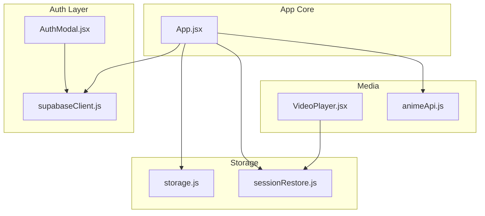
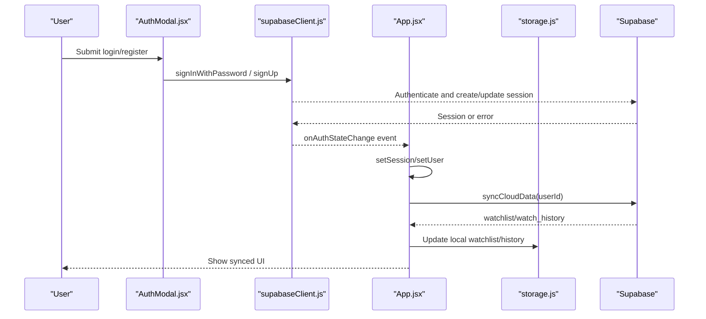
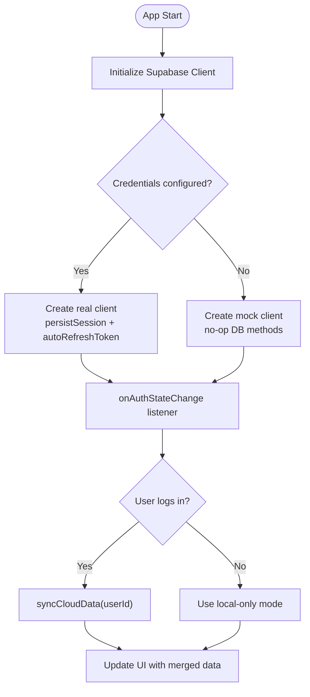
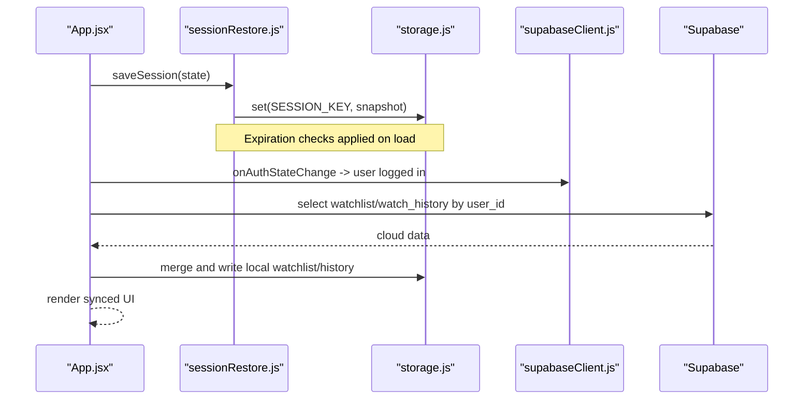
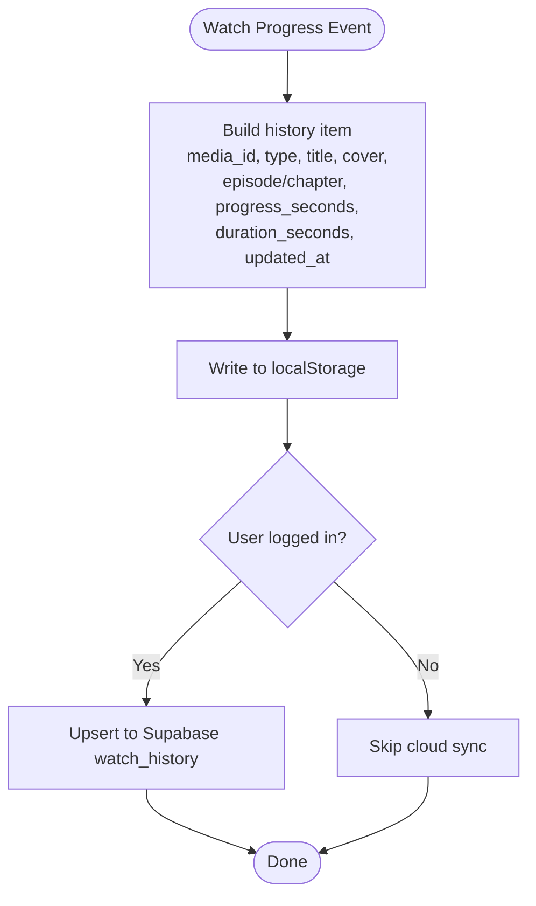
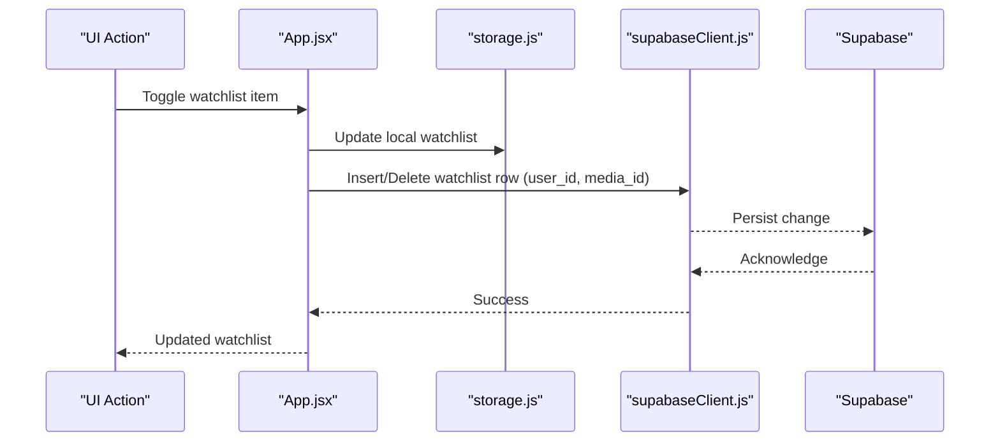
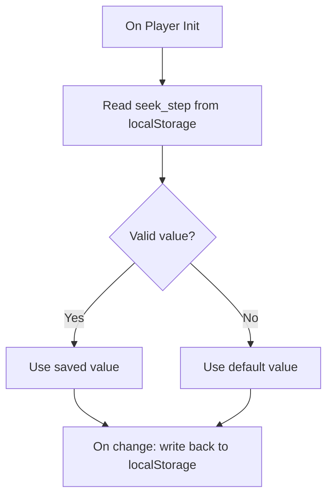
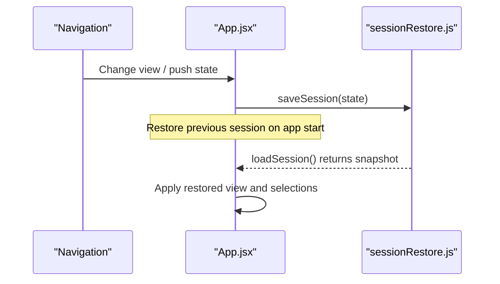
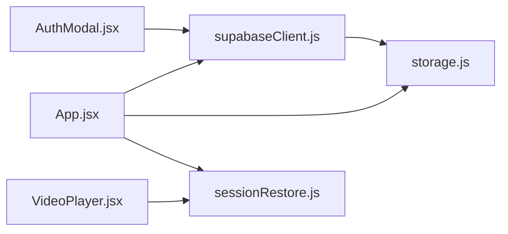

# User Management

<cite>
**Referenced Files in This Document**
- [supabaseClient.js](file://src/supabaseClient.js)
- [AuthModal.jsx](file://src/components/AuthModal.jsx)
- [App.jsx](file://src/App.jsx)
- [storage.js](file://src/utils/storage.js)
- [sessionRestore.js](file://src/utils/sessionRestore.js)
- [VideoPlayer.jsx](file://src/components/VideoPlayer.jsx)
- [animeApi.js](file://src/features/anime/api/animeApi.js)
- [README.md](file://README.md)
</cite>

## Table of Contents
1. [Introduction](#introduction)
2. [Project Structure](#project-structure)
3. [Core Components](#core-components)
4. [Architecture Overview](#architecture-overview)
5. [Detailed Component Analysis](#detailed-component-analysis)
6. [Dependency Analysis](#dependency-analysis)
7. [Performance Considerations](#performance-considerations)
8. [Troubleshooting Guide](#troubleshooting-guide)
9. [Conclusion](#conclusion)
10. [Appendices](#appendices)

## Introduction
This document explains Project Anime’s user management system with a focus on authentication, data synchronization, session management, watch history tracking, personal watchlist management, and user preferences. It covers how Supabase is integrated for authentication and cloud storage, how local storage is used for offline capability and cross-device consistency, and how the application maintains state across devices and sessions. It also includes guidance on implementing user-specific features, handling authentication errors, optimizing sync performance, and addressing privacy and security considerations.

## Project Structure
The user management system spans several modules:
- Authentication client and fallback behavior
- Auth UI (login/register/social)
- App-level auth state and sync engine
- Persistent storage abstraction (Capacitor Preferences or localStorage)
- Session restoration and video progress persistence
- Video player integration for progress updates
- Feature APIs that interact with content and indirectly with user data

**Diagram sources**
- [AuthModal.jsx:1-419](file://src/components/AuthModal.jsx#L1-L419)
- [supabaseClient.js:1-98](file://src/supabaseClient.js#L1-L98)
- [App.jsx:224-725](file://src/App.jsx#L224-L725)
- [storage.js:1-71](file://src/utils/storage.js#L1-L71)
- [sessionRestore.js:1-158](file://src/utils/sessionRestore.js#L1-L158)
- [VideoPlayer.jsx:1-200](file://src/components/VideoPlayer.jsx#L1-L200)
- [animeApi.js:1-20](file://src/features/anime/api/animeApi.js#L1-L20)

**Section sources**
- [supabaseClient.js:1-98](file://src/supabaseClient.js#L1-L98)
- [AuthModal.jsx:1-419](file://src/components/AuthModal.jsx#L1-L419)
- [App.jsx:224-725](file://src/App.jsx#L224-L725)
- [storage.js:1-71](file://src/utils/storage.js#L1-L71)
- [sessionRestore.js:1-158](file://src/utils/sessionRestore.js#L1-L158)
- [VideoPlayer.jsx:1-200](file://src/components/VideoPlayer.jsx#L1-L200)
- [animeApi.js:1-20](file://src/features/anime/api/animeApi.js#L1-L20)

## Core Components
- Supabase client initialization with custom persistent storage adapter and graceful fallback to a mock client when credentials are missing.
- Auth modal supporting email/password login, registration, and OAuth providers (Google, Discord).
- App-level auth state subscription and data synchronization between local storage and Supabase.
- Universal storage abstraction using Capacitor Preferences on native platforms and localStorage on web.
- Session restore utilities for app state and per-media playback progress.
- Video player integration that persists seek step preference and triggers progress updates.

**Section sources**
- [supabaseClient.js:1-98](file://src/supabaseClient.js#L1-L98)
- [AuthModal.jsx:1-419](file://src/components/AuthModal.jsx#L1-L419)
- [App.jsx:224-725](file://src/App.jsx#L224-L725)
- [storage.js:1-71](file://src/utils/storage.js#L1-L71)
- [sessionRestore.js:1-158](file://src/utils/sessionRestore.js#L1-L158)
- [VideoPlayer.jsx:1-200](file://src/components/VideoPlayer.jsx#L1-L200)

## Architecture Overview
The system combines local-first storage with optional cloud sync via Supabase. When configured, Supabase provides authentication and database operations; otherwise, the app continues to function with local-only data. The app subscribes to auth state changes and synchronizes watchlist and watch history on login, while persisting user preferences and session state locally.

**Diagram sources**
- [AuthModal.jsx:121-187](file://src/components/AuthModal.jsx#L121-L187)
- [supabaseClient.js:26-39](file://src/supabaseClient.js#L26-L39)
- [App.jsx:592-725](file://src/App.jsx#L592-L725)
- [storage.js:29-70](file://src/utils/storage.js#L29-L70)

## Detailed Component Analysis

### Authentication Flow and Token Management
- The Supabase client is created with environment variables for URL and anon key. A custom storage adapter uses the universal storage module to persist auth tokens across app restarts and platform boundaries.
- If credentials are not configured, a mock client is provided so the app remains functional without cloud features.
- The AuthModal handles login, registration, and OAuth flows, normalizing error messages and guiding users through confirmation steps.
- The app subscribes to auth state changes to update session/user state and trigger data synchronization upon login.

**Diagram sources**
- [supabaseClient.js:1-98](file://src/supabaseClient.js#L1-L98)
- [AuthModal.jsx:121-187](file://src/components/AuthModal.jsx#L121-L187)
- [App.jsx:592-725](file://src/App.jsx#L592-L725)

**Section sources**
- [supabaseClient.js:1-98](file://src/supabaseClient.js#L1-L98)
- [AuthModal.jsx:1-419](file://src/components/AuthModal.jsx#L1-L419)
- [App.jsx:592-725](file://src/App.jsx#L592-L725)

### Session Management and Cross-Device Consistency
- Session state (current view, selected items, episodes/chapters) is saved on navigation and app lifecycle events, then restored on launch if recent.
- Video playback positions are stored per media item with expiration logic to avoid restoring near-complete items.
- On login, the app merges local watchlist and watch history with cloud records, uploading any local-only items and updating local storage to reflect the authoritative cloud state.

**Diagram sources**
- [sessionRestore.js:17-95](file://src/utils/sessionRestore.js#L17-L95)
- [App.jsx:263-277](file://src/App.jsx#L263-L277)
- [App.jsx:624-725](file://src/App.jsx#L624-L725)
- [storage.js:29-70](file://src/utils/storage.js#L29-L70)

**Section sources**
- [sessionRestore.js:1-158](file://src/utils/sessionRestore.js#L1-L158)
- [App.jsx:263-277](file://src/App.jsx#L263-L277)
- [App.jsx:624-725](file://src/App.jsx#L624-L725)

### Watch History Tracking System
- Watch history is updated whenever a user watches content. Each entry stores media identifiers, type, title, cover, episode/chapter numbers, progress seconds, duration seconds, and timestamps.
- Local storage keeps a copy for immediate availability and offline use. On login, local entries are uploaded to the cloud if missing, and the UI reflects the merged dataset sorted by last updated time.

**Diagram sources**
- [App.jsx:1325-1380](file://src/App.jsx#L1325-L1380)

**Section sources**
- [App.jsx:1325-1380](file://src/App.jsx#L1325-L1380)

### Personal Watchlist Management
- Users can add/remove items from their watchlist. Local storage is updated immediately, and when logged in, the change is mirrored to the cloud via insert/delete operations keyed by user_id and media_id.
- On login, the app fetches the cloud watchlist, merges with local items, uploads any missing local items, and sets the UI to the merged list.

**Diagram sources**
- [App.jsx:1289-1323](file://src/App.jsx#L1289-L1323)
- [App.jsx:624-668](file://src/App.jsx#L624-L668)

**Section sources**
- [App.jsx:1289-1323](file://src/App.jsx#L1289-L1323)
- [App.jsx:624-668](file://src/App.jsx#L624-L668)

### User Preference Storage
- Player preferences such as seek step size are persisted locally and restored on startup.
- Other preferences like subscriptions and notifications are initialized from local storage with sensible defaults.

**Diagram sources**
- [VideoPlayer.jsx:49-70](file://src/components/VideoPlayer.jsx#L49-L70)

**Section sources**
- [VideoPlayer.jsx:49-70](file://src/components/VideoPlayer.jsx#L49-L70)
- [App.jsx:102-161](file://src/App.jsx#L102-L161)

### Protected Route Access and Navigation
- The app manages routing via browser history state and restores previous views on launch. While there is no explicit route guard component shown, protected behaviors are enforced by checking user presence before syncing or performing cloud operations.
- Direct links to watch pages are parsed on load to resume viewing context.

**Diagram sources**
- [App.jsx:322-445](file://src/App.jsx#L322-L445)
- [App.jsx:263-277](file://src/App.jsx#L263-L277)
- [sessionRestore.js:17-48](file://src/utils/sessionRestore.js#L17-L48)

**Section sources**
- [App.jsx:322-445](file://src/App.jsx#L322-L445)
- [App.jsx:263-277](file://src/App.jsx#L263-L277)
- [sessionRestore.js:17-48](file://src/utils/sessionRestore.js#L17-L48)

## Dependency Analysis
- The Supabase client depends on environment configuration and the universal storage module for token persistence.
- The AuthModal depends on the Supabase client for authentication actions and displays user-friendly error messages.
- The App orchestrates auth state changes, syncs data with Supabase, and updates local storage accordingly.
- Session restoration and video progress utilities depend on the universal storage module.
- The video player integrates with session restoration to persist playback preferences and may trigger progress updates that feed into watch history.

**Diagram sources**
- [supabaseClient.js:1-98](file://src/supabaseClient.js#L1-L98)
- [AuthModal.jsx:1-419](file://src/components/AuthModal.jsx#L1-L419)
- [App.jsx:224-725](file://src/App.jsx#L224-L725)
- [sessionRestore.js:1-158](file://src/utils/sessionRestore.js#L1-L158)
- [storage.js:1-71](file://src/utils/storage.js#L1-L71)
- [VideoPlayer.jsx:1-200](file://src/components/VideoPlayer.jsx#L1-L200)

**Section sources**
- [supabaseClient.js:1-98](file://src/supabaseClient.js#L1-L98)
- [AuthModal.jsx:1-419](file://src/components/AuthModal.jsx#L1-L419)
- [App.jsx:224-725](file://src/App.jsx#L224-L725)
- [sessionRestore.js:1-158](file://src/utils/sessionRestore.js#L1-L158)
- [storage.js:1-71](file://src/utils/storage.js#L1-L71)
- [VideoPlayer.jsx:1-200](file://src/components/VideoPlayer.jsx#L1-L200)

## Performance Considerations
- Prefer batched or idempotent writes when syncing watchlist and history to reduce network calls.
- Debounce frequent progress updates to limit upsert frequency while preserving accuracy.
- Use selective queries (e.g., filter by user_id) and minimal payloads to optimize bandwidth.
- Expire stale session snapshots and video progress to keep local storage lean.
- Avoid redundant re-renders by memoizing derived lists and minimizing state churn during sync.

[No sources needed since this section provides general guidance]

## Troubleshooting Guide
- Authentication errors: The AuthModal normalizes Supabase errors into user-friendly messages, including rate limiting, unconfirmed emails, duplicate registrations, invalid credentials, and disabled signups.
- Missing Supabase credentials: The client warns and falls back to a mock client; cloud sync will be disabled until credentials are configured.
- Sync failures: Errors during sync are logged; ensure network connectivity and correct environment variables.
- Local storage issues: The storage module gracefully falls back to localStorage if Capacitor Preferences is unavailable or fails.

**Section sources**
- [AuthModal.jsx:6-37](file://src/components/AuthModal.jsx#L6-L37)
- [supabaseClient.js:21-46](file://src/supabaseClient.js#L21-L46)
- [storage.js:8-27](file://src/utils/storage.js#L8-L27)

## Conclusion
Project Anime implements a robust user management system that balances local-first functionality with optional cloud synchronization. Authentication is handled via Supabase with a resilient fallback, while session restoration and per-media progress tracking provide continuity across sessions and devices. Watch history and watchlist are synchronized on login, ensuring consistent experiences across devices when configured. The architecture supports offline capability, efficient sync strategies, and clear error handling to deliver a smooth user experience.

[No sources needed since this section summarizes without analyzing specific files]

## Appendices

### Environment Variables and Configuration
- Frontend environment variables include API base URLs and optional Supabase credentials for authentication and cloud sync.
- Backend configuration includes ports, CORS settings, and relay endpoints for streaming proxies.

**Section sources**
- [README.md:76-141](file://README.md#L76-L141)