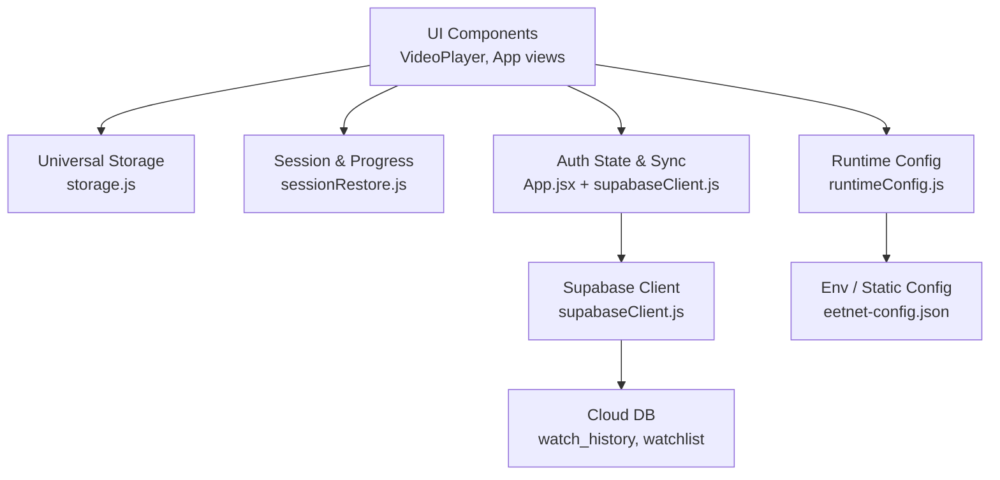
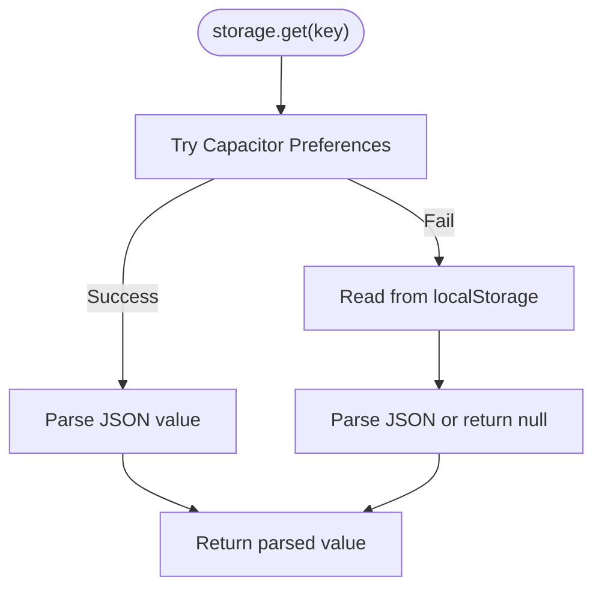
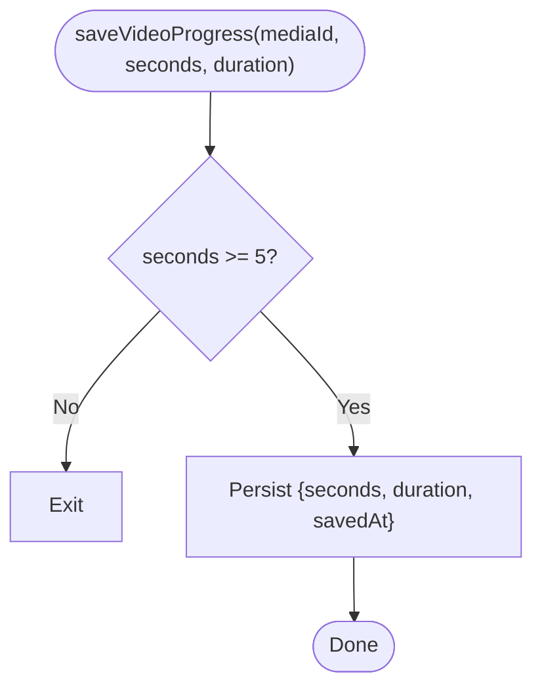
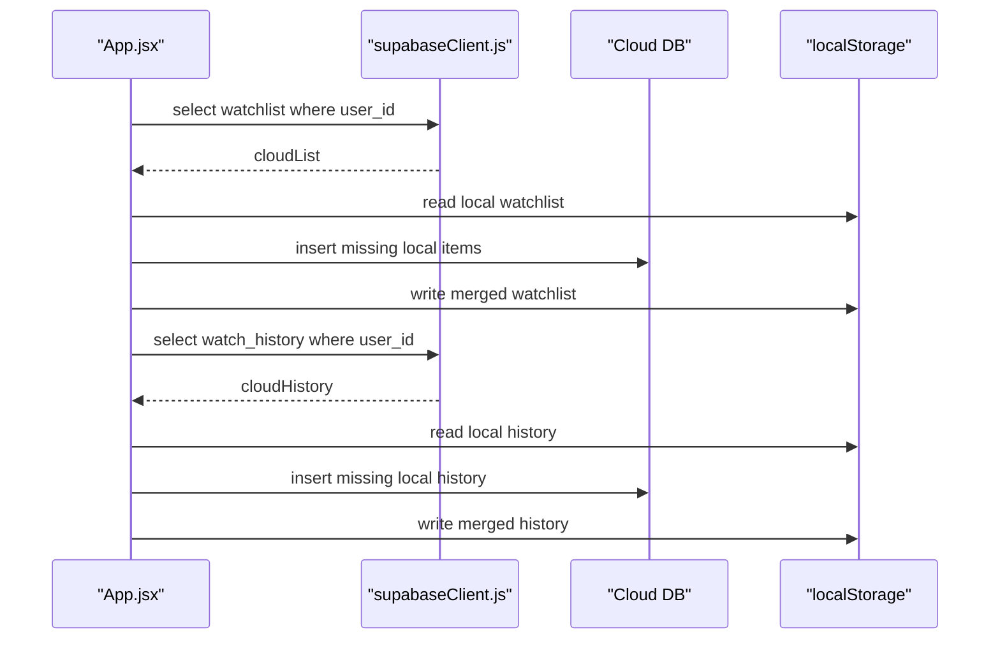
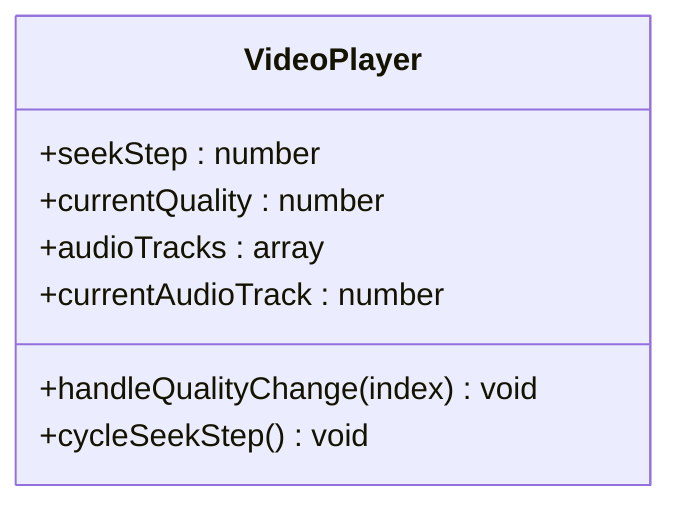
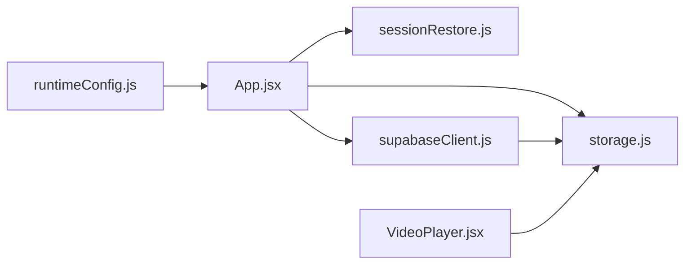

# User Preferences & Personalization

<cite>
**Referenced Files in This Document**
- [storage.js](file://src/utils/storage.js)
- [sessionRestore.js](file://src/utils/sessionRestore.js)
- [supabaseClient.js](file://src/supabaseClient.js)
- [runtimeConfig.js](file://src/runtimeConfig.js)
- [App.jsx](file://src/App.jsx)
- [VideoPlayer.jsx](file://src/components/VideoPlayer.jsx)
- [main.jsx](file://src/main.jsx)
- [eetnet-config.json](file://public/eetnet-config.json)
</cite>

## Table of Contents
1. Introduction
2. Project Structure
3. Core Components
4. Architecture Overview
5. Detailed Component Analysis
6. Dependency Analysis
7. Performance Considerations
8. Troubleshooting Guide
9. Conclusion
10. Appendices

## Introduction
This document explains how Project Anime stores and synchronizes user preferences and personalization data across devices. It covers local storage, cloud sync via Supabase, session restoration, video playback preferences (quality, seek step), watch history and watchlist synchronization, and privacy considerations. It also provides guidance for adding new preference types, handling migrations, and implementing personalized recommendations based on viewing habits.

## Project Structure
The preference system is built around a small set of focused modules:
- A universal storage abstraction that persists to Capacitor Preferences on native Android or falls back to localStorage on the web.
- Session and progress utilities that save and restore app state and per-media playback positions.
- A Supabase client configured with custom auth storage to persist sessions and enable cloud features when credentials are present; otherwise it gracefully degrades to local-only behavior.
- Runtime configuration that resolves API endpoints without relying on stale browser storage.
- The application root orchestrates initial loading, route parsing, session restoration, and cloud sync triggers on authentication changes.
- Video player components manage playback-related preferences like quality selection and seek step size.



**Diagram sources**
- [storage.js:1-70](file://src/utils/storage.js#L1-L70)
- [sessionRestore.js:1-158](file://src/utils/sessionRestore.js#L1-L158)
- [supabaseClient.js:1-98](file://src/supabaseClient.js#L1-L98)
- [runtimeConfig.js:1-163](file://src/runtimeConfig.js#L1-L163)
- [App.jsx:480-725](file://src/App.jsx#L480-L725)
- [eetnet-config.json:1-4](file://public/eetnet-config.json#L1-L4)

**Section sources**
- [storage.js:1-70](file://src/utils/storage.js#L1-L70)
- [sessionRestore.js:1-158](file://src/utils/sessionRestore.js#L1-L158)
- [supabaseClient.js:1-98](file://src/supabaseClient.js#L1-L98)
- [runtimeConfig.js:1-163](file://src/runtimeConfig.js#L1-L163)
- [App.jsx:480-725](file://src/App.jsx#L480-L725)
- [eetnet-config.json:1-4](file://public/eetnet-config.json#L1-L4)

## Core Components
- Universal storage layer: Provides get/set/remove/clear with automatic fallback from Capacitor Preferences to localStorage. All values are JSON-serialized.
- Session and progress persistence: Saves full app navigation state and per-media playback position with expiration policies.
- Cloud sync engine: On login, merges local watchlist and watch history with cloud records, uploading missing items and updating UI state.
- Player preferences: Seek step size and quality/audio track selections managed within the player component.
- Runtime configuration: Resolves backend base URL using query overrides, serverless endpoint, static config, and environment variables without using localStorage.

Key responsibilities:
- Keep preferences resilient across app restarts and OS updates (native) or browser sessions (web).
- Provide seamless offline-first experience with optional cloud sync when authenticated.
- Ensure no runtime errors if cloud services are unavailable by using mock clients and graceful fallbacks.

**Section sources**
- [storage.js:1-70](file://src/utils/storage.js#L1-L70)
- [sessionRestore.js:1-158](file://src/utils/sessionRestore.js#L1-L158)
- [supabaseClient.js:1-98](file://src/supabaseClient.js#L1-L98)
- [runtimeConfig.js:1-163](file://src/runtimeConfig.js#L1-L163)
- [App.jsx:480-725](file://src/App.jsx#L480-L725)
- [VideoPlayer.jsx:50-70](file://src/components/VideoPlayer.jsx#L50-L70)
- [VideoPlayer.jsx:950-1025](file://src/components/VideoPlayer.jsx#L950-L1025)

## Architecture Overview
The preference architecture follows an offline-first pattern with optional cloud synchronization:
- Local-first: All preferences and session data are stored locally via the universal storage layer.
- Optional cloud sync: When Supabase credentials are configured and the user is authenticated, the app fetches and merges cloud data into local state.
- Graceful degradation: If credentials are missing or network calls fail, the app continues functioning with local-only data.

```mermaid
sequenceDiagram
participant U as "User"
participant A as "App.jsx"
participant S as "storage.js"
participant SR as "sessionRestore.js"
participant SC as "supabaseClient.js"
participant C as "Cloud DB"
U->>A : Launch app
A->>SR : loadSession()
SR-->>A : Restored state (if valid)
A->>SC : onAuthStateChange listener
Note over A,SC : If credentials configured, real client; else mock client
U->>A : Sign in
A->>SC : getSession()
SC-->>A : Session exists
A->>C : Fetch watchlist/watch_history
C-->>A : Cloud records
A->>S : Merge and update local lists
A-->>U : Updated UI with synced data
```

**Diagram sources**
- [App.jsx:592-725](file://src/App.jsx#L592-L725)
- [supabaseClient.js:1-98](file://src/supabaseClient.js#L1-L98)
- [sessionRestore.js:17-48](file://src/utils/sessionRestore.js#L17-L48)
- [storage.js:29-70](file://src/utils/storage.js#L29-L70)

**Section sources**
- [App.jsx:592-725](file://src/App.jsx#L592-L725)
- [supabaseClient.js:1-98](file://src/supabaseClient.js#L1-L98)
- [sessionRestore.js:17-48](file://src/utils/sessionRestore.js#L17-L48)
- [storage.js:29-70](file://src/utils/storage.js#L29-L70)

## Detailed Component Analysis

### Universal Storage Layer
Responsibilities:
- Detect native platform and use Capacitor Preferences when available; otherwise use localStorage.
- Serialize/deserialize values to/from JSON.
- Provide safe operations with try/catch to avoid blocking UI on failures.

Behavior highlights:
- get returns null if key not found or parse fails.
- remove and clear fall through to localStorage if Capacitor is unavailable.
- No direct schema enforcement; consumers should define keys and validate values at usage sites.



**Diagram sources**
- [storage.js:16-53](file://src/utils/storage.js#L16-L53)

**Section sources**
- [storage.js:1-70](file://src/utils/storage.js#L1-L70)

### Session and Playback Progress
Responsibilities:
- Save full app navigation state on meaningful changes.
- Restore last session on launch if within age limit.
- Persist per-media playback position with expiration and near-completion checks.

Policies:
- Session expiry: older than 7 days is cleared.
- Video progress expiry: older than 30 days is ignored.
- Near completion: if >95% watched, do not restore position.



**Diagram sources**
- [sessionRestore.js:63-72](file://src/utils/sessionRestore.js#L63-L72)

**Section sources**
- [sessionRestore.js:1-158](file://src/utils/sessionRestore.js#L1-L158)

### Cloud Sync Engine (Watch History & Watchlist)
Responsibilities:
- On sign-in, fetch cloud watchlist and watch history.
- Merge with local data, uploading missing local items.
- Update UI state and persist merged results locally.

Merge strategy:
- Watchlist: union of cloud and local; upload local-only items.
- Watch history: merge cloud and local; sort by updated_at; upload local-only items.



**Diagram sources**
- [App.jsx:624-725](file://src/App.jsx#L624-L725)
- [supabaseClient.js:1-98](file://src/supabaseClient.js#L1-L98)

**Section sources**
- [App.jsx:624-725](file://src/App.jsx#L624-L725)
- [supabaseClient.js:1-98](file://src/supabaseClient.js#L1-L98)

### Player Preferences (Quality, Audio Track, Seek Step)
Responsibilities:
- Manage seek step size (5/10/15 seconds) persisted locally.
- Present quality levels detected from HLS manifest; allow manual override or auto.
- Support audio track selection when multi-audio streams are available.

Validation and defaults:
- Seek step validated against allowed values; default is 10 seconds.
- Quality defaults to Auto (-1); user can pick specific level index.
- Audio tracks default to first available unless overridden.



**Diagram sources**
- [VideoPlayer.jsx:50-70](file://src/components/VideoPlayer.jsx#L50-L70)
- [VideoPlayer.jsx:950-1025](file://src/components/VideoPlayer.jsx#L950-L1025)

**Section sources**
- [VideoPlayer.jsx:50-70](file://src/components/VideoPlayer.jsx#L50-L70)
- [VideoPlayer.jsx:950-1025](file://src/components/VideoPlayer.jsx#L950-L1025)

### Runtime Configuration
Responsibilities:
- Resolve API base URL from multiple sources without using localStorage.
- Provide helpers to build API URLs safely.
- Handle native vs. web differences and development environments.

Priority order:
1. Query parameter override (?apiBase=)
2. Serverless runtime config endpoint
3. Static config file
4. Build-time environment variable
5. Local dev detection or fallback tunnel

**Section sources**
- [runtimeConfig.js:1-163](file://src/runtimeConfig.js#L1-L163)
- [eetnet-config.json:1-4](file://public/eetnet-config.json#L1-L4)
- [main.jsx:1-15](file://src/main.jsx#L1-L15)

## Dependency Analysis
Coupling and cohesion:
- App.jsx depends on storage, sessionRestore, and supabaseClient for persistence and sync.
- supabaseClient depends on storage for auth persistence and uses environment variables for credentials.
- VideoPlayer.jsx is self-contained for player preferences but integrates with higher-level state via props and callbacks.
- runtimeConfig is independent and consumed early during bootstrap.

External dependencies:
- @capacitor/preferences for native persistent storage.
- @supabase/supabase-js for cloud auth and database access.
- HLS.js for streaming and quality detection.

Potential circular dependencies:
- None observed; modules are layered with clear boundaries.

Integration points:
- Cloud tables: watchlist, watch_history.
- Environment variables: VITE_SUPABASE_URL, VITE_SUPABASE_ANON_KEY, VITE_API_BASE.



**Diagram sources**
- [App.jsx:480-725](file://src/App.jsx#L480-L725)
- [supabaseClient.js:1-98](file://src/supabaseClient.js#L1-L98)
- [storage.js:1-70](file://src/utils/storage.js#L1-L70)
- [sessionRestore.js:1-158](file://src/utils/sessionRestore.js#L1-L158)
- [runtimeConfig.js:1-163](file://src/runtimeConfig.js#L1-L163)

**Section sources**
- [App.jsx:480-725](file://src/App.jsx#L480-L725)
- [supabaseClient.js:1-98](file://src/supabaseClient.js#L1-L98)
- [storage.js:1-70](file://src/utils/storage.js#L1-L70)
- [sessionRestore.js:1-158](file://src/utils/sessionRestore.js#L1-L158)
- [runtimeConfig.js:1-163](file://src/runtimeConfig.js#L1-L163)

## Performance Considerations
- Prefer minimal state snapshots in session storage to reduce serialization overhead.
- Debounce frequent writes (e.g., video progress) to avoid excessive storage calls.
- Use conditional sync: only merge and upload when authenticated and online.
- Avoid heavy computations during startup; defer non-critical tasks until after mount.
- Leverage HLS.js worker and retry settings already configured to improve streaming performance.

[No sources needed since this section provides general guidance]

## Troubleshooting Guide
Common issues and resolutions:
- Cloud sync disabled: If Supabase credentials are not configured, the app logs a warning and uses a mock client. Enable cloud features by setting environment variables.
- Storage full: storage methods catch errors and ignore failures; check device storage capacity if writes fail repeatedly.
- Session expired: Sessions older than 7 days are cleared automatically; users will start fresh on next launch.
- Video progress not restored: Positions near completion (>95%) or older than 30 days are ignored intentionally.

Operational tips:
- Verify runtime config resolution by checking console logs for API_BASE.
- Confirm Capacitor Preferences availability on native builds; otherwise localStorage is used.
- Inspect localStorage keys for local-only features (e.g., liked videos, watch later, playlists, subscriptions, notifications).

**Section sources**
- [supabaseClient.js:41-98](file://src/supabaseClient.js#L41-L98)
- [sessionRestore.js:32-48](file://src/utils/sessionRestore.js#L32-L48)
- [sessionRestore.js:78-95](file://src/utils/sessionRestore.js#L78-L95)
- [runtimeConfig.js:82-130](file://src/runtimeConfig.js#L82-L130)

## Conclusion
Project Anime’s preference system is robust, offline-first, and optionally synchronized to the cloud when authenticated. It supports essential personalization such as theme-like behaviors (via UI state), quality preferences, and viewing habits (history and watchlist). The design ensures resilience across platforms and environments, with clear extension points for adding new preferences and migrating existing data. Privacy is respected by keeping sensitive data local unless explicitly synced by the user through authentication.

[No sources needed since this section summarizes without analyzing specific files]

## Appendices

### Preference Schema Summary
- Session state:
  - Keys: view, activeSection, selected media identifiers, episode/chapter numbers.
  - Expiration: 7 days.
- Video progress:
  - Keys: prefix-based per media ID.
  - Fields: seconds, duration, savedAt.
  - Expiration: 30 days; near-completion ignored.
- Player preferences:
  - Seek step: integer from {5, 10, 15}; default 10.
  - Quality: -1 for Auto; otherwise index into available levels.
  - Audio track: index into available tracks.
- Watchlist and history:
  - Local keys: watchlist, watch_history arrays.
  - Cloud fields: user_id, media_id, type, title, cover, episode/chapter numbers, progress_seconds, duration_seconds, updated_at.
- User collections:
  - Liked videos, watch later, custom playlists, subscriptions, notifications stored locally with simple arrays and metadata.

**Section sources**
- [sessionRestore.js:10-158](file://src/utils/sessionRestore.js#L10-L158)
- [VideoPlayer.jsx:50-70](file://src/components/VideoPlayer.jsx#L50-L70)
- [App.jsx:87-161](file://src/App.jsx#L87-L161)
- [App.jsx:624-725](file://src/App.jsx#L624-L725)

### Adding a New Preference Type
Steps:
1. Define a stable key name and validation rules at the usage site.
2. Persist via storage.set/get for cross-platform compatibility.
3. If cloud-synced, add corresponding fields to cloud tables and extend sync logic to merge and upload changes.
4. Initialize default values on first run and handle migration if schema evolves.
5. Update UI to reflect and edit the preference.

Example references:
- Seek step persistence pattern: [VideoPlayer.jsx:50-70](file://src/components/VideoPlayer.jsx#L50-L70)
- Session snapshot building: [sessionRestore.js:101-158](file://src/utils/sessionRestore.js#L101-L158)
- Cloud merge patterns: [App.jsx:624-725](file://src/App.jsx#L624-L725)

**Section sources**
- [VideoPlayer.jsx:50-70](file://src/components/VideoPlayer.jsx#L50-L70)
- [sessionRestore.js:101-158](file://src/utils/sessionRestore.js#L101-L158)
- [App.jsx:624-725](file://src/App.jsx#L624-L725)

### Handling Preference Migrations
Guidelines:
- Version your preference schema if necessary and apply migrations on app start.
- Clear or transform outdated keys to new formats.
- Preserve user data whenever possible; log warnings for irreversible changes.
- Test migration paths across upgrades.

Reference patterns:
- Session expiration and cleanup: [sessionRestore.js:32-48](file://src/utils/sessionRestore.js#L32-L48)
- Storage fallback and error handling: [storage.js:29-70](file://src/utils/storage.js#L29-L70)

**Section sources**
- [sessionRestore.js:32-48](file://src/utils/sessionRestore.js#L32-L48)
- [storage.js:29-70](file://src/utils/storage.js#L29-L70)

### Implementing Personalized Recommendations
Approach:
- Use local viewing habits (watch history, liked videos, watch later) to compute recommendations.
- Optionally leverage cloud-synchronized history for richer signals when authenticated.
- Integrate with external APIs (e.g., TMDB) for content enrichment and ranking.

References:
- Recommendation utility import: [App.jsx:12](file://src/App.jsx#L12)
- History and collection data sources: [App.jsx:87-161](file://src/App.jsx#L87-L161), [App.jsx:480-725](file://src/App.jsx#L480-L725)

**Section sources**
- [App.jsx:12](file://src/App.jsx#L12)
- [App.jsx:87-161](file://src/App.jsx#L87-L161)
- [App.jsx:480-725](file://src/App.jsx#L480-L725)

### Privacy and User Control
- Local-only mode: Without Supabase credentials, all data remains on-device.
- Opt-in cloud sync: Only after authentication does the app sync watchlist and history.
- Data minimization: Session snapshots store minimal identifiers and titles.
- Transparency: Console warnings indicate when cloud features are disabled.

**Section sources**
- [supabaseClient.js:21-46](file://src/supabaseClient.js#L21-L46)
- [sessionRestore.js:101-158](file://src/utils/sessionRestore.js#L101-L158)